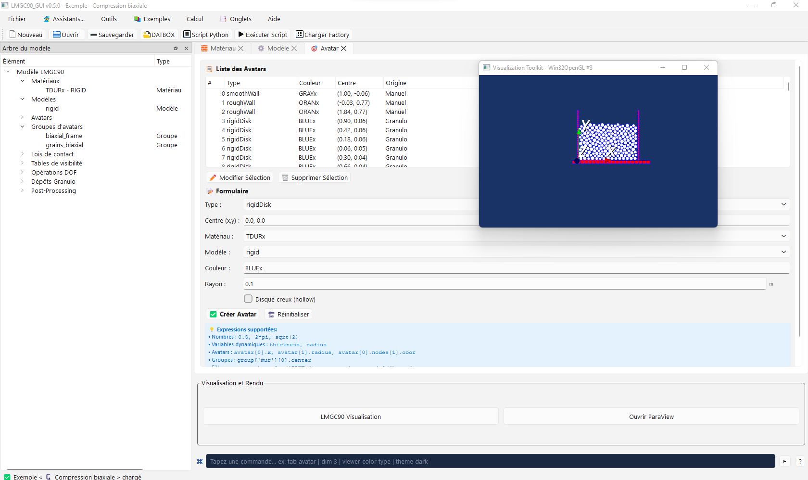
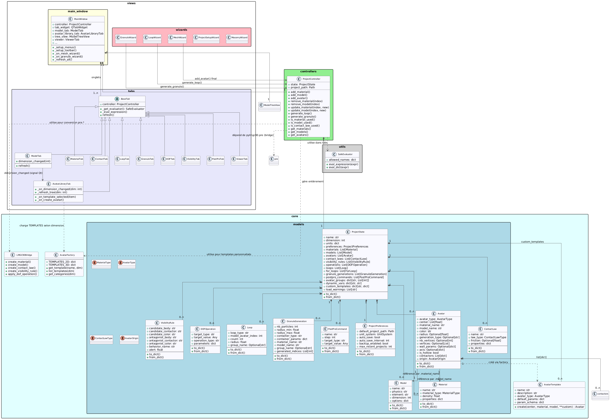

# LMGC90_GUI — Architecture MVC 


**LMGC90_GUI** est une interface graphique moderne en architecture **MVC** (Model-View-Controller) pour le solveur [LMGC90](https://git-xen.lmgc.univ-montp2.fr/lmgc90/lmgc90_user/-/wikis/home).



## Documentation (fr)
[Documentation de LMGC90_GUI](docs/fr/overview.md) . [pdf](docs/LMGC90_GUI_Documentation_fr.pdf)

[English documentation of LMGC90_GUI](docs/overview.md). [pdf](docs/LMGC90_GUI_Documentation_en.pdf)

## 🎯 Points Clés de la Refactorisation

### ✅ Architecture Propre
- **Séparation MVC stricte** : Model (core/), View (views/), Controller (controllers/)
- **Logique métier testable** sans dépendances GUI
- **Validation centralisée** dans des classes dédiées

### ✅ Sécurité Améliorée
- ✅ Validation stricte des entrées utilisateur
- ✅ Gestion d'erreurs robuste

### ✅ Testabilité
- 🧪 **Tests unitaires** pour toute la logique métier
- 🧪 **Tests d'intégration** avec pytest-qt
- 📊 Coverage > 40%

### ✅ Maintenabilité
- 📝 Docstrings complètes
- 🏗️ Fonctions < 50 lignes

## 📁 Structure du Projet

```
LMGC90_GUI/
├── src/
│   ├── core/                    # Logique métier (Model)
│   │   ├── models.py            # Modèles de données (dataclasses)
│   │   ├── validators.py        # Validation des données
│   │   ├── generators.py        # Boucles, granulo
│   │   ├── serializers.py       # Save/Load JSON
│   │   └── pylmgc_bridge.py     # Pont vers pylmgc90
│   ├── controllers/             # Contrôleurs (Controller)
│   │   └── project_controller.py # Contrôleur principal
│   ├── views/                   # Interface (View)
│   │   ├── main_window.py       # Fenêtre principale
│   │   ├── tree_view.py         # Arbre du modèle
│   │   ├── dialogs.py           # Dialogues
│   │   └── tabs/                # Onglets
│   │       ├── material_tab.py
│   │       ├── avatar_tab.py
│   │       └── ...
│   └── utils/                   # Utilitaires
│       └── safe_eval.py         # Éval sécurisé
├── tests/
│   ├── unit/                    # Tests unitaires
│   │   ├── test_validators.py
│   │   └── test_generators.py
│   ├── integration/             # Tests d'intégration
│   │   ├── test_project_lifecycle.py
│   │   └── test_gui_workflow.py
│   └── conftest.py              # Fixtures pytest
├── main.py                      # Point d'entrée
├── requirements.txt
├── requirements-dev.txt
├── pytest.ini
└── README.md

```

## Diagramme de classes
Voir les détails sur le diagramme de classes [Diagramme de classes](docs/LMG90_GUI_MVC_Diagrammes.md)



## 🚀 Installation

```bash
# Cloner le projet
git clone https://github.com/bzerourou/LMG90_GUI_MVC.git
cd LMGC90_GUI_MVC

# Créer un environnement virtuel
python -m venv venv
source venv/bin/activate  # Linux/Mac
# ou
venv\Scripts\activate  # Windows

# Installer les dépendances
pip install -r requirements.txt

# Pour le développement
pip install -r requirements-dev.txt
```

## 🎮 Utilisation

```bash
# Lancer l'application
python main.py
```

## 🧪 Tests

```bash
# Tous les tests
pytest

# Tests unitaires seulement
pytest tests/unit/

# Tests avec coverage
pytest --cov=src --cov-report=html

# Tests spécifiques
pytest tests/unit/test_validators.py::TestMaterialValidator::test_valid_material
```

## 📖 Exemples de Code

### Créer un matériau programmatiquement

```python
from src.controllers.project_controller import ProjectController
from src.core.models import Material, MaterialType

controller = ProjectController()

material = Material(
    name="STEEL",
    material_type=MaterialType.RIGID,
    density=7800.0,
    properties={'young': 2.1e11, 'nu': 0.3}
)

controller.add_material(material)
```

### Générer une boucle

```python
from src.core.models import Loop

loop = Loop(
    loop_type="Cercle",
    model_avatar_index=0,  # Index de l'avatar modèle
    count=12,
    radius=3.0,
    group_name="particules_cercle"
)

indices = controller.generate_loop(loop)
print(f"{len(indices)} avatars créés")
```

### Validation sécurisée

```python
from src.utils.safe_eval import SafeEvaluator

evaluator = SafeEvaluator()

# Évaluer des paramètres
params = evaluator.eval_dict("young=1e9, nu=0.3, density=2500")
# → {'young': 1000000000.0, 'nu': 0.3, 'density': 2500}

# Expressions mathématiques
result = evaluator.eval_expression("2 * math.pi * 0.5")
# → 3.141592653589793
```


