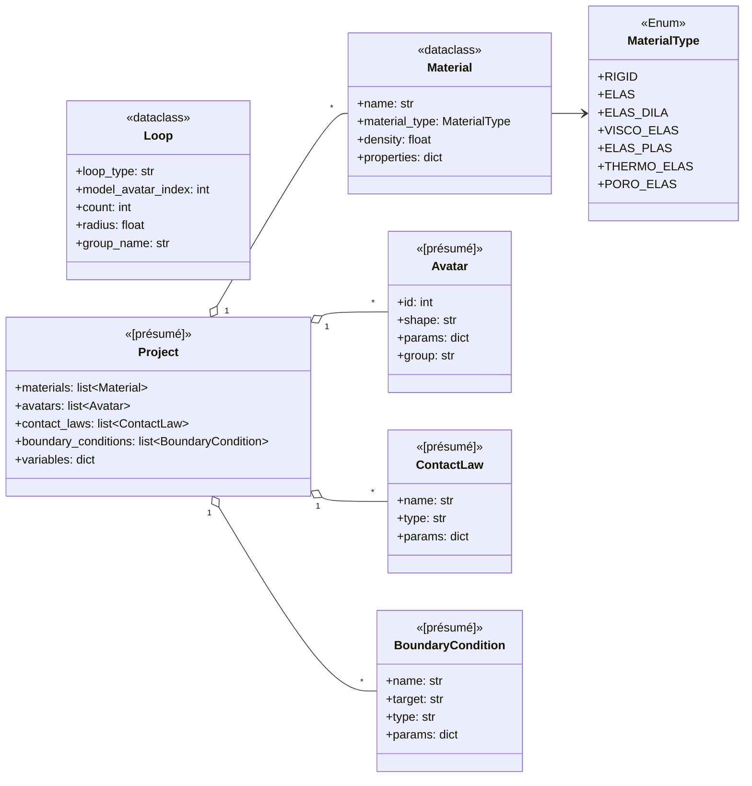
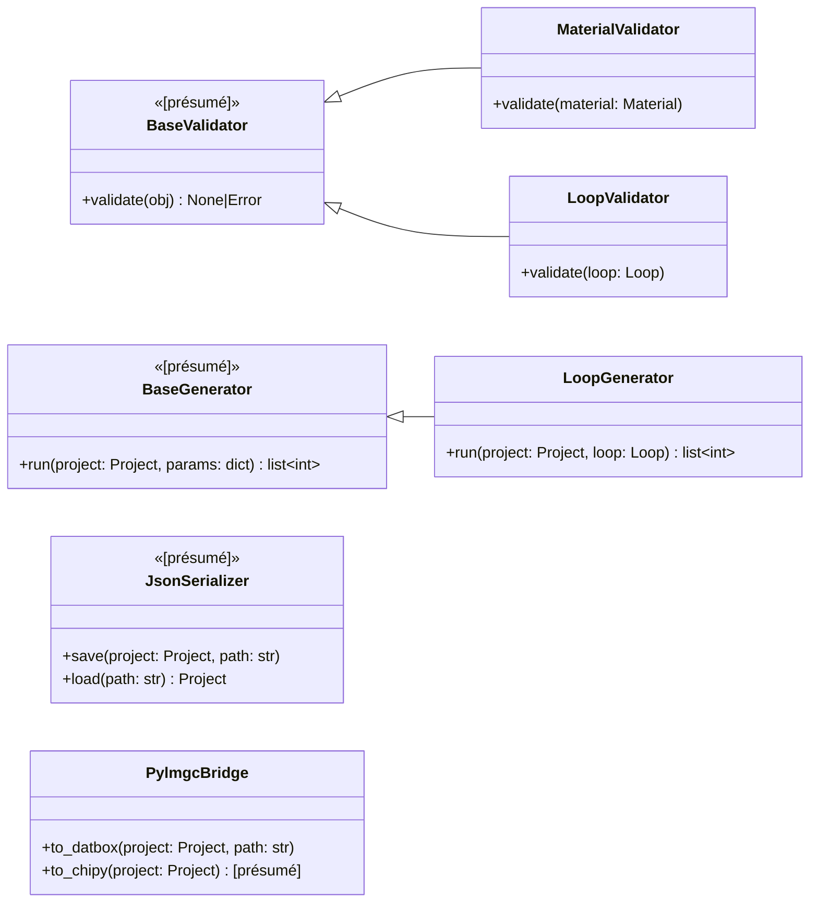
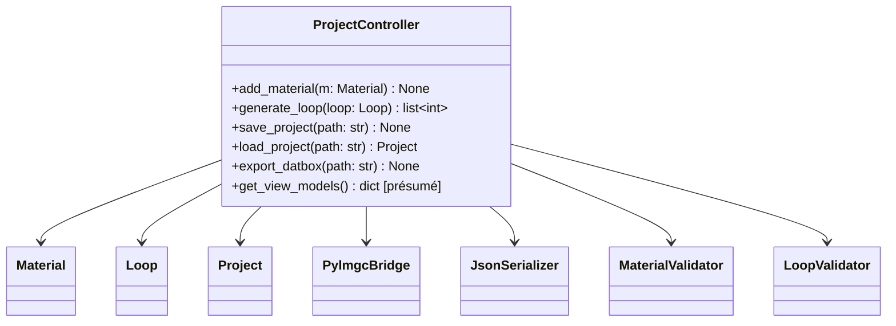
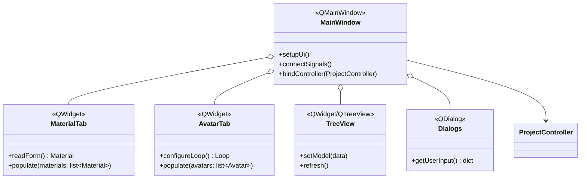
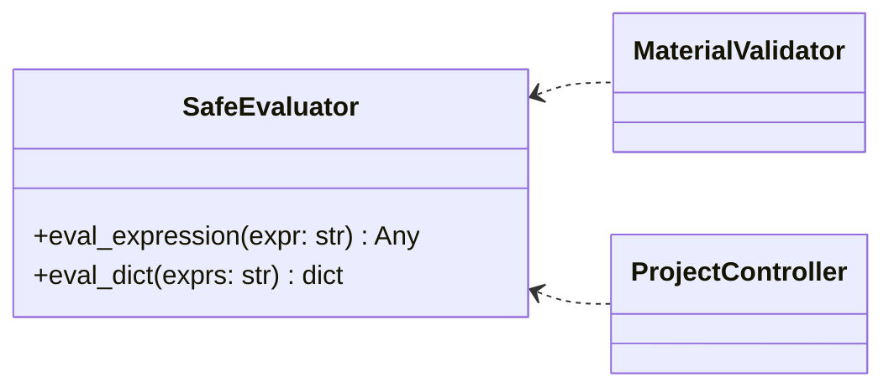
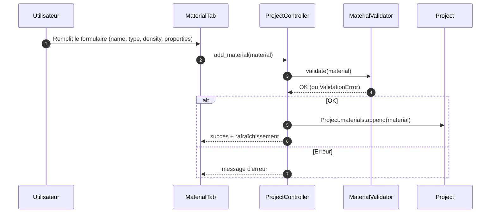
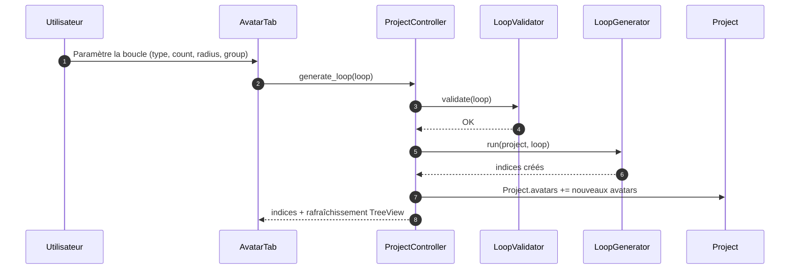

# LMG90_GUI_MVC — Schéma complet (Architecture, Classes, Séquences)

> **Version :** 2026-01-24 19:12  > **Auteur :** M365 Copilot  > **Portée :** Schémas basés sur la structure publique du dépôt *LMG90_GUI_MVC* et le périmètre fonctionnel de *LMGC90*. Les éléments marqués **[présumé]** sont déduits du contexte et à confirmer par lecture des sources.

---

## Sommaire
- [1) Vue d’ensemble — Architecture (MVC)](#1-vue-densemble--architecture-mvc)
- [2) Diagrammes de classes](#2-diagrammes-de-classes)
  - [2.1. Modèle (core)](#21-modèle-core)
  - [2.2. Validation / Génération / Sérialisation / Bridge](#22-validation--génération--sérialisation--bridge)
  - [2.3. Contrôleur](#23-contrôleur)
  - [2.4. Vues (PyQt6)](#24-vues-pyqt6)
  - [2.5. Utilitaires (sécurité)](#25-utilitaires-sécurité)
- [3) Diagrammes de séquence (workflows clés)](#3-diagrammes-de-séquence-workflows-clés)
  - [3.1. Ajouter un matériau](#31-ajouter-un-matériau)
  - [3.2. Générer une boucle d’avatars](#32-générer-une-boucle-davatars)
- [4) Hypothèses & limites](#4-hypothèses--limites)
- [5) Références](#5-références)

---

## 1) Vue d’ensemble — Architecture (MVC)

```mermaid
flowchart LR
  subgraph View[View (PyQt6)]
    MW[MainWindow]
    TV[TreeView]
    DLG[Dialogs]
    TABS[Tabs
(MaterialTab, AvatarTab, ...)]
  end

  subgraph Controller[Controller]
    PC[ProjectController]
  end

  subgraph Model[Model (core)]
    MOD[models.py
(Material, MaterialType, Loop, [Project]…)]
    VAL[validators.py
(MaterialValidator, LoopValidator, …)]
    GEN[generators.py
(LoopGenerator, [GranuloGenerator]…)]
    SER[serializers.py
(JsonSerializer [présumé])]
    BR[pylmgc_bridge.py
(PylmgcBridge)]
  end

  subgraph Utils[Utils]
    SE[SafeEvaluator (AST)]
  end

  MW -->|signals/slots| PC
  TABS -->|signals/slots| PC
  TV -->|refresh via adapter| PC
  DLG -->|inputs| PC

  PC --> MOD
  PC --> VAL
  PC --> GEN
  PC --> SER
  PC --> BR
  VAL --> SE
  PC --> SE
```

---

## 2) Diagrammes de classes

### 2.1. Modèle (core)

> Champs affichés quand explicitement visibles dans la documentation/exemples. D’autres entités sont **[présumées]** d’après le périmètre LMGC90/GUI.



### 2.2. Validation / Génération / Sérialisation / Bridge



### 2.3. Contrôleur



### 2.4. Vues (PyQt6)



### 2.5. Utilitaires (sécurité)



---

## 3) Diagrammes de séquence (workflows clés)

### 3.1. Ajouter un matériau



### 3.2. Générer une boucle d’avatars



---

## 4) Hypothèses & limites
- Les classes marquées **[présumé]** sont déduites du périmètre fonctionnel *LMGC90_GUI* et de la doc LMGC90. Elles doivent être **confirmées par inspection du code** (`src/core/*.py`, `src/controllers/*.py`, `src/views/*.py`).
- Les signatures de méthodes indiquées reflètent les **exemples publics** (`add_material`, `generate_loop`) et les usages plausibles pour `save/load/export`. Une lecture complète permettrait d’étendre/ajuster les signatures.

---

## 5) Références
- Dépôt **LMG90_GUI_MVC** (structure, exemples de code et organisation MVC) : https://github.com/bzerourou/LMG90_GUI_MVC
- Dépôt **LMGC90_GUI** (périmètre fonctionnel de l’interface historique) : https://github.com/bzerourou/LMGC90_GUI
- Documentation **LMGC90** (architecture, préprocesseur/Chipy, Datbox) :
  - Page d’accueil doc : https://lmgc90.pages-git-xen.lmgc.univ-montp2.fr/lmgc90_dev/
  - Structure LMGC90 : https://lmgc90.pages-git-xen.lmgc.univ-montp2.fr/lmgc90_dev/dev_presentation.html

---

> Pour transformer ce fichier en **PNG/SVG/PDF**, utilisez par exemple *Mermaid* (support natif GitHub/GitLab/VS Code) ou `@mermaid-js/mermaid-cli` (`mmdc`).
