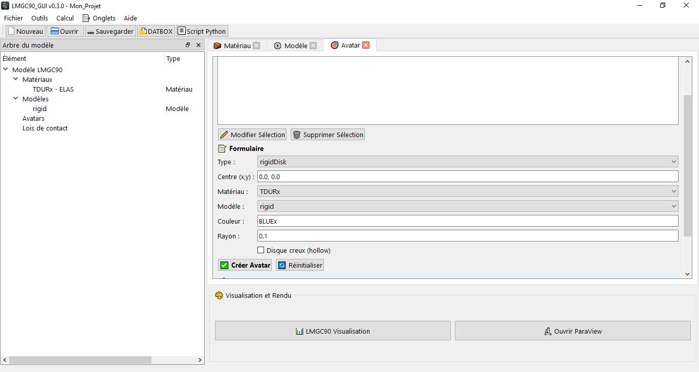

# Création d'un Avatar (Corps rigide simple)

**Onglet Avatar** Permet de créer, modifier et supprimer les corps rigides du projet : disques, sphères, joncs, polygones, murs, cylindres, polyèdres et plus encore.  
Chaque avatar est défini par un **type**, un **centre**, un **matériau**, un **modèle** et des **paramètres géométriques** spécifiques à son type.

---

## Interface générale

L'onglet est divisé en deux zones :

- **Liste des avatars** (en haut) : arbre affichant tous les avatars du projet avec leur index, type, couleur et centre. Double-clic sur une ligne pour l'éditer. Clic droit pour accéder au menu contextuel (Modifier, Supprimer, Informations).
- **Formulaire de création / modification** (en bas) : champs adaptés au type d'avatar sélectionné.

## Liste des avatars par dimension

### Avatars 2D

| Type pylmgc90 | Description courte | Paramètres clés |
|---------------|--------------------|-----------------|
| `rigidDisk` | Disque rigide | `r`, `is_hollow` |
| `rigidJonc` | Ellipse rigide | `axe1`, `axe2` |
| `rigidPolygon` | Polygone rigide | `generation_type`, `nb_vertices`, `radius` ou `vertices` |
| `rigidOvoidPolygon` | Ovoïde rigide | `ra`, `rb`, `nb_vertices` |
| `rigidDiscreteDisk` | Disque discret | `r` |
| `rigidCluster` | Cluster de disques | `r`, `nb_disk` |
| `roughWall` | Mur rugueux | `l`, `r`, `nb_vertex` |
| `fineWall` | Mur fin | `l`, `r`, `nb_vertex` |
| `smoothWall` | Mur lisse | `l`, `h`, `nb_polyg` |
| `granuloRoughWall` | Mur granulaire | `l`, `rmin`, `rmax`, `nb_vertex` |

### Avatars 3D

| Type pylmgc90 | Description courte | Paramètres clés |
|---------------|--------------------|-----------------|
| `rigidSphere` | Sphère rigide | `r` |
| `rigidPlan` | Plan rigide | `axe1`, `axe2`, `axe3` |
| `rigidCylinder` | Cylindre rigide | `r`, `h` |
| `rigidPolyhedron` | Polyèdre rigide | `generation_type`, `nb_vertices`, `radius` ou `vertices` + `faces` |
| `roughWall3D` | Mur rugueux 3D | `lx`, `ly`, `r` |
| `granuloRoughWall3D` | Mur granulaire 3D | `lx`, `ly`, `rmin`, `rmax` |

### Champs communs à tous les types

| Champ | Description |
|-------|-------------|
| **Type** | Type d'avatar pylmgc90. Détermine les champs supplémentaires affichés. |
| **Centre** | Coordonnées du centre de référence. Format `x, y` en 2D ou `x, y, z` en 3D. Accepte les expressions Python (`avatar[0].x + 0.5`). |
| **Matériau** | Sélection parmi les matériaux définis dans l'onglet Matériaux. |
| **Modèle** | Sélection parmi les modèles définis dans l'onglet Modèles. |
| **Couleur** | Couleur d'affichage LMGC90 en 5 caractères. Voir liste des couleurs ci-dessous. |

### Couleurs LMGC90 disponibles
Exemples de couleurs que vous pourriez utiliser : 

| Code | Couleur |
|------|---------|
| `BLUEx` | Bleu |
| `REDxx` | Rouge |
| `VERTx` | Vert |
| `JAUNx` | Jaune |
| `GRAYx` | Gris |
| `BLACx` | Noir |
| `WHITx` | Blanc |
| `ORANx` | Orange |
| `CYANx` | Cyan |
| `MAGEx` | Magenta |
| `VIOLx` | Violet |
| `ROSEx` | Rose |

---

## Types d'avatars 2D

### 1. rigidDisk — Disque rigide 2D

Corps circulaire rigide 2D. C'est le type le plus courant pour les simulations granulaires.

| Paramètre | Description | Exemple |
|-----------|-------------|---------|
| `r` (rayon) | Rayon du disque (m). | `0.1` |
| `is_hollow` | Si coché, crée un disque creux (`is_Hollow=True`). Utile pour les anneaux rigides. | case à cocher |

---

### rigidJonc — Jonc / Ellipse rigide 2D

Corps elliptique rigide 2D. Défini par deux demi-axes.

| Paramètre | Description | Exemple |
|-----------|-------------|---------|
| `axe1` | Demi-axe principal (m) — longueur. | `0.15` |
| `axe2` | Demi-axe secondaire (m) — largeur. | `0.05` |

---

### rigidPolygon — Polygone rigide 2D

Corps polygonal rigide 2D. Trois modes de génération disponibles selon `generation_type`.

| Paramètre | Description | Valeurs |
|-----------|-------------|---------|
| `generation_type` | Mode de génération de la forme. | `regular` · `full` · `bevel` |
| `nb_vertices` | Nombre de sommets (pour `regular` et `full`). | `3` à `20` |
| `radius` | Rayon du cercle circonscrit (m) — utilisé pour `regular`. Non utilisé pour `full` et `bevel`. | `0.1` |
| `vertices` | Liste explicite de sommets `[[x1,y1],[x2,y2],…]` — utilisé pour `full` et `bevel`. | `[[-0.1,-0.1],[0.1,-0.1],[0.,0.1]]` |

**Modes de génération :**

- **`regular`** : polygone régulier (tous les côtés égaux). Défini par `nb_vertices` et `radius` (rayon du cercle circonscrit).
- **`full`** : polygone quelconque à partir d'une liste de sommets explicites. Le rayon n'est pas utilisé.
- **`bevel`** : polygone avec chanfreinage automatique des angles pour éviter les singularités de contact.

---

### rigidOvoidPolygon — Ovoïde rigide 2D

Corps ovoïde (ellipse polygonale) rigide 2D. Approximation polygonale d'une ellipse.

| Paramètre | Description | Exemple |
|-----------|-------------|---------|
| `ra` | Demi-axe principal (m). | `0.15` |
| `rb` | Demi-axe secondaire (m). | `0.08` |
| `nb_vertices` | Nombre de sommets de l'approximation polygonale. | `20` |

---

### rigidDiscreteDisk — Disque discret rigide 2D

Corps circulaire rigide 2D à cinématique discrète. Même géométrie qu'un `rigidDisk`, mais avec un contacteur de type `xKSID` (disque discret). Utilisé dans certains modèles discrets avancés.

| Paramètre | Description | Exemple |
|-----------|-------------|---------|
| `r` (rayon) | Rayon du disque (m). | `0.1` |

---

### rigidCluster — Cluster de disques rigides 2D

Corps rigide 2D composé de plusieurs disques liés rigidement. Permet de créer des formes non convexes complexes.

| Paramètre | Description | Exemple |
|-----------|-------------|---------|
| `r` | Rayon de chaque disque dans le cluster (m). | `0.05` |
| `nb_vertices` (nb_disk) | Nombre de disques dans le cluster. | `4` |

> Le paramètre est nommé `nb_disk` dans le script pylmgc90 généré (pas `nb_vertices`).

---

### roughWall — Mur rugueux 2D

Paroi 2D rugueuse composée de disques alignés. Utilisé pour les parois confinantes avec rugosité géométrique.

| Paramètre | Description | Exemple |
|-----------|-------------|---------|
| `l` | Longueur totale du mur (m). | `2.0` |
| `r` | Rayon des disques constituant la rugosité (m). | `0.05` |
| `nb_vertex` | Nombre de disques le long du mur. Défaut : `10`. | `20` |

---

### fineWall — Mur fin 2D

Paroi 2D fine composée de disques très petits. Mêmes paramètres que `roughWall` mais avec une rugosité plus fine.

| Paramètre | Description | Exemple |
|-----------|-------------|---------|
| `l` | Longueur totale du mur (m). | `2.0` |
| `r` | Rayon des disques (m). Typiquement très petit (0,001 à 0,01). | `0.005` |
| `nb_vertex` | Nombre de disques. Défaut : `10`. | `50` |

---

### smoothWall — Mur lisse 2D

Paroi 2D lisse définie par une demi-largeur et une hauteur. Contacteur `CLxxx` (surface continue).

| Paramètre | Description | Exemple |
|-----------|-------------|---------|
| `l` | Demi-longueur du mur (m) — la longueur totale est `2 × l`. | `1.0` |
| `h` | Demi-hauteur (épaisseur) du mur (m). | `0.01` |
| `nb_polyg` | Nombre de segments polygonaux. Défaut : `10`. | `20` |

---

### granuloRoughWall — Mur granulaire rugueux 2D

Paroi 2D avec rugosité aléatoire générée par distribution granulométrique de disques.

| Paramètre | Description | Exemple |
|-----------|-------------|---------|
| `l` | Longueur totale du mur (m). | `2.0` |
| `rmin` | Rayon minimal des disques (m). | `0.01` |
| `rmax` | Rayon maximal des disques (m). | `0.05` |
| `nb_vertex` | Nombre de disques. Défaut : `10`. | `30` |

---

## Types d'avatars 3D

### rigidSphere — Sphère rigide 3D

Corps sphérique rigide 3D. Équivalent 3D du `rigidDisk`.

| Paramètre | Description | Exemple |
|-----------|-------------|---------|
| `r` (rayon) | Rayon de la sphère (m). | `0.1` |

---

### rigidPlan — Plan rigide 3D

Surface plane rigide 3D. Défini par trois vecteurs directeurs formant un repère local.

| Paramètre | Description | Exemple |
|-----------|-------------|---------|
| `axe1` | Vecteur du premier axe du plan (direction X locale). | `[1.0, 0.0, 0.0]` |
| `axe2` | Vecteur du deuxième axe du plan (direction Y locale). | `[0.0, 1.0, 0.0]` |
| `axe3` | Normale au plan (direction Z locale). | `[0.0, 0.0, 1.0]` |

> Les trois vecteurs doivent former une base orthonormée directe.

---

### rigidCylinder — Cylindre rigide 3D

Corps cylindrique rigide 3D.

| Paramètre | Description | Exemple |
|-----------|-------------|---------|
| `r` (rayon) | Rayon du cylindre (m). | `0.1` |
| `h` | Hauteur (longueur axiale) du cylindre (m). Défaut : `1.0` si absent. | `0.5` |

---

### rigidPolyhedron — Polyèdre rigide 3D

Corps polyédrique rigide 3D. Deux modes de génération disponibles selon `generation_type`.

| Paramètre | Description | Valeurs |
|-----------|-------------|---------|
| `generation_type` | Mode de génération. | `regular` · `vertices` |
| `nb_vertices` | Nombre de sommets (pour `regular`). | `8` (cube), `12` (icosaèdre)… |
| `radius` | Rayon du polyèdre régulier (m) — pour `regular`. | `0.1` |
| `vertices` | Liste explicite de sommets 3D `[[x,y,z],…]` — pour `vertices`. | `[[−1,−1,−1],[1,−1,−1],…]` |
| `faces` | Connectivité des faces `[[i,j,k],…]` (dans `wall_params`) — pour `vertices`. | `[[0,1,2],[2,3,0],…]` |

**Modes de génération :**

- **`regular`** : polyèdre régulier (similaire à une sphère polygonale). Défini par `nb_vertices` et `radius`.
- **`vertices`** : polyèdre quelconque défini par une liste explicite de sommets et la connectivité des faces.

---

### roughWall3D — Mur rugueux 3D

Paroi 3D rugueuse composée de sphères alignées sur une surface rectangulaire.

| Paramètre | Description | Exemple |
|-----------|-------------|---------|
| `lx` | Dimension du mur en X (m). | `2.0` |
| `ly` | Dimension du mur en Y (m). | `2.0` |
| `r` | Rayon des sphères de rugosité (m). | `0.05` |

---

### granuloRoughWall3D — Mur granulaire rugueux 3D

Paroi 3D rugueuse avec sphères de tailles aléatoires.

| Paramètre | Description | Exemple |
|-----------|-------------|---------|
| `lx` | Dimension en X (m). | `2.0` |
| `ly` | Dimension en Y (m). | `2.0` |
| `rmin` | Rayon minimal des sphères (m). | `0.01` |
| `rmax` | Rayon maximal des sphères (m). | `0.05` |

---

## Remarques générales

**Expressions Python dans les champs numériques :** tous les champs numériques (centre, rayon, dimensions) acceptent des expressions Python évaluées via `SafeEvaluator`. Exemples : `avatar[0].radius * 2`, `thickness + 0.1`, `math.sqrt(2) * r_base`.

**Matériau RIGID :** les avatars rigides doivent utiliser un matériau de type `RIGID`. Un matériau élastique peut techniquement être assigné, mais n'a pas d'effet mécanique sur un corps rigide.

**Modèle Rxx :** les avatars rigides utilisent un modèle avec élément `Rxx2D` (2D) ou `Rxx3D` (3D). Ces éléments n'ont aucune option numérique.

**Avatars non utilisés :** les avatars dont le matériau ou le modèle a été supprimé restent dans la liste mais génèrent une erreur à la création du script. Une validation est effectuée avant la génération.