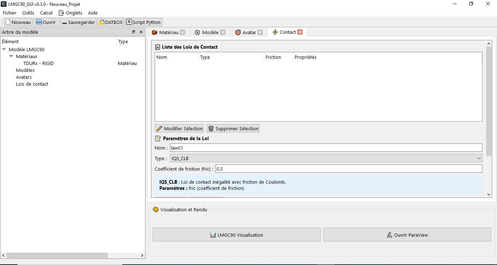

# Lois de Contact

Définition des interactions entre vos avatars.

## Lois disponibles
Liste de types d'inetractions qui sont implémentées : 
## Interactions Corps Rigide / Corps Rigide (rigid/rigid)
### Frottement sec classique
- IQS_CLB : Loi de Coulomb implicite quasi-statique
Paramètre : `fric` (coefficient de frottement constant)

- IQS_CLB_g0 : Loi de Coulomb avec gap initial
Paramètre : `fric`

- IQS_DS_CLB : Loi de Coulomb avec frottement dynamique/statique
Paramètres : `dyfr` (frottement dynamique), `stfr` (frottement statique)

- COUPLED_DOF (liaison parfaite)
### Lois cohésives               
   
- IQS_MOHR_DS_CLB : Loi de Mohr-Coulomb avec cohésion
Paramètres : `cohn`, `coht`, `dyfr`, `stfr `  
### Modèles de zones cohésives (CZM)
- IQS_MAC_CZM : Modèle cohésif de Mohr-Coulomb-Allix-Corigliano
Paramètres : `dyfr`, `stfr`, `cn`, `ct`, `b`, `w`           

### Câbles élastiques
- ELASTIC_WIRE : Câble élastique simple
Paramètres : `stiffness`, `prestrain`  

- ELASTIC_REPELL_CLB (barre élastique)
### Interactions Universelles (any/any)
#### Couplages cinématiques
- COUPLED_DOF : Couplage parfait (saut de vitesse nul)
Aucun paramètre

#### Lois de répulsion élastique
- ELASTIC_REPELL_CLB : Répulsion élastique de type Coulomb
Paramètres : `stiffness`, `fric`

## Exemple 
On va créer une loi de Coulomb avec un frottement de 0.3, pour cela il faut se rendre dans l'onglet "Contact", il faut ensuite choisir "IQS_CLB" comme type de loi de contact et de renseigner la valeur de 0.3 pour le frottement, on termine par cliquer sur le bouton "Créer Loi"

## Utilisation typique
- COUPLED_DOF pour joints mécaniques
- IQS_CLB pour contacts frottants

