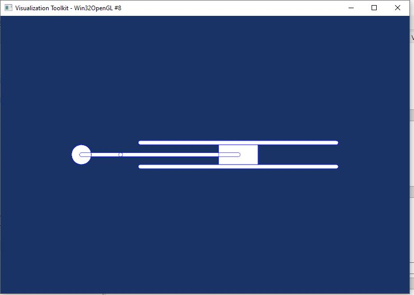

# Onglet DOF — Conditions aux limites

L'onglet **DOF** (`Ctrl+5`) permet d'appliquer des conditions aux limites mécaniques, thermiques ou initiales sur les avatars du projet. Chaque opération est enregistrée dans `state.operations`, appliquée immédiatement sur les objets pylmgc90 et exportée dans le script Python généré.

---

## Principe de fonctionnement

Une **opération DOF** (`DOFOperation`) est composée de :

| Champ | Description |
|-------|-------------|
| `operation_type` | Nature de l'opération : `translate`, `rotate`, `imposeDrivenDof`, `imposeInitValue` |
| `target_type` | Cible : `'avatar'` (index unique) ou `'group'` (nom de groupe) |
| `target_value` | Index de l'avatar (int) ou nom du groupe (str) |
| `parameters` | Dictionnaire de paramètres passé directement à la méthode pylmgc90 |

---

## Interface de l'onglet

L'onglet est organisé en deux zones :

- **Liste des opérations** (en haut) : tableau de toutes les opérations enregistrées avec leur type, cible et paramètres principaux. Double-clic pour éditer. Clic droit pour accéder au menu contextuel.
- **Formulaire de création / modification** (en bas) : champs qui s'adaptent dynamiquement au type d'opération choisi.

### Sélection de la cible

| Champ | Description |
|-------|-------------|
| **Type de cible** | `Avatar` (index numérique) ou `Groupe` (nom de groupe). |
| **Cible** | Si Avatar : index de l'avatar dans la liste (0-based). Si Groupe : liste déroulante de tous les groupes définis dans le projet (boucles, granulométrie, maçonnerie, etc.). |

> Tous les groupes créés dans les onglets Boucles, Granulométrie et Maçonnerie apparaissent automatiquement dans la liste des groupes disponibles.

---

## Les quatre opérations

---

### 1. `translate` — Déplacement rigide

Déplace tous les nœuds de l'avatar d'un vecteur de translation. Opération purement géométrique — n'impose pas de condition cinématique pour la simulation.

**Signature pylmgc90 :**
```python
avatar.translate(dx=0., dy=0., dz=0.)
```

**Paramètres :**

| Paramètre | Type | Défaut | Description |
|-----------|------|--------|-------------|
| `dx` | float | `0.0` | Translation selon l'axe X (m) |
| `dy` | float | `0.0` | Translation selon l'axe Y (m) |
| `dz` | float | `0.0` | Translation selon l'axe Z (m) — 3D uniquement |

**Exemple :**
```python
bodies[0].translate(dx=0.5, dy=0.0)
```

> La position de l'avatar dans `state.avatars` est resynchronisée automatiquement après la translation (`_sync_avatar_position`). Cela met à jour l'affichage dans l'arbre du modèle et le viewer 3D.

---

### 2. `rotate` — Rotation rigide

Applique une rotation à l'avatar autour d'un centre donné. Deux modes de description sont disponibles : angles d'Euler ou axe-angle.

**Signature pylmgc90 :**
```python
avatar.rotate(
    description='Euler',   # ou 'axis'
    phi=0., theta=0., psi=0.,   # angles d'Euler (rad) — mode Euler
    alpha=0.,                    # angle (rad) — mode axis
    axis=[0., 0., 1.],           # axe de rotation — mode axis
    center=[0., 0., 0.]          # centre de rotation (m)
)
```

**Paramètres communs :**

| Paramètre | Type | Défaut | Description |
|-----------|------|--------|-------------|
| `description` | str | `'Euler'` | Mode : `'Euler'` ou `'axis'` |
| `center` | list[3] | `[0., 0., 0.]` | Centre de rotation en coordonnées absolues (m) |

**Paramètres mode `'Euler'` :**

| Paramètre | Type | Défaut | Description |
|-----------|------|--------|-------------|
| `phi` | float | `0.0` | 1ᵉʳ angle d'Euler — rotation autour de Z (rad) |
| `theta` | float | `0.0` | 2ᵉ angle d'Euler — rotation autour de X (rad) |
| `psi` | float | `0.0` | 3ᵉ angle d'Euler — rotation autour de Z (rad) |

Les trois rotations sont appliquées successivement : d'abord `phi` autour de Z, puis `theta` autour de X, puis `psi` autour de Z.

**Paramètres mode `'axis'` :**

| Paramètre | Type | Défaut | Description |
|-----------|------|--------|-------------|
| `alpha` | float | `0.0` | Angle de rotation (rad) |
| `axis` | list[3] | `[0., 0., 1.]` | Vecteur directeur de l'axe de rotation |

**Exemples :**
```python
# Rotation de 90° autour de Z centré à l'origine (mode axis)
bodies[0].rotate(description='axis', alpha=1.5708, axis=[0., 0., 1.], center=[0., 0., 0.])

# Rotation d'Euler de 45° dans le plan XY
bodies[2].rotate(description='Euler', phi=0.7854, theta=0., psi=0., center=[1.0, 0.5, 0.])
```

> **Conseil :** pour les murs maçonnés, la rotation `'axis'` avec `axis=[0,0,1]` permet de créer des angles de bâtiment. L'angle est saisi en degrés dans l'interface et converti en radians automatiquement.

---

### 3. `imposeDrivenDof` — DDL piloté

Impose un degré de liberté **piloté** sur les nœuds d'un groupe de l'avatar. La valeur imposée peut être constante, sinusoïdale avec rampe, ou définie par un fichier d'évolution temporelle.

**Signature pylmgc90 :**
```python
avatar.imposeDrivenDof(
    group='all',
    component=1,
    description='predefined',
    dofty='vlocy',
    ct=0.,
    amp=0.,
    omega=0.,
    phi=0.,
    rampi=1.,
    ramp=0.,
    evolutionFile=''
)
```

**Paramètres :**

| Paramètre | Type | Défaut | Description |
|-----------|------|--------|-------------|
| `group` | str | `'all'` | Groupe de nœuds de l'avatar. `'all'` = tous les nœuds. Pour les corps déformables : `'down'`, `'up'`, `'left'`, `'right'`, `'front'`, `'rear'`. |
| `component` | int ou list | `1` | Composante(s) du DDL. Voir tableau ci-dessous. |
| `description` | str | `'predefined'` | Mode temporel : `'predefined'` (formule analytique) ou `'evolution'` (fichier). |
| `dofty` | str | `'vlocy'` | Type de DDL. Voir tableau ci-dessous. |
| `ct` | float | `0.0` | Valeur constante. |
| `amp` | float | `0.0` | Amplitude du cosinus. |
| `omega` | float | `0.0` | Pulsation angulaire (rad/s). |
| `phi` | float | `0.0` | Phase du cosinus (rad). |
| `rampi` | float | `1.0` | Valeur initiale de la rampe multiplicatrice. |
| `ramp` | float | `0.0` | Pente de la rampe (s⁻¹). |
| `evolutionFile` | str | `''` | Chemin vers un fichier d'évolution temporelle (`*.evol`). Utilisé si `description='evolution'`. |

#### Composantes (`component`)

| Valeur | Signification |
|--------|--------------|
| `1` | Translation selon X (ou DDL 1) |
| `2` | Translation selon Y (ou DDL 2) |
| `3` | Translation selon Z (ou DDL 3) — 3D uniquement |
| `[1, 2]` | X et Y simultanément (bloque le plan horizontal) |
| `[1, 2, 3]` | Blocage complet 3D |

#### Types de DDL (`dofty`)

| Physique | `dofty` | Description |
|----------|---------|-------------|
| **MECAx** | `'vlocy'` | Vitesse imposée (m/s) |
| **MECAx** | `'force'` | Force imposée (N) |
| **THERx** | `'temp'` | Température imposée (K ou °C selon convention) |
| **THERx** | `'flux'` | Flux thermique imposé (W/m²) |
| **POROx** | `'vlocy'` | Vitesse de filtration (m/s) |
| **POROx** | `'force'` | Pression imposée |
| **MULTI** | `'prim_'` | Variable primale (pression, température…) |
| **MULTI** | `'dual_'` | Variable duale (flux, force…) |

#### Formule générale (mode `'predefined'`)

La valeur imposée à l'instant `t` est :

```
f(t) = [ct + amp × cos(ω × t + φ)] × clamp(rampi + ramp × t)
```

où `clamp(x) = sign(x) × min(|x|, 1)` — la rampe est bornée à 1 pour éviter les amplifications non physiques.

| Scénario | Paramètres | Comportement |
|----------|------------|--------------|
| Bloqué (vitesse nulle) | `ct=0`, `dofty='vlocy'` | Nœuds fixes pendant toute la simulation |
| Déplacement constant | `ct=v0`, `dofty='vlocy'` | Vitesse constante `v0` m/s |
| Oscillation sinusoïdale | `amp=A`, `omega=ω`, `phi=φ` | v(t) = A × cos(ωt + φ) |
| Démarrage progressif | `ct=v0`, `rampi=0`, `ramp=1/t_rampe` | Montée linéaire de 0 à `v0` sur `t_rampe` secondes |
| Évolution quelconque | `description='evolution'`, `evolutionFile='monfichier.evol'` | Valeur interpolée depuis le fichier |

#### Exemples

```python
# Bloquer la base d'un maillage EF (vitesse nulle en X et Y)
mesh.imposeDrivenDof(group='down', component=[1, 2], dofty='vlocy', ct=0.)

# Imposer un déplacement vertical constant de 0.001 m/s
bodies[3].imposeDrivenDof(group='all', component=2, dofty='vlocy', ct=0.001)

# Oscillation sinusoïdale en X, fréquence 5 Hz, amplitude 0.01 m/s
bodies[5].imposeDrivenDof(
    group='all', component=1, dofty='vlocy',
    ct=0., amp=0.01, omega=31.416, phi=0.
)

# Chargement thermique depuis fichier d'évolution
mesh.imposeDrivenDof(
    group='up', component=1, dofty='temp',
    description='evolution', evolutionFile='temperature.evol'
)
```

---

### 4. `imposeInitValue` — Valeur initiale

Impose une **condition initiale** (position ou vitesse) sur les nœuds d'un groupe, uniquement à l'instant `t = 0`. N'impose aucune contrainte pendant le calcul.

**Signature pylmgc90 :**
```python
avatar.imposeInitValue(
    group='all',
    component=1,
    value=0.
)
```

**Paramètres :**

| Paramètre | Type | Défaut | Description |
|-----------|------|--------|-------------|
| `group` | str | `'all'` | Groupe de nœuds. |
| `component` | int ou list | `1` | Composante(s) du DDL (même convention que `imposeDrivenDof`). |
| `value` | float | `0.0` | Valeur initiale à imposer (m/s, m, K selon le type). |


> **Différence avec `imposeDrivenDof` :** `imposeInitValue` n'est actif qu'à `t = 0`. L'avatar est libre de se déplacer ensuite. `imposeDrivenDof` maintient la contrainte tout au long de la simulation.

---

## Gestion des opérations

### Créer une opération

Remplir le formulaire et cliquer sur **✅ Appliquer**. L'opération est appliquée immédiatement sur les objets pylmgc90 et sauvegardée dans `state.operations`. Le signal `operation_applied` est émis, déclenchant un rafraîchissement complet de l'interface et du viewer 3D.

### Modifier une opération

Double-cliquer sur une opération dans la liste ou sélectionner et cliquer sur **✏️ Modifier**. Le formulaire est chargé avec les valeurs de l'opération. Modifier et cliquer sur **💾 Enregistrer** pour mettre à jour (`update_dof_operation`). L'opération est réappliquée.

### Supprimer une opération

Sélectionner et cliquer sur **🗑️ Supprimer**. L'opération est retirée de `state.operations` (`remove_dof_operation`). Le signal `operation_deleted` est émis.

> **Attention :** la suppression d'une opération n'annule pas son effet sur les avatars (les translations et rotations déjà appliquées restent en place). Pour annuler une translation, créer une translation inverse.

---

## Support des groupes

La liste déroulante de groupes inclut automatiquement tous les groupes définis dans le projet :

| Source | Exemples de noms |
|--------|----------------|
| Boucles géométriques | `ma_ligne`, `anneau_particules` |
| Boucles `for` | nom saisi dans le formulaire de la boucle |
| Granulométrie | `granulo_box2d`, `granulo_couette2d` |
| Maçonnerie | `mur_briques`, `mur_facade` |
| Groupes DOF maillage EF | `down`, `up`, `left`, `right`, `front`, `rear` |

Appliquer une opération à un groupe exécute la même opération sur chaque avatar du groupe :

```python
# Exemple script généré pour un groupe :
for av in group_granulo_box2d:
    av.imposeDrivenDof(group='all', component=1, dofty='vlocy', ct=0.0)
```

---


## Exemple — Bielle-manivelle (`slider_crank.lmgc90`)

L'exemple fourni dans les exemples du projet illustre l'application de quatre conditions aux limites sur les avatars du mécanisme bielle-manivelle :



| Opération | Type | Cible | Paramètres typiques |
|-----------|------|-------|---------------------|
| Rotation de la manivelle | `imposeDrivenDof` | Avatar manivelle | `component=3, dofty='vlocy', ct=ω` |
| Blocage du coulisseau | `imposeDrivenDof` | Avatar coulisseau | `component=2, dofty='vlocy', ct=0.` |
| Pivot bielle-manivelle | `imposeInitValue` | Avatar bielle | `component=[1,2], value=0.` |
| Position initiale | `translate` | Avatar manivelle | `dx=x0, dy=y0` |


---

## Remarques importantes

**Ordre des opérations :** les opérations sont appliquées dans l'ordre où elles sont créées. Une translation suivie d'une rotation donne un résultat différent de la rotation suivie de la translation. L'ordre dans `state.operations` est respecté à la fois lors de l'application et dans le script généré.

**Annulation impossible :** `translate` et `rotate` modifient les coordonnées physiques des nœuds pylmgc90. Il n'existe pas de bouton Annuler — pour inverser, créer une opération opposée (translation inverse, rotation de signe opposé).

**`imposeDrivenDof` vs `imposeInitValue` :** utiliser `imposeDrivenDof` avec `ct=0` et `dofty='vlocy'` pour **bloquer** un DDL pendant la simulation. Utiliser `imposeInitValue` uniquement pour définir une **condition initiale** sans contrainte sur la durée.

**Fichiers d'évolution :** le fichier `.evol` doit être placé dans le répertoire `DATBOX/` du projet. Il contient deux colonnes : temps (s) et valeur, séparées par des espaces ou des tabulations. Le nombre de lignes doit couvrir toute la durée de simulation.

**Composantes pour les corps déformables :** pour les maillages EF, `component` accepte directement les entiers 1, 2, 3 (DDL de déplacement nodaux). Pour les corps rigides, `component=1` correspond à la translation en X, `component=2` en Y, `component=3` en Z. La composante de rotation est `component=4` (2D) ou 4-6 (3D) selon la physique.


