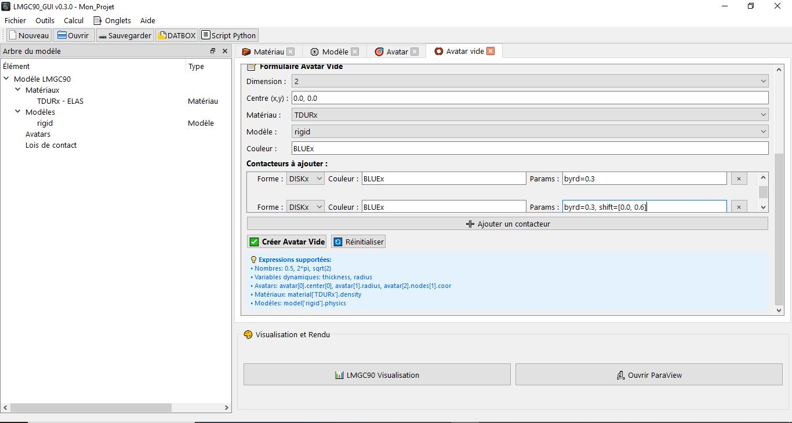

# Avatar Vide (Personnalisation avancée)

**Onglet Avatar vide** Permet de créer des **avatars à contacteurs personnalisés** : soit un corps vide (`emptyAvatar`) entièrement défini par ses contacteurs, soit l'ajout de contacteurs à un **corps déformable existant** (maillage FEM).  
C'est l'outil le plus flexible de LMGC90_GUI pour les cas avancés qui ne rentrent pas dans les types d'avatars rigides standards.



---

## Deux modes de fonctionnement

Le champ **Mode** en haut du formulaire bascule entre deux comportements distincts :

| Mode | Description |
|------|-------------|
| **Avatar vide (emptyAvatar)** | Crée un nouveau corps pylmgc90 entièrement assemblé à partir de ses contacteurs. Le corps est rigide mais sa géométrie est définie manuellement. |
| **Corps déformable existant** | Ajoute des contacteurs de contact sur un corps déformable (maillage FEM) déjà créé via l'assistant de maillage. Appelle `body.addContactors()` directement sur l'objet pylmgc90. |

---

## Mode 1 — Avatar vide (emptyAvatar)

### Principe

Un avatar vide est un corps rigide dont la géométrie n'est pas prédéfinie. pylmgc90 l'assemble en trois étapes :

1. Création d'un corps vide `pre.avatar(dimension=…)`
2. Ajout d'un bulk rigide `pre.rigid2d()` ou `pre.rigid3d()`
3. Ajout d'un nœud principal et des **contacteurs** qui définissent la forme

Les propriétés inertielles (masse, moment d'inertie) sont calculées automatiquement depuis la géométrie des contacteurs via `body.computeRigidProperties()`.

### Champs du formulaire

| Champ | Description |
|-------|-------------|
| **Dimension** | `2` ou `3`. Détermine la liste de formes de contacteurs disponibles et le format du centre. |
| **Centre (x,y) ou (x,y,z)** | Coordonnées du nœud principal de référence. Accepte les expressions Python. |
| **Matériau** | Matériau de type `RIGID` assigné au corps. |
| **Modèle** | Modèle avec élément `Rxx2D` (2D) ou `Rxx3D` (3D). |
| **Couleur** | Couleur pour l'interaction LMGC90 (5 caractères), n'est pas très importante. |

---

## Mode 2 — Corps déformable existant

### Principe

Ce mode ne crée pas de nouvel avatar — il enrichit un corps déformable (maillage FEM) déjà présent dans le projet en lui ajoutant des contacteurs de surface. Cela est nécessaire pour que le corps déformable puisse interagir avec d'autres corps (rigides ou déformables).

La fonction appelée sur l'objet pylmgc90 est : `body.addContactors(shape=…, color=…, **params)`.

### Champs spécifiques à ce mode

| Champ | Description |
|-------|-------------|
| **Corps déformable** | Liste déroulante des corps de type `MESH_DEFORMABLE` présents dans le projet. Le format affiché est `#index — géométrie (matériau/modèle)`. |
| **Groupe (group=)** | Paramètre `group` passé à `addContactors()`. Détermine sur quel groupe de nœuds du maillage le contacteur est appliqué (ex : `102` pour le groupe d'index 102). Laisser vide pour appliquer sur tous les nœuds. |

> **Important :** le corps déformable doit avoir été créé et reconstruit en mémoire (présent dans `_pylmgc_bodies`) avant d'ajouter des contacteurs. Si le projet vient d'être chargé depuis un fichier JSON sans reconstruction, le corps pylmgc90 n'existe pas encore en mémoire et l'ajout de contacteurs échouera.

---

## Gestion des contacteurs

Chaque ligne de la liste **Contacteurs à ajouter** correspond à un appel `body.addContactors()`. Cliquer sur **➕ Ajouter un contacteur** pour créer une nouvelle ligne. Cliquer sur **×** pour supprimer une ligne.

### Colonnes d'une ligne de contacteur

| Colonne | Description |
|---------|-------------|
| **Forme** | Type de contacteur pylmgc90. La liste s'adapte au mode (avatar vide ou déformable) et à la dimension. |
| **Couleur** | Couleur du contacteur (5 caractères LMGC90). Indépendante de la couleur du corps, mais très importante pour la détection de contact |
| **Params** | Paramètres géométriques du contacteur au format `cle=valeur, cle=valeur`. Rempli automatiquement avec une suggestion selon la forme choisie. |

---

## Formes de contacteurs disponibles

### Avatar vide 2D — `shapes_2d`

| Forme | Description | Paramètres | Suggestion par défaut |
|-------|-------------|------------|-----------------------|
| `DISKx` | Disque 2D | `byrd` = rayon | `byrd=0.3` |
| `xKSID` | Disque discret 2D | `byrd` = rayon | `byrd=0.3` |
| `JONCx` | Jonc / ellipse 2D | `axe1` = demi-axe long, `axe2` = demi-axe court | `axe1=1.0, axe2=0.1` |
| `POLYG` | Polygone 2D | `nb_vertices` = nombre de sommets, `vertices` = liste `[[x,y],…]` | `nb_vertices=4, vertices=[[-1.,-1.],[1.,-1.],[1.,1.],[-1.,1.]]` |
| `PT2Dx` | Nœud ponctuel 2D (FEM) | aucun | *(vide)* |

### Avatar vide 3D — `shapes_3d`

| Forme | Description | Paramètres | Suggestion par défaut |
|-------|-------------|------------|-----------------------|
| `SPHER` | Sphère 3D | `byrd` = rayon | `byrd=0.3` |
| `PLANx` | Plan 3D | `axe1`, `axe2`, `axe3` = dimensions des axes | `axe1=1.0, axe2=1.0, axe3=0.1` |
| `CYLND` | Cylindre 3D | `byrd` = rayon, `High` = hauteur | `byrd=0.5, High=1.0` |
| `DNLYC` | Cylindre creux 3D | `byrd` = rayon, `High` = hauteur | `byrd=0.5, High=1.0` |
| `POLYR` | Polyèdre 3D | `nb_vertices` = nombre de sommets, `vertices` = liste `[[x,y,z],…]` | `nb_vertices=8, vertices=[[−1,−1,−1],[1,−1,−1],…]` |
| `PT3Dx` | Nœud ponctuel 3D (FEM) | aucun | *(vide)* |

### Corps déformable 2D — `mesh_shapes_2d`

Ces formes sont destinées à être ajoutées sur un maillage FEM 2D. Elles définissent des contacteurs de surface pour les interactions rigide-déformable.

| Forme | Description | Usage |
|-------|-------------|-------|
| `ALpxx` | Contacteur ligne pour maçonnerie FEM 2D | Interactions `ALpMECAx` (CLALp / MECAx) |
| `CLxx` | Contacteur ligne continu 2D | Interactions `DKMECAx` (disque / MECAx) |
| `DISKL` | Disque sur nœud FEM 2D | Interaction disque-disque sur maillage |
| `PT2TL` | Point de transmission 2D | Couplage nœud-nœud FEM |

### Corps déformable 3D — `mesh_shapes_3d`

| Forme | Description | Usage |
|-------|-------------|-------|
| `ASpxx` | Contacteur surface pour sphères FEM 3D | Interactions `SPMECAx` (sphère / MECAx 3D) |
| `CSpxx` | Contacteur surface continu 3D | Interactions rigide-déformable 3D génériques |
| `PT3Dx` | Nœud ponctuel FEM 3D | Couplage nœud-nœud FEM 3D |

---

## Détails des paramètres par forme

### DISKx / xKSID / SPHER — Disque, disque discret, sphère

```
byrd=0.3
```

| Paramètre | Description |
|-----------|-------------|
| `byrd` | Rayon du contacteur (m). Correspond au rayon de contact utilisé dans les détecteurs. |

---

### JONCx — Jonc / Ellipse 2D

```
axe1=1.0, axe2=0.1
```

| Paramètre | Description |
|-----------|-------------|
| `axe1` | Demi-axe principal (m) — axe long de l'ellipse. |
| `axe2` | Demi-axe secondaire (m) — axe court de l'ellipse. |

---

### POLYG — Polygone 2D

```
nb_vertices=4, vertices=[[-1.,-1.],[1.,-1.],[1.,1.],[-1.,1.]]
```

| Paramètre | Description |
|-----------|-------------|
| `nb_vertices` | Nombre de sommets du polygone. |
| `vertices` | Liste des coordonnées locales des sommets `[[x1,y1],[x2,y2],…]`. Les coordonnées sont relatives au centre du corps. Les sommets doivent être dans l'ordre trigonométrique (anti-horaire). |

---

### PLANx — Plan 3D

```
axe1=1.0, axe2=1.0, axe3=0.1
```

| Paramètre | Description |
|-----------|-------------|
| `axe1` | Dimension selon le premier axe du plan (m). |
| `axe2` | Dimension selon le deuxième axe du plan (m). |
| `axe3` | Épaisseur du plan (m) — utilisée pour le calcul des propriétés inertielles. |

---

### CYLND / DNLYC — Cylindre 3D

```
byrd=0.5, High=1.0
```

| Paramètre | Description |
|-----------|-------------|
| `byrd` | Rayon du cylindre (m). |
| `High` | Hauteur (longueur axiale) du cylindre (m). Notez la majuscule. |

---

### POLYR — Polyèdre 3D

```
nb_vertices=8, vertices=[[-1.,-1.,-1.],[1.,-1.,-1.],[1.,1.,-1.],[-1.,1.,-1.],
                          [-1.,-1.,1.],[1.,-1.,1.],[1.,1.,1.],[-1.,1.,1.]]
```

| Paramètre | Description |
|-----------|-------------|
| `nb_vertices` | Nombre de sommets du polyèdre. |
| `vertices` | Liste des coordonnées 3D de chaque sommet `[[x,y,z],…]`. Coordonnées locales relatives au centre. |

> Pour un polyèdre convexe, les sommets peuvent être fournis dans n'importe quel ordre — pylmgc90 calcule l'enveloppe convexe. Pour un polyèdre non convexe, l'ordre des faces doit être cohérent.

---

### PT2Dx / PT3Dx — Nœuds ponctuels

Aucun paramètre. Ces contacteurs représentent un point de contact en un nœud.

```
(champ Params vide)
```

---

## Exemples complets

### Avatar vide 2D — corps polygonal à 6 sommets

```
Mode      : Avatar vide (emptyAvatar)
Dimension : 2
Centre    : 0.0, 0.5
Matériau  : BRIQx
Modèle    : rigid
Couleur   : REDxx

Contacteur 1 :
  Forme  : POLYG
  Couleur: REDxx
  Params : nb_vertices=6, vertices=[[-0.1,-0.05],[0.1,-0.05],[0.15,0.0],
                                    [0.1,0.05],[-0.1,0.05],[-0.15,0.0]]
```

---

### Avatar vide 3D — corps avec sphère et cylindre

```
Mode      : Avatar vide (emptyAvatar)
Dimension : 3
Centre    : 0.0, 0.0, 0.5
Matériau  : ACIER
Modèle    : rig3D
Couleur   : CYANx

Contacteur 1 :
  Forme  : SPHER
  Couleur: CYANx
  Params : byrd=0.2

Contacteur 2 :
  Forme  : CYLND
  Couleur: GRAYx
  Params : byrd=0.05, High=0.8
```

---

### Ajout de contacteurs à un corps déformable

```
Mode             : Corps déformable existant
Corps déformable : #3 — Rectangle (beton/MECAx)
Groupe (group=)  : 102

Contacteur 1 :
  Forme  : CLxx
  Couleur: BLUEx
  Params : (vide)
```

---

## Interface — liste des avatars vides

La liste en haut de l'onglet affiche uniquement les avatars de type `EMPTY_AVATAR`. Les colonnes sont :

| Colonne | Description |
|---------|-------------|
| `#` | Index de l'avatar dans la liste globale des avatars du projet. |
| `Couleur` | Code couleur LMGC90 du corps. |
| `Centre` | Coordonnées du centre de référence arrondies à 2 décimales. |
| `Contacteurs` | Nombre de contacteurs définis sur ce corps. |

**Menu contextuel (clic droit) :**
- **✏️ Modifier** — charge l'avatar dans le formulaire pour édition.
- **🗑️ Supprimer** — supprime l'avatar après confirmation. Refusé si l'avatar est référencé par une boucle ou un groupe.
- **ℹ️ Informations** — affiche une boîte de dialogue avec le détail de tous les contacteurs.

---

## Remarques importantes

**Un avatar vide nécessite au moins un contacteur.** La création est refusée si la liste de contacteurs est vide.

**Contacteurs multiples.** Un avatar vide peut avoir autant de contacteurs que nécessaire, de formes différentes. Chaque contacteur génère une ligne `body.addContactors(…)` distincte dans le script.
