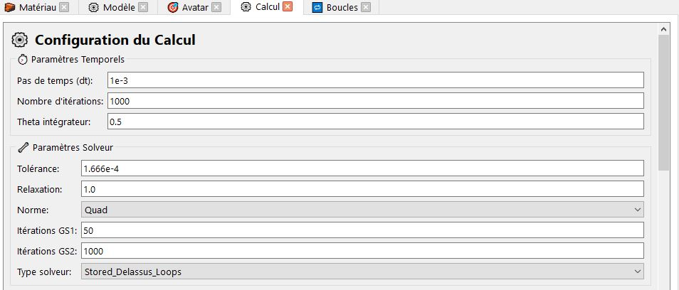
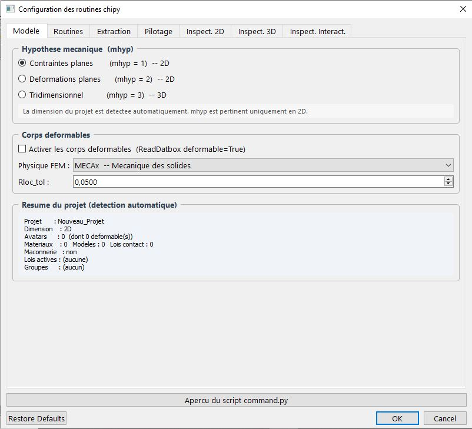
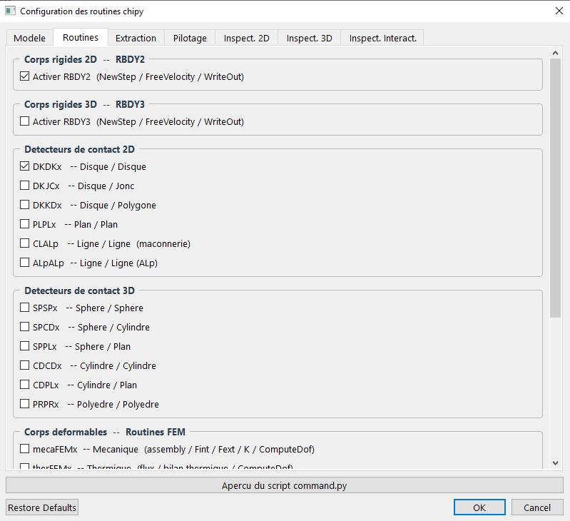
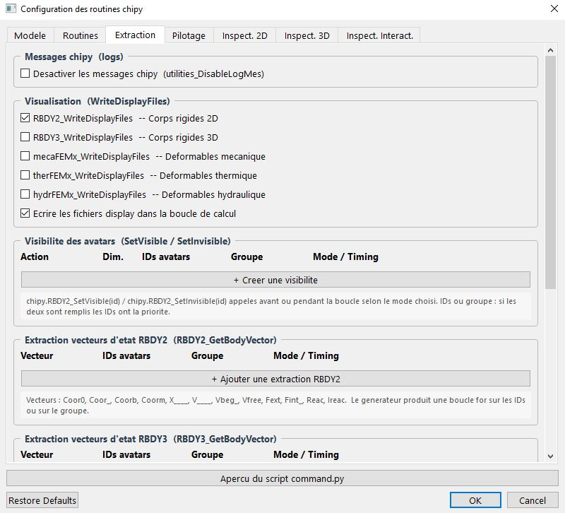
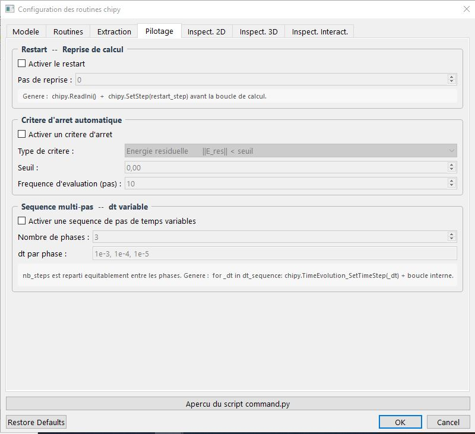
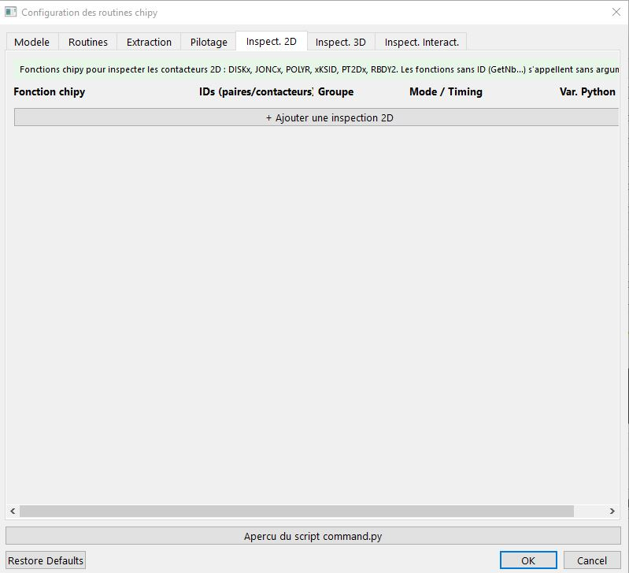
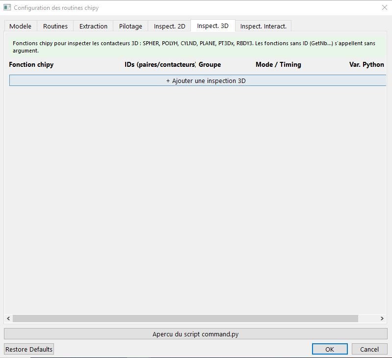
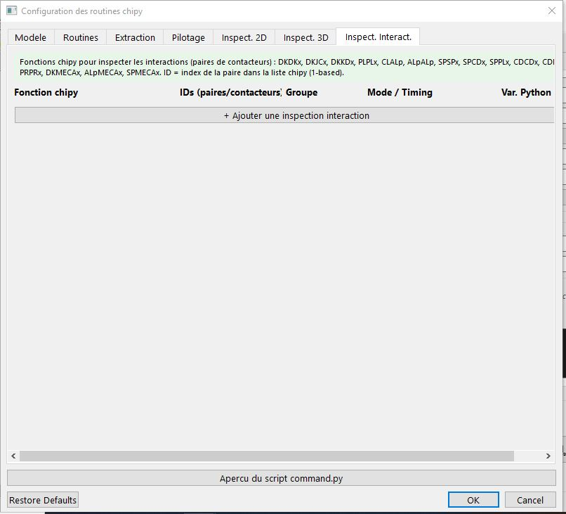

# Calcul

## Vue d'ensemble

L'onglet `calcul` gère la configuration et le lancement des simulations LMGC90. Il génère automatiquement le DATBOX et le script `command.py`, puis exécute ce script.
## Paramètres de calcul

| Paramètre | Champ UI | Valeur par défaut | Description |
|---|---|---|---|
| `dt` | Pas de temps | `1e-3` | Incrément temporel |
| `nb_steps` | Nombre d'itérations | `1000` | Nombre de pas de calcul |
| `theta` | Theta intégrateur | `0.5` | Paramètre du schéma d'intégration |
| `tol` | Tolérance | `1.666e-4` | Tolérance de convergence du solveur |
| `relax` | Relaxation | `1.0` | Facteur de relaxation |
| `norm` | Norme | `Quad ` | Norme de convergence (`Quad `, `QM   `, `Maxim`) |
| `gs_it1` | Itérations GS1 | `50` | Nombre d'itérations Gauss-Seidel (boucle externe) |
| `gs_it2` | Itérations GS2 | `100` | Nombre d'itérations Gauss-Seidel (boucle interne) |
| `solver_type` | Solveur | `NLGS` | Type de solveur (`Stored_Delassus_Loops`, `Exchange_Local_Global`, `Exchange_Local_Global` ) |
| `freq_write` | Fréquence écriture | `50` | Écriture des résultats tous les N pas |
| `freq_display` | Fréquence affichage | `50` | Mise à jour affichage tous les N pas |

## Fichiers générés au lancement d'un calcul

| Fichier | Emplacement | Description |
|---|---|---|
| `DATBOX/` | Dossier du projet | Données d'entrée LMGC90 |
| `command.py` | Dossier du projet | Script de calcul chipy |
| `OUTBOX/` | Dossier du projet | Résultats (créé par LMGC90) |
| `Display/` | Dossier du projet | Fichiers d'affichage |
| `Postpro/` | Dossier du projet | Fichiers post-traitement |

### Paramétrer vos calculs 
Il est possible de paramétrer vos scripts calculs via au bouton "Configurer les routines chipy", une boite de dialogue s'ouvrira sur votre interface, 

#### 1.Onglet Modèle 
Le premier onglet fait l'objet d'une détéection automatique sur l'hypothèse de votre modèle, et charge tous les paramètres se lon vos avatars, 

|Contraintes planes (mhyp = 1)	|Calcul 2D en état plan de contraintes. Pertinent pour les structures minces.
| --- | ------- |
|Déformations planes (mhyp = 2)	|Calcul 2D en état plan de déformations. Pertinent pour les structures infiniment longues en z.|
|Tridimensionnel (mhyp = 3)	|Calcul 3D complet.|

##### Corps déformables 
|Activer les corps déformables	|Génère ReadDatbox(deformable=True) dans le script. Active automatiquement mecaFEMx si la physique est MECAx.|
|----|--------|
|Physique FEM	|Détermine le solveur éléments finis utilisé : MECAx (mécanique des solides), THERx (thermique), HYDRx (hydraulique), ou THMx (thermo-hydraulique-mécanique couplé).|
|Rloc_tol	|Tolérance sur les efforts de contact pour la reprise de Rloc. Valeur typique : 5 × 10⁻². Utilisée dans chipy.SetRlocTol().|

#### 2.Routines
Cet onglet sélectionne les routines chipy à inclure dans la boucle de calcul. Chaque case à cocher correspond à un appel de la famille NewStep / ComputeStep / WriteOut dans le script généré.

**Corps rigides 2D — RBDY2**

–	RBDY2 (NewStep / FreeVelocity / WriteOut) — coché par défaut. Routines obligatoires pour tout corps rigide 2D. Génère RBDY2_NewStep(), RBDY2_FreeVelocity(), RBDY2_WriteOut() dans la boucle.

**Corps rigides 3D — RBDY3**

–	RBDY3 (NewStep / FreeVelocity / WriteOut) — déclenche les routines équivalentes en 3D.

**Détecteurs de contact 2D**

Chaque case active la détection de contact entre une paire de types de contacteurs. Le script génère XXX_SelectProxTactors() et XXX_RecupRloc() / XXX_StockRloc() correspondants.
|Détecteur	|Description|
|---|-----|
|`DKDKx`	|Disque / Disque (coché par défaut) — granulométrie 2D, milieux granulaires|
|`DKJCx`	|Disque / Jonc — particules avec ellipses|
|`DKKDx`	|Disque / Polygone (Corde) — interaction disque-paroi polygonale|
|`PLPLx`	|Plan / Plan — parois planes entre elles|
|`CLALp`	|Ligne / Ligne maçonnerie — interfaces entre briques (CLALp)|
|`ALpALp`	|Ligne / Ligne ALp — variante pour contacteurs polygonaux|

**Détecteurs de contact 3D**
|Détecteur	|Description|
|---|-----|
|SPSPx	|Sphère / Sphère — granulométrie 3D|
|SPCDx	|Sphère / Cylindre|
|SPPLx	|Sphère / Plan|
|CDCDx	|ylindre / Cylindre|
|CDPLx	|Cylindre / Plan|
|PRPRx	|Polyèdre / Polyèdre|

**Corps déformables — Routines FEM**

–	mecaFEMx — Mécanique des solides : assemblage, calcul des forces internes (Fint), forces externes (Fext), matrice de rigidité (K) et résolution (ComputeDof).

–	therFEMx — Thermique : flux thermique, bilan d'énergie thermique, résolution ComputeDof.

–	hydrFEMx — Hydraulique : pression hydraulique, flux fluide, résolution ComputeDof.

**Contacteurs mixtes — Rigide / Déformable**

–	DKMECAx — Interaction entre disques rigides (2D) et maillages mécaniques (MECAx FEM 2D).

–	ALpMECAx — Interaction entre interfaces de maçonnerie (CLALp) et maillages mécaniques FEM 2D. Utile pour les simulations 
de structures maçonnées avec blocs déformables.

–	SPMECAx — Interaction entre sphères rigides (3D) et maillages mécaniques FEM 3D.

**Routines spéciales**

–	PT2Dx — Nœuds ponctuels 2D : interaction point/point pour les éléments câbles (ELASTIC_WIRE) et barres élastiques (ELASTIC_ROD).

–	PT3Dx — Équivalent 3D de PT2Dx.

–	NODES — Nœuds couplés : routines de couplage de degrés de liberté (COUPLED_DOF, NORMAL_COUPLED_DOF).

–	UpdateBulkBehav — Lois de comportement volumique : génère chipy.UpdateBulkBehav() pour les modèles avec plasticité, endommagement ou variables d'histoire.

#### 3.Extraction
Cet onglet configure toutes les sorties du calcul : fichiers de visualisation, visibilité des avatars, extraction de vecteurs d'état, forces de contact, énergie et champs FEM.

**Messages chipy (logs)**

–	Désactiver les messages chipy (utilities_DisableLogMes) — Génère chipy.utilities_DisableLogMes() immédiatement après chipy.Initialize(). Supprime tous les messages de progression dans la console. Recommandé pour les calculs en production ou de longue durée.

**Visualisation (WriteDisplayFiles)**

Contrôle l'écriture des fichiers de visualisation vers le répertoire DISPLAY/. Chaque case correspond à une famille d'avatars :
–	RBDY2_WriteDisplayFiles — Corps rigides 2D (coché par défaut).
–	RBDY3_WriteDisplayFiles — Corps rigides 3D.
–	mecaFEMx_WriteDisplayFiles — Maillages déformables mécaniques.
–	therFEMx_WriteDisplayFiles — Maillages déformables thermiques.
–	hydrFEMx_WriteDisplayFiles — Maillages déformables hydrauliques.
–	Écrire les fichiers display dans la boucle — Si coché, les fichiers sont écrits à chaque pas (ou à la fréquence définie). Si décoché, un seul fichier est écrit à la fin du calcul.

**Visibilité des avatars (SetVisible / SetInvisible)**

Permet d'afficher ou de masquer des avatars individuellement ou par groupe à des moments précis de la simulation. Chaque ligne de la liste correspond à une règle de visibilité.
Pour créer une règle, cliquer sur « + Créer une visibilité ». Chaque ligne contient :

|Action	|SetVisible ou SetInvisible — rend l'avatar visible ou invisible dans chipy.|
|---|-----|
|Dim.	|2D (RBDY2) ou 3D (RBDY3) — détermine le préfixe de la fonction générée.|
|IDs avatars	|Liste d'identifiants séparés par des virgules (ex. : 1, 3, 5). Prioritaire sur le groupe si les deux sont renseignés.|
|Groupe	|Nom d'un groupe d'avatars défini dans le projet. Résolu en liste d'IDs à la génération.|
|Mode / Timing	|Détermine quand l'appel est généré (voir tableau des modes ci-dessous).|

**Modes de temporisation (Timing)**

Modes de temporisation (Timing)

|Mode	|Condition générée	|Usage typique|
|---|---|---|
|Tous les pas	|Aucune condition (appel direct)	|Extraction systématique, bilan énergétique continu|
Tous les N pas	|if k % N == 0:	|Réduire la fréquence d'écriture pour alléger les sorties|
|Au pas k =	|if k == K:	|Événement ponctuel : changer la visibilité à un pas précis|
|Après boucle	|Hors de la boucle (après for k ...)	|État final uniquement, post-traitement en fin de calcul|

**Extraction de vecteurs d'état RBDY2 (RBDY2_GetBodyVector)**

Génère des appels à `chipy.RBDY2_GetBodyVector(vecteur, id)` dans la boucle de calcul. Pour chaque ligne ajoutée via « + Ajouter une extraction RBDY2 », configurer :

|Vecteur	|Nom du vecteur d'état à extraire (voir liste complète ci-dessous).|
|---|------|
|IDs avatars	|Liste d'IDs séparés par des virgules. Si renseigné, génère une boucle for sur ces IDs.|
|Groupe	|Groupe d'avatars à parcourir. Priorité inférieure aux IDs si les deux sont renseignés.|
|Mode / Timing	|Un des quatre modes de temporisation décrits ci-dessus.|

Vecteurs disponibles :
|Nom	|Description|
|---|----|
|Coor0	|Position de référence (configuration initiale)|
|Coor_	|Position courante|
|Coorb	|Position au pas précédent|
|Coorm	|Position moyenne entre deux pas|
|X____	|Déplacement total accumulé|
|V____	|Vitesse courante (linéaire et angulaire)|
|Vbeg_	|Vitesse en début de pas|
|Vfree	|Vitesse libre (avant résolution du contact)|
|Fext_	|Forces et moments extérieurs appliqués|
|Fint_	|Forces et moments internes|
|Reac_	|Résultante des réactions de contact|
|Ireac	|Impulsions de réaction de contact|

**Forces et réactions de contact**

–	Forces nodales (inter_handler_Rnod) — Extrait les forces nodales aux points de contact et les écrit dans POSTPRO/.
–	Vitesses locales (inter_handler_Vloc) — Extrait les vitesses relatives dans le repère local de contact.
–	Forces locales (inter_handler_Rloc) — Extrait les impulsions/forces dans le repère local de contact.

**Énergie**

–	Bilan énergétique global (ComputeEnergy + WriteEnergy) — Calcule et écrit l'énergie cinétique, potentielle et dissipée par frottement.
–	Énergie cinétique RBDY2 (RBDY2_KineticEnergy) — Écrit l'énergie cinétique de chaque corps rigide 2D séparément.

**Champs FEM (contraintes, déformations, température…)**

–	Champs par élément (mecaFEMx_WriteBodies) — Écrit les champs par élément : contraintes et déformations (MECAx), température (THERx), pression (HYDRx).
–	Variables internes (mecaFEMx_WriteInternalVariables) — Écrit les variables internes aux points de Gauss : plasticité, endommagement, variables d'histoire.

### 4.Pilotage

Cet onglet contrôle des fonctions avancées du déroulement du calcul : reprise depuis un état sauvegardé, arrêt anticipé sur critère de convergence et séquençage multi-pas.

**Restart — Reprise de calcul**
Permet de reprendre un calcul à partir d'un état précédemment sauvegardé dans les fichiers .dat.last.

|Activer le restart	|Génère chipy.ReadIni() puis chipy.SetStep(restart_step) avant la boucle de calcul.|
|---|--------|
|Pas de reprise	|Numéro du pas de temps à partir duquel reprendre (entier, de 0 à 9 999 999).|

**Critère d'arrêt automatique**

Interrompt la boucle de calcul avant la fin du nombre de pas prévu si un critère de convergence est satisfait.

|Activer un critère d'arrêt	|Active le mécanisme d'arrêt anticipé. Génère une condition break dans la boucle for k.|
|----|---------|
|Type de critère	|Trois types disponibles : résidu d'énergie (‖E_res‖ < seuil), déplacement maximum (max|u| < seuil), résidu de force (‖F_res‖ < seuil).|
|Seuil	|Valeur numérique du critère d'arrêt (de 10⁻¹⁶ à 1,0). Valeur par défaut : 10⁻⁶.|
|Fréquence d'évaluation	|Évaluer le critère tous les N pas. Évite un calcul du critère à chaque itération, ce qui peut être coûteux.|

**Séquence multi-pas — dt variable**

Permet de définir plusieurs phases de calcul avec des pas de temps différents. Utile pour les calculs avec chargements progressifs ou pour affiner le pas de temps à l'approche d'un événement critique.

|Activer une séquence multi-pas	|Génère une boucle externe sur les phases : for _dt in dt_sequence: chipy.TimeEvolution_SetTimeStep(_dt) + boucle interne.|
|----|-------|
|Nombre de phases	|Entre 2 et 20 phases. Le nombre total de pas (nb_steps) est réparti équitablement entre les phases.|
|dt par phase	|Liste de valeurs de dt séparées par des virgules, une par phase (ex. : 1e-3, 1e-4, 1e-5).|

### 5. Inspection 2D

Cet onglet permet d'ajouter des appels d'inspection sur les contacteurs 2D du modèle. Chaque ligne correspond à un appel chipy.XXXX_GetYYYY() inséré dans la boucle de calcul ou après celle-ci.

Cliquer sur « + Ajouter une inspection 2D » pour créer une ligne. Chaque ligne contient cinq colonnes :

|Fonction chipy	|Sélection dans la liste déroulante des fonctions disponibles pour les contacteurs 2D. La description s'affiche dans l'infobulle.|
|---|------|
|IDs (contacteurs)	|Liste d'identifiants chipy séparés par des virgules. Laissé vide pour les fonctions de type GetNb... qui ne prennent pas d'argument.|
|Groupe	|Nom d'un groupe d'avatars. Résolu en IDs à la génération si les IDs sont vides.|
|Mode / Timing	|Un des quatre modes de temporisation (Avant la boucle, Tous les N pas, Au pas k =, Après boucle). _depuis(v0.4.9)_|
|Var. Python	|Nom de la variable Python dans laquelle stocker le résultat (ex. : vel_disk). Laissé vide si le résultat n'est pas réutilisé.|

**Fonctions disponibles — Contacteurs 2D**

Les fonctions sont regroupées par type de contacteur :

`DISKx — Disques rigides 2D`
–	DISKx_GetNbDISKx — Nombre total de contacteurs DISKx (pas d'ID requis).
–	DISKx_GetBodyId(i) — ID du corps RBDY2 auquel appartient le contacteur i.
–	DISKx_GetPtrDISKx2BDYTY(i) — Index local du contacteur dans son corps RBDY2.
–	DISKx_GetPtrTactBehav(i) — Loi de comportement de contact associée au contacteur i.
–	DISKx_GetRadius(i) — Rayon du disque i.
–	DISKx_GetCoor(i) — Coordonnées du centre du disque i.
–	DISKx_GetVelocity(i) — Vitesse du centre du disque i.

`JONCx — Joncs / Ellipses 2D`
–	JONCx_GetNbJONCx — Nombre total de contacteurs JONCx.
–	JONCx_GetBodyId(i), JONCx_GetPtrJONCx2BDYTY(i), JONCx_GetPtrTactBehav(i) — Identification.
–	JONCx_GetAxes(i) — Demi-axes (a, b) du jonc i.
–	JONCx_GetCoor(i) — Coordonnées du centre du jonc i.

`POLYR — Polygones rigides 2D`
–	POLYR_GetNbPOLYR — Nombre total de contacteurs POLYR.
–	POLYR_GetBodyId(i), POLYR_GetPtrPOLYR2BDYTY(i), POLYR_GetPtrTactBehav(i) — Identification.
–	POLYR_GetNbVerti(i) — Nombre de sommets du polygone i.
–	POLYR_GetVerti(i) — Coordonnées de tous les sommets du polygone i.
–	POLYR_GetCoor(i) — Coordonnées du centre de référence du polygone i.

`xKSID — Clusters de disques discrets 2D`
–	xKSID_GetNbxKSID, xKSID_GetBodyId(i), xKSID_GetPtrxKSID2BDYTY(i), xKSID_GetRadius(i).

`RBDY2 — Corps rigides 2D (synthèse)`
–	RBDY2_GetNbRBDY2 — Nombre total de corps rigides 2D.
–	RBDY2_KineticEnergy — Énergie cinétique totale de tous les corps RBDY2.

`PT2Dx — Nœuds contacteurs FEM 2D`
–	PT2Dx_GetNbPT2Dx — Nombre de nœuds contacteurs FEM 2D.
–	PT2Dx_GetBodyId(i) — ID du corps FEM parent.
–	PT2Dx_GetCoor(i) — Coordonnées du nœud contacteur i.

### 6. Inspection 3D

Fonctionnement identique à l'onglet Inspection 2D, mais pour les contacteurs 3D. Les familles disponibles sont :

`SPHER — Sphères rigides 3D`
–	SPHER_GetNbSPHER, SPHER_GetBodyId(i), SPHER_GetPtrSPHER2BDYTY(i), SPHER_GetPtrTactBehav(i).
–	SPHER_GetRadius(i) — Rayon de la sphère i.
–	SPHER_GetCoor(i), SPHER_GetVelocity(i) — Position et vitesse.

`POLYH — Polyèdres rigides 3D`
–	POLYH_GetNbPOLYH, POLYH_GetBodyId(i), POLYH_GetPtrPOLYH2BDYTY(i), POLYH_GetPtrTactBehav(i).
–	POLYH_GetNbFaces(i), POLYH_GetNbVerti(i), POLYH_GetVerti(i) — Géométrie.
–	POLYH_GetCoor(i) — Coordonnées du centre de référence.

`CYLND — Cylindres rigides 3D`
–	CYLND_GetNbCYLND, CYLND_GetBodyId(i), CYLND_GetPtrCYLND2BDYTY(i), CYLND_GetPtrTactBehav(i).
–	CYLND_GetRadius(i), CYLND_GetLength(i), CYLND_GetCoor(i).

`PLANE — Plans rigides 3D`
–	PLANE_GetNbPLANE, PLANE_GetBodyId(i), PLANE_GetNormal(i), PLANE_GetCoor(i).

`RBDY3 et PT3Dx`
–	RBDY3_GetNbRBDY3 — Nombre total de corps rigides 3D.
–	PT3Dx_GetNbPT3Dx, PT3Dx_GetBodyId(i), PT3Dx_GetCoor(i) — Nœuds contacteurs FEM 3D.

### 7. Inespection des interactions 

Cet onglet inspecte les paires de contacteurs actives (interactions en cours de simulation). L'ID utilisé est l'index de la paire dans la liste chipy (numérotation 1-based).

Les fonctions sont regroupées par type d'interaction :

``DKDKx — Disque / Disque``
–	DKDKx_GetNbDKDKx — Nombre de paires actives.
–	DKDKx_GetBodyIds(i) — IDs RBDY2 des deux corps de la paire i.
–	DKDKx_GetTactors(i) — IDs des deux contacteurs DISKx de la paire i.
–	DKDKx_GetGapTT(i) — Jeu (gap) de la paire i.
–	DKDKx_GetStatusTT(i) — Statut de contact : 0 = pas de contact, 1 = contact actif.
–	DKDKx_GetRlocTT(i) — Réaction locale (Rn, Rt) dans le repère local de contact.
–	DKDKx_GetVlocTT(i) — Vitesse locale relative (Vn, Vt).

``DKJCx — Disque / Jonc``
–	DKJCx_GetNbDKJCx, DKJCx_GetBodyIds(i), DKJCx_GetTactors(i), DKJCx_GetGapTT(i), DKJCx_GetStatusTT(i), DKJCx_GetRlocTT(i).

``DKKDx — Disque / Corde (Polygone)``
–	DKKDx_GetNbDKKDx, DKKDx_GetBodyIds(i), DKKDx_GetGapTT(i), DKKDx_GetRlocTT(i).

``PLPLx — Polygone / Polygone``
–	PLPLx_GetNbPLPLx, PLPLx_GetBodyIds(i), PLPLx_GetTactors(i), PLPLx_GetGapTT(i), PLPLx_GetStatusTT(i), PLPLx_GetRlocTT(i), PLPLx_GetVlocTT(i).

``CLALp — Brique / Brique (maçonnerie)``
–	CLALp_GetNbCLALp, CLALp_GetBodyIds(i), CLALp_GetGapTT(i), CLALp_GetStatusTT(i), CLALp_GetRlocTT(i).
●  Utiliser CLALp avec le mode « Tous les pas » pour suivre l'évolution des forces de contact dans les joints de maçonnerie au cours de la simulation.

``ALpALp — ALp / ALp``
–	ALpALp_GetNbALpALp, ALpALp_GetBodyIds(i), ALpALp_GetGapTT(i), ALpALp_GetRlocTT(i).

``SPSPx — Sphère / Sphère (3D)``
–	SPSPx_GetNbSPSPx, SPSPx_GetBodyIds(i), SPSPx_GetTactors(i), SPSPx_GetGapTT(i), SPSPx_GetStatusTT(i), SPSPx_GetRlocTT(i) (Rn, Rt, Rs), SPSPx_GetVlocTT(i) (Vn, Vt, Vs).

``SPCDx — Sphère / Cylindre (3D)``
–	SPCDx_GetNbSPCDx, SPCDx_GetBodyIds(i), SPCDx_GetTactors(i), SPCDx_GetGapTT(i), SPCDx_GetRlocTT(i).

``SPPLx — Sphère / Plan (3D)``
–	SPPLx_GetNbSPPLx, SPPLx_GetBodyIds(i), SPPLx_GetGapTT(i), SPPLx_GetRlocTT(i).

``CDCDx — Cylindre / Cylindre (3D)``
–	CDCDx_GetNbCDCDx, CDCDx_GetBodyIds(i), CDCDx_GetGapTT(i), CDCDx_GetRlocTT(i).
CDPLx — Cylindre / Plan (3D)
–	CDPLx_GetNbCDPLx, CDPLx_GetBodyIds(i), CDPLx_GetGapTT(i), CDPLx_GetRlocTT(i).

``PRPRx — Polyèdre / Polyèdre (3D)``
–	PRPRx_GetNbPRPRx, PRPRx_GetBodyIds(i), PRPRx_GetTactors(i), PRPRx_GetGapTT(i), PRPRx_GetStatusTT(i), PRPRx_GetRlocTT(i) (Rn, Rt, Rs).

``Contacteurs mixtes Rigide / Déformable``
–	DKMECAx_GetNbDKMECAx, DKMECAx_GetBodyIds(i), DKMECAx_GetGapTT(i), DKMECAx_GetRlocTT(i) — Disque / MECAx FEM 2D.
–	ALpMECAx_GetNbALpMECAx, ALpMECAx_GetBodyIds(i), ALpMECAx_GetRlocTT(i) — ALp / MECAx FEM 2D.
–	SPMECAx_GetNbSPMECAx, SPMECAx_GetBodyIds(i), SPMECAx_GetRlocTT(i) — Sphère / MECAx FEM 3D.

