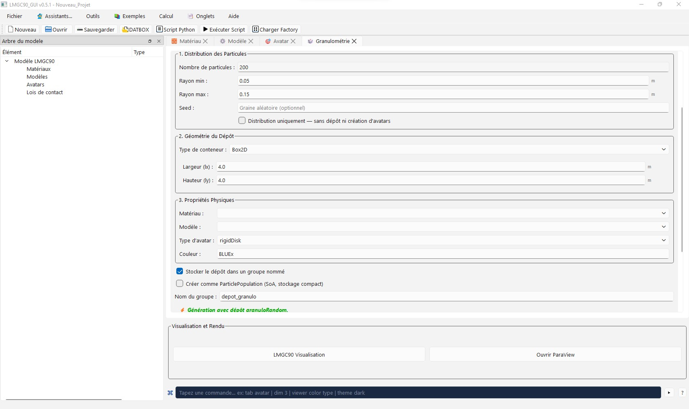
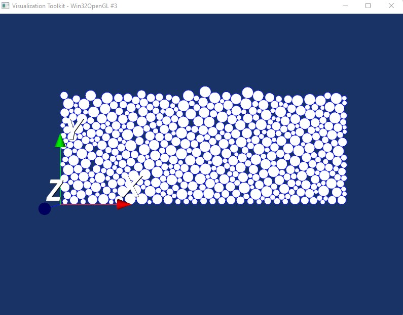
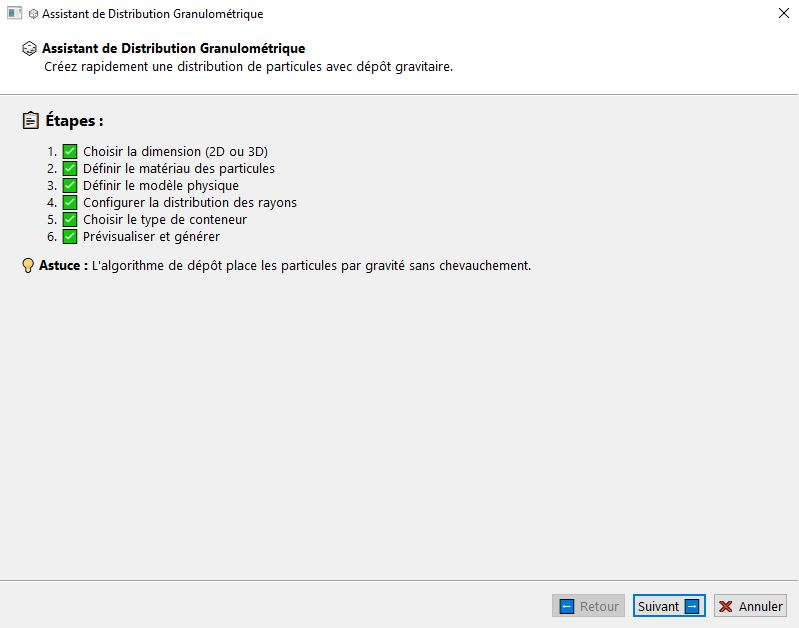
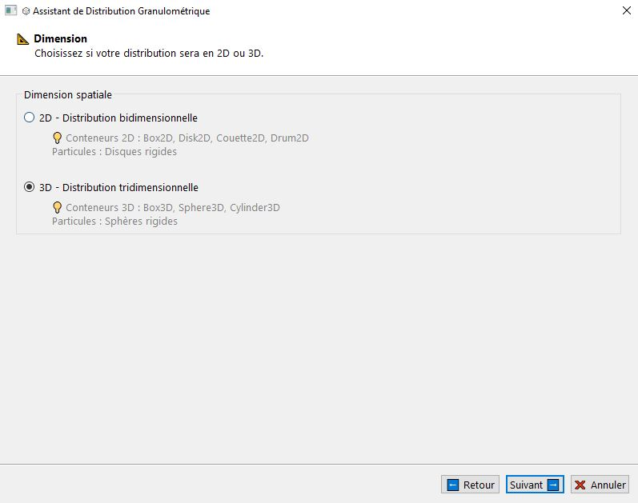
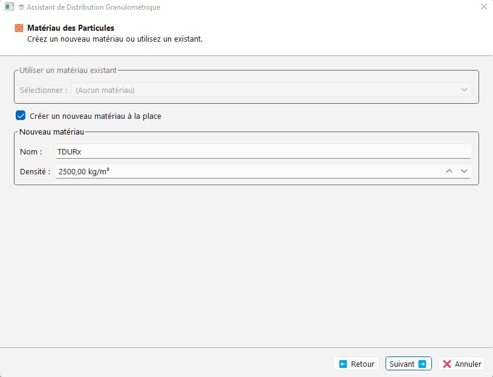
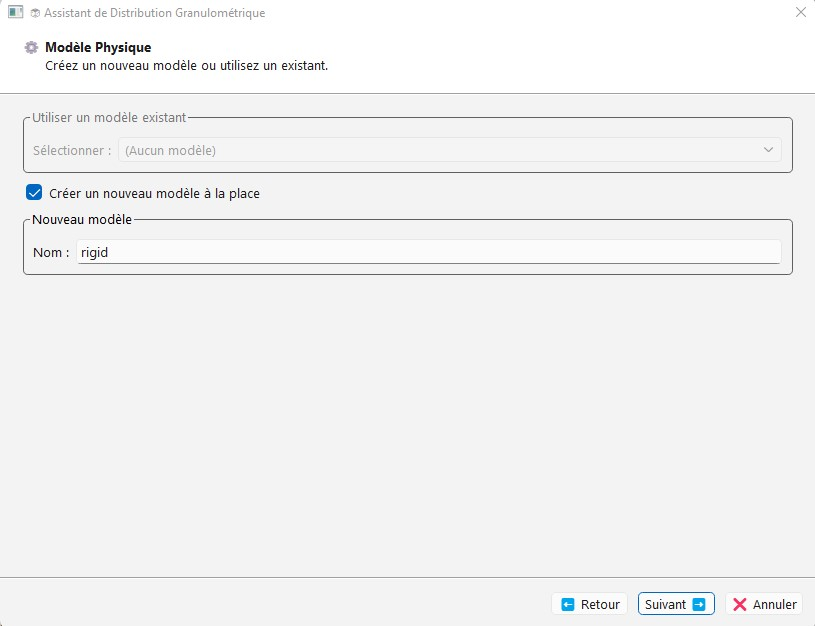
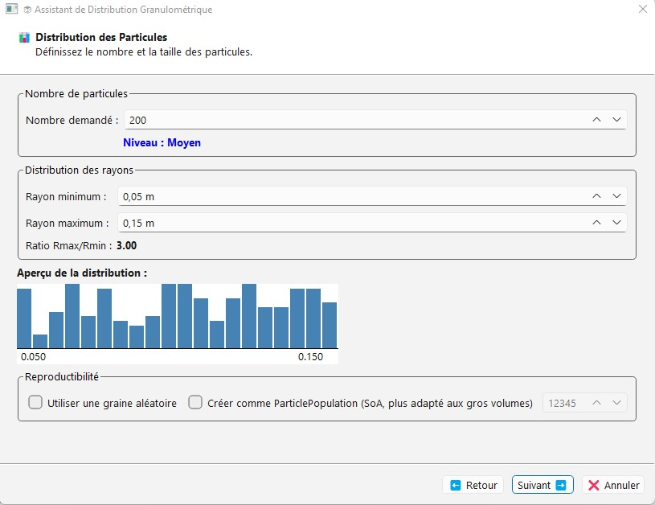
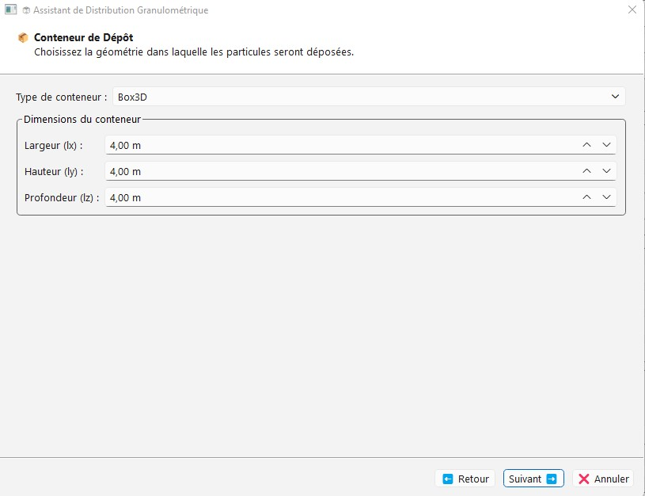
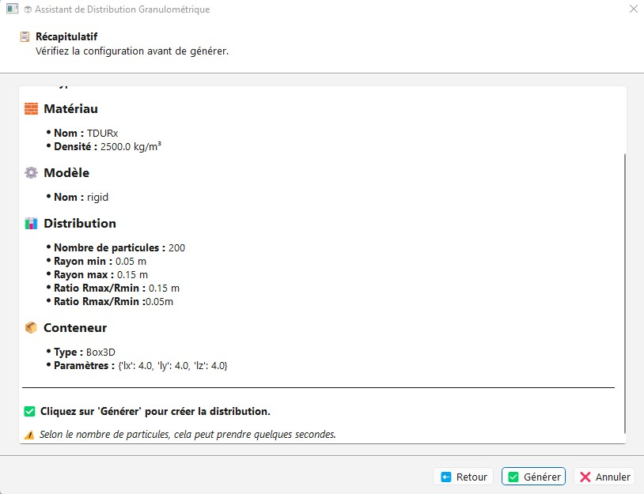
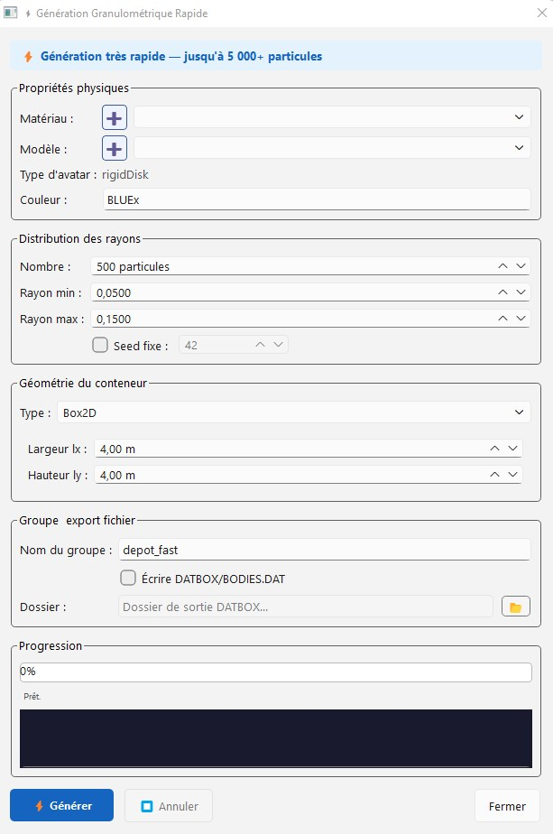

# Granulométrie

L'onglet **Granulométrie** (`Ctrl+7`) permet de créer, gérer et supprimer des distributions granulaires directement depuis l'interface, sans passer par l'assistant. Il est adapté pour des générations rapides à partir d'avatars et de matériaux déjà définis dans le projet.



---

## Interface générale

L'onglet est divisé en deux zones :

- **Liste des distributions** (en haut) : tableau affichant toutes les générations granulométriques du projet avec leur type de conteneur, le nombre de particules, les rayons min/max et le groupe associé. Double-clic pour éditer. Clic droit pour accéder au menu contextuel.
- **Formulaire de création / modification** (en bas) : champs de configuration de la distribution.

---

## Champs du formulaire

### Avatar modèle

| Champ | Description |
|-------|-------------|
| **Avatar modèle** | Sélection d'un avatar rigide existant dans le projet (défini dans l'onglet Avatar). Tous ses attributs sont copiés sur chaque particule générée : type (`rigidDisk` ou `rigidSphere`), matériau, modèle, couleur. |

> L'avatar modèle doit être de type `rigidDisk` (2D) ou `rigidSphere` (3D). C'est lui qui définit indirectement le matériau, le modèle et la couleur de toutes les particules générées.

---

### Distribution des particules

| Champ | Description | Plage | Défaut |
|-------|-------------|-------|--------|
| **Nombre de particules** | Nombre de particules demandé à l'algorithme de dépôt. Le nombre réellement placé peut être inférieur si le conteneur est saturé. | 10 à 10 000 | `200` |
| **Rayon minimum (rmin)** | Rayon minimal des particules (m). | 0,001 à 10,0 | `0.05 m` |
| **Rayon maximum (rmax)** | Rayon maximal des particules (m). Doit être strictement supérieur à rmin. | 0,001 à 10,0 | `0.15 m` |

> **Performance :** au-delà de ~1 500 avatars, le rafraîchissement de l'interface peut ralentir significativement. Pour les grands assemblages, utiliser l'**assistant granulométrie** (`Ctrl+Shift+G`) ou la **génération numpy** (menu Assistants).

---

### Reproductibilité

| Champ | Description | Défaut |
|-------|-------------|--------|
| **Utiliser une graine** | Case à cocher. Si activée, les rayons et positions sont générés de façon identique à chaque exécution. | décoché |
| **Valeur de la graine** | Entier de 0 à 999 999. Transmis à `pre.granulo_Random(seed=...)`. | `12345` |

---

### Conteneur de dépôt

Sélection du type de conteneur et de ses dimensions. Les conteneurs 2D sont disponibles quel que soit la dimension du projet — adapter en fonction du type d'avatar modèle choisi.

#### Conteneurs 2D

| Conteneur | Paramètres | Fonction pylmgc90 | Description |
|-----------|------------|-------------------|-------------|
| **Box2D** | `lx` (m), `ly` (m) | `pre.depositInBox2D(radii, lx, ly)` | Boîte rectangulaire. Dépôt gravitaire depuis le haut. |
| **Disk2D** | `r` (m) | `pre.depositInDisk2D(radii, r)` | Disque circulaire. |
| **Couette2D** | `rint` (m), `rext` (m) | `pre.depositInCouette2D(radii, rint, rext)` | Cellule de Couette — espace annulaire entre deux cylindres. |
| **Drum2D** | `r` (m) | `pre.depositInDrum2D(radii, r)` | Tambour rotatif circulaire. |

#### Conteneurs 3D

| Conteneur | Paramètres | Fonction pylmgc90 | Description |
|-----------|------------|-------------------|-------------|
| **Box3D** | `lx`, `ly`, `lz` (m) | `pre.depositInBox3D(radii, lx, ly, lz)` | Boîte parallélépipédique. |
| **Sphere3D** | `r` (m) | `pre.depositInSphere3D(radii, r)` | Sphère 3D. |
| **Cylinder3D** | `r` (m) | `pre.depositInCylinder3D(radii, r)` | Cylindre 3D. |

---

### Options

| Champ | Description | Défaut |
|-------|-------------|--------|
| **Couleur** | Code couleur LMGC90 à 5 caractères. Écrase la couleur de l'avatar modèle si renseigné. | `BLUEx` |
| **Stocker le depot dans un groupe nommé** | Si coché, tous les avatars générés sont enregistrés dans un groupe nommé dans `state.avatar_groups`. | coché |
| **Nom du groupe** | Identifiant du groupe. Par défaut automatique : `depot_{type_conteneur}` (ex. `granulo_box2d`). | `depot_granulo` |
| **Créer comme ParticlePopulation (SoA, stockage compact)** | Si coché, les avatars seront stockés dans des tableaux numpy sous le un fichier `.npz` [voir SOA](../fr/particle_population.md) | à cocher |

---

## Générer une distribution

Cliquer sur **✅ Générer le dépôt** pour lancer la génération. L'algorithme :

1. Tire aléatoirement `nb` rayons dans [rmin, rmax] via `pre.granulo_Random`.
2. Positionne les particules dans le conteneur choisi via `pre.depositInXxx`.
3. Crée un avatar `rigidDisk` ou `rigidSphere` pour chaque particule placée.
4. Enregistre la configuration dans `state.granulo_generations`.
5. Émet le signal `granulo_generated` pour rafraîchir l'interface.

> Le signal `granulo_generated` déclenche un rafraîchissement complet de l'arbre du modèle et de tous les onglets.

---

## Gestion des distributions

### Modifier une distribution

Sélectionner une distribution dans la liste et cliquer sur **✏️ Modifier**. La configuration est chargée dans le formulaire en mode **Édition**. Modifier les paramètres et cliquer sur **💾 Enregistrer** pour régénérer. Les anciens avatars sont supprimés et remplacés.

### Supprimer une distribution

Sélectionner et cliquer sur **🗑️ Supprimer**. Tous les avatars générés par cette distribution sont supprimés automatiquement (indices enregistrés dans `GranuloGeneration.generated_indices`). Le signal `granulo_deleted` est émis.

---

## Exemple de configuration


| Champ | Valeur exemple |
|-------|---------------|
| Avatar modèle | `#0` — `rigidDisk` / `TDURx` / `rigid` |
| Nombre de particules | `400` |
| Rayon minimum | `0.05 m` |
| Rayon maximum | `0.075 m` |
| Conteneur | `Box2D` — `lx=4.0 m`, `ly=4.0 m` |
| Couleur | `BLUEx` |
| Groupe | `granulo_box2d` |



---

## Remarques

**Nombre réel vs demandé :** le nombre de particules réellement placées (`_nb_remaining`) peut être inférieur au nombre demandé si le conteneur est trop petit ou la densité d'empilement est atteinte.

**Limite de performance :** l'onglet appelle `add_avatar()` pour chaque particule, ce qui émet un signal par avatar. Au-delà de ~1 500 avatars, l'interface ralentit. Pour des assemblages plus grands, utiliser l'**assistant granulométrie** qui insère les avatars directement dans les conteneurs pylmgc90 sans signal individuel.

**Distribution uniquement**, il est tout à fait possible de créer des distributions sans dépôt d'avatars si la case à cocher est activée _depuis(v0.4.3)_.

**Groupe automatique :** si aucun nom de groupe n'est saisi, un nom est généré automatiquement sous la forme `granulo_{type_conteneur}`.

**Créer comme ParticlePopulation**, cette option vous permettra de stocker une très grande quantité d'avatars sous une structure de tableau (SOA) _depuis(v0.4.8)_.


# Assistant de granulométrie — pylmgc90

L'**Assistant de distribution granulométrique** guide pas à pas la création d'un dépôt de particules rigides (disques 2D ou sphères 3D) via l'API officielle pylmgc90. Il crée ou réutilise automatiquement le matériau et le modèle, configure la distribution des rayons et le conteneur de dépôt, puis génère tous les avatars d'un seul coup de façon optimisée.

> **Accès :** menu **Assistants → Assistant de granulométrie** · raccourci `Ctrl+Shift+G`

> **Recommandé pour :** jusqu'à environ **8 000 particules**. Au-delà, l'interface peut ralentir. Utiliser la génération numpy pour les très grands assemblages.

---

## Vue d'ensemble des étapes

L'assistant est composé de **7 pages** actives (la page Aperçu est désactivée dans la version actuelle).

| Page | Titre | Description |
|------|-------|-------------|
| 0 | Introduction | Présentation de l'algorithme |
| 1 | Dimension | 2D (disques) ou 3D (sphères) |
| 2 | Matériau | Créer ou réutiliser un matériau `RIGID` |
| 3 | Modèle | Créer ou réutiliser un modèle `Rxx2D` / `Rxx3D` |
| 4 | Distribution | Nombre de particules, rayons, graine |
| 5 | Conteneur | Géométrie et dimensions du dépôt |
| 6 | Récapitulatif | Vérification avant génération |

---

## Page 0 — Introduction

Présente le principe de l'algorithme en deux étapes :

1. **`pre.granulo_Random(nb, r_min, r_max, seed)`** — génère aléatoirement `nb` rayons dans [r_min, r_max] selon une distribution uniforme.
2. **`pre.depositInXxx(radii, ...)`** — effectue un dépôt gravitaire des particules dans le conteneur choisi, sans chevauchement.



Cliquer sur **Suivant ➡️** pour commencer.

---

## Page 1 — Dimension

| Choix | Type de particule généré | Conteneurs disponibles |
|-------|--------------------------|------------------------|
| **2D** | `rigidDisk` | Box2D, Disk2D, Couette2D, Drum2D |
| **3D** | `rigidSphere` | Box3D, Sphere3D, Cylinder3D |

La valeur **2D** est sélectionnée par défaut.

> La dimension conditionne le type d'avatar créé, la liste des conteneurs disponibles à la page 5 et l'élément du modèle (`Rxx2D` ou `Rxx3D`).



---

## Page 2 — Matériau des particules

Deux modes :

### Mode A — Utiliser un matériau existant _(proposé si des matériaux existent)_

Liste déroulante de tous les matériaux du projet.

### Mode B — Créer un nouveau matériau _(coché automatiquement si aucun n'existe)_

| Champ | Description | Défaut |
|-------|-------------|--------|
| **Nom** | Identifiant, 5 caractères maximum. | `TDURx` |
| **Densité** | Masse volumique (kg/m³). Plage : 100 à 20 000. | `2500 kg/m³` |

> Le type est toujours `RIGID` — les particules granulaires sont des corps rigides.



---

## Page 3 — Modèle physique

Deux modes :

### Mode A — Utiliser un modèle existant

Liste déroulante des modèles du projet.

### Mode B — Créer un nouveau modèle

| Champ | Valeur |
|-------|--------|
| **Nom** | 5 caractères maximum. Défaut : `rigid`. |
| **Physique** | `MECAx` (automatique) |
| **Élément** | `Rxx2D` (2D) ou `Rxx3D` (3D) — adapté automatiquement |



---

## Page 4 — Distribution des particules

### Nombre de particules

| Champ | Description | Plage | Défaut |
|-------|-------------|-------|--------|
| **Nombre demandé** | Nombre de particules à générer. Le nombre réellement placé peut être inférieur si le conteneur est saturé. | 10 à 10 000 | `200` |

Un indicateur visuel signale la densité :
- **Orange** (< 100) : faible densité
- **Bleu** (100 à 499) : densité moyenne
- **Vert** (≥ 500) : densité élevée

### Distribution des rayons

| Champ | Description | Plage | Défaut |
|-------|-------------|-------|--------|
| **Rayon minimum** | Rayon le plus petit des particules (m). | 0,001 à 10,0 | `0.05 m` |
| **Rayon maximum** | Rayon le plus grand (m). Doit être > Rmin. | 0,001 à 10,0 | `0.15 m` |
| **Ratio Rmax/Rmin** | Calculé automatiquement. Indique l'étendue de la polydispersité. Un ratio ≥ 3 produit une distribution très étalée. | — | `3.00` |

Un **histogramme en temps réel** (20 classes, 200 rayons de prévisualisation) visualise la distribution des tailles avant génération.

### Reproductibilité

| Champ | Description | Défaut |
|-------|-------------|--------|
| **Utiliser une graine** | Case à cocher. Rend la génération reproductible. | décoché |
| **Valeur de la graine** | Entier de 0 à 999 999. Transmis à `pre.granulo_Random(seed=...)`. | `12345` |
| **Créer comme ParticlePopulation (SoA, stockage compact)** | Si coché, les avatars seront stockés dans des tableaux numpy sous le un fichier `.npz` | à cocher |



---

## Page 5 — Conteneur de dépôt

La liste des conteneurs s'adapte automatiquement à la dimension choisie à la page 1.

### Conteneurs 2D

#### Box2D — Boîte rectangulaire 2D

| Paramètre | Description | Défaut |
|-----------|-------------|--------|
| **Largeur (lx)** | Dimension horizontale de la boîte (m). | `4.0 m` |
| **Hauteur (ly)** | Dimension verticale de la boîte (m). | `4.0 m` |

**Fonction pylmgc90 :** `pre.depositInBox2D(radii, lx, ly)`  
**Usage :** essai de compression biaxiale, colonne de sol, cellule de cisaillement.

---

#### Disk2D — Disque circulaire 2D

| Paramètre | Description | Défaut |
|-----------|-------------|--------|
| **Rayon (r)** | Rayon du disque conteneur (m). | `2.0 m` |

**Fonction pylmgc90 :** `pre.depositInDisk2D(radii, r)`  
**Usage :** silo circulaire, tambour 2D.

---

#### Couette2D — Cellule de Couette 2D

Espace annulaire entre un cylindre intérieur de rayon `rint` et un cylindre extérieur de rayon `rext`.

| Paramètre | Description | Défaut |
|-----------|-------------|--------|
| **Rayon intérieur (rint)** | Rayon du cylindre intérieur (m). | `2.0 m` |
| **Rayon extérieur (rext)** | Rayon du cylindre extérieur (m). Doit être > rint. | `4.0 m` |

**Fonction pylmgc90 :** `pre.depositInCouette2D(radii, rint, rext)`  
**Usage :** rhéomètre de Couette, mesure de viscosité effective, écoulement annulaire.

---

#### Drum2D — Tambour rotatif 2D

| Paramètre | Description | Défaut |
|-----------|-------------|--------|
| **Rayon (r)** | Rayon du tambour (m). | `2.0 m` |

**Fonction pylmgc90 :** `pre.depositInDrum2D(radii, r)`  
**Usage :** mélangeur rotatif, broyeur à boulets, sécheur.

---

### Conteneurs 3D

#### Box3D — Boîte parallélépipédique 3D

| Paramètre | Description |
|-----------|-------------|
| **Largeur (lx)** | Dimension en X (m). |
| **Profondeur (ly)** | Dimension en Y (m). |
| **Hauteur (lz)** | Dimension en Z (m). |

**Fonction pylmgc90 :** `pre.depositInBox3D(radii, lx, ly, lz)`  
**Usage :** essai triaxial 3D, modèle de sol 3D.

---

#### Sphere3D — Sphère conteneur 3D

| Paramètre | Description |
|-----------|-------------|
| **Rayon (r)** | Rayon de la sphère conteneur (m). |

**Fonction pylmgc90 :** `pre.depositInSphere3D(radii, r)`

---

#### Cylinder3D — Cylindre conteneur 3D

| Paramètre | Description |
|-----------|-------------|
| **Rayon (r)** | Rayon du cylindre (m). |

**Fonction pylmgc90 :** `pre.depositInCylinder3D(radii, r)`  
**Usage :** colonne cylindrique, silo, essai œdométrique 3D.



---

## Page 6 — Récapitulatif

Affiche un tableau complet avant génération :

| Section | Informations |
|---------|-------------|
| **Dimension** | 2D ou 3D |
| **Matériau** | Nom et densité (nouveau) ou matériau existant |
| **Modèle** | Nom (nouveau) ou modèle existant |
| **Distribution** | Nombre de particules, Rmin, Rmax, ratio Rmax/Rmin |
| **Graine** | Valeur si activée |
| **Conteneur** | Type, paramètres (lx, ly, r, rint, rext…) |

Cliquer sur **✅ Générer** pour lancer. Un message de confirmation indique le succès.

> **En cas d'erreur :** l'état du projet (nom, chemin, dimension) est entièrement restauré.



---

## Résultat de la génération

| Élément créé | Description |
|--------------|-------------|
| **Matériau** | Ajouté à l'onglet Matériau (si créé). Type `RIGID`. |
| **Modèle** | Ajouté à l'onglet Modèle (si créé). `MECAx` + `Rxx2D` / `Rxx3D`. |
| **Avatars particules** | Un `rigidDisk` (2D) ou `rigidSphere` (3D) par particule placée. Couleur `BLUEx`. Origine `AvatarOrigin.GRANULO`. |
| **Groupe automatique** | Groupe `granulo_{conteneur}` (ex. `granulo_box3d`). |
| **GranuloGeneration** | Configuration sauvegardée dans `state.granulo_generations` pour la reconstruction du script. |

> **Optimisation :** l'assistant insère les avatars directement dans les conteneurs pylmgc90 (`_bodies_container`, `_pylmgc_bodies`) sans émettre de signal par particule — ce qui permet de traiter plusieurs milliers de particules sans ralentir l'interface.
---

## Remarques importantes

**Reproductibilité :** deux générations avec les mêmes paramètres produisent des générations différents. Fixer une distribution garantit l'identité exacte des résultats — indispensable pour les études paramétriques.

**Ratio Rmax/Rmin :** un ratio élevé (> 3) produit un assemblage polydisperse où les petites particules comblent les vides entre les grandes, augmentant la compacité. Un ratio proche de 1 donne un assemblage quasi-monodisperse avec une compacité maximale plus faible.

**Limite 12 000 particules :** au-delà, le rafraîchissement de l'arbre du modèle et des onglets peut prendre plusieurs secondes. Pour les très grands assemblages, utiliser la génération numpy.


# Génération granulométrie numpy _(bêta)_

La **génération granulométrie numpy** est un mode de génération rapide adapté aux très grands assemblages (> 5 000 particules). Elle s'ouvre en tant que dialogue simple (`QDialog`) — sans étapes, sans page à parcourir — et utilise un **thread de calcul en arrière-plan** (`GranuloWorker`) pour ne pas bloquer l'interface pendant le dépôt.

> **Accès :** menu **Assistants → ⚡ Génération granulométrie numpy… (bêta)**

> **Recommandé pour :** assemblages de **5 000 particules et plus**. En dessous de ce seuil, l'assistant pylmgc90 (`Ctrl+Shift+G`) est préférable car il utilise directement les routines de dépôt officielles de pylmgc90.

> **Statut :** fonctionnalité en version **bêta**. Les positions générées peuvent différer légèrement de celles produites par `pre.depositInBox2D` de pylmgc90, car l'algorithme de placement est distinct. Le résultat est toutefois physiquement cohérent (sans chevauchement).

---

## Accès

Cliquer sur le menu **Assistants** puis **⚡ Génération granulométrie numpy… (bêta)**. Le dialogue s'ouvre directement — aucun assistant par étapes.



---

## Différences avec l'assistant pylmgc90

| Caractéristique | Assistant pylmgc90 (`Ctrl+Shift+G`) | Génération numpy (bêta) |
|-----------------|--------------------------------------|--------------------------|
| **Interface** | Assistant 7 pages | Dialogue unique |
| **Algorithme de placement** | `pre.depositInXxx` — dépôt gravitaire physique pylmgc90 | `GranuloGenerator` via numpy — placement algorithmique |
| **Calcul** | Thread principal (peut bloquer l'UI) | Thread en arrière-plan (`GranuloWorker`) — UI non bloquée |
| **Barre de progression** | Non | Oui — progression en temps réel |
| **Limite recommandée** | ~8 000 particules | > 5 000 particules, sans limite pratique |
| **Matériau / modèle** | Création ou réutilisation | Utilise matériaux et modèles existants |
| **Conteneurs 3D** | Box3D, Sphere3D, Cylinder3D | 2D uniquement (Box2D, Disk2D, Couette2D, Drum2D) |
| **Reproductibilité** | Oui (graine) | Oui (graine) |

---

## Champs du dialogue

### Paramètres de distribution

| Champ | Description | Plage | Défaut |
|-------|-------------|-------|--------|
| **Nombre de particules** | Nombre de particules demandé à l'algorithme de placement. | 10 à 100 000+ | `1000` |
| **Rayon minimum (rmin)** | Rayon minimal des particules (m). | 0,001 à 10,0 | `0.05 m` |
| **Rayon maximum (rmax)** | Rayon maximal des particules (m). Doit être > rmin. | 0,001 à 10,0 | `0.10 m` |

---

### Matériau et modèle

| Champ | Description |
|-------|-------------|
| **Matériau** | Liste déroulante des matériaux existants dans le projet. Sélectionner le matériau à appliquer aux particules. |
| **Modèle** | Liste déroulante des modèles existants dans le projet. |

> Contrairement à l'assistant pylmgc90, ce dialogue ne crée pas de nouveau matériau ni de nouveau modèle — ils doivent déjà exister dans le projet.

---

### Conteneur de dépôt

Seuls les conteneurs **2D** sont disponibles dans la version actuelle.

| Conteneur | Paramètres | Description |
|-----------|------------|-------------|
| **Box2D** | `lx` (m), `ly` (m) | Boîte rectangulaire. |
| **Disk2D** | `r` (m) | Disque circulaire. |
| **Couette2D** | `rint` (m), `rext` (m) | Cellule de Couette — espace annulaire. |
| **Drum2D** | `r` (m) | Tambour rotatif. |

---

### Reproductibilité

| Champ | Description | Défaut |
|-------|-------------|--------|
| **Utiliser une graine** | Case à cocher. Rend la génération reproductible. | décoché |
| **Valeur de la graine** | Entier de 0 à 999 999. | `12345` |

---

### Options

| Champ | Description | Défaut |
|-------|-------------|--------|
| **Couleur** | Code couleur LMGC90 à 5 caractères. | `BLUEx` |
| **Groupe** | Nom du groupe dans lequel stocker les avatars générés (`state.avatar_groups`). | `granulo_numpy` |

---

## Fonctionnement interne

### Thread de calcul — `GranuloWorker`

La génération s'exécute dans un thread séparé (`GranuloWorker`, sous-classe de `QThread`) pour ne pas bloquer l'interface.

**Signaux émis par `GranuloWorker` :**

| Signal | Paramètres | Déclenchement |
|--------|-----------|---------------|
| `progress_updated` | `(nb_fait, nb_total, message)` | À chaque étape de calcul — met à jour la barre de progression |
| `data_ready` | `list[{center, radius}]` | Calcul terminé — envoie les données au thread principal |
| `error_occurred` | `str` | En cas d'exception — affiche un message d'erreur |

**Séquence d'exécution :**

```
1. GranuloFastDialog.exec()
   ↓
2. GranuloWorker.start()  ← thread secondaire
   ↓
3. GranuloGenerator.generate(config)
   ├── pre.granulo_Random(nb, rmin, rmax, seed)
   └── pre.depositInXxx(radii, ...)
   ↓
4. GranuloWorker.data_ready.emit(particles_data)
   ↓
5. Thread principal : création des avatars
   ↓
6. GranuloFastDialog.granulo_generated.emit()
   ↓
7. MainWindow._refresh_all()
```

### Données retournées par `GranuloWorker`

Chaque particule est transmise au thread principal sous forme de dictionnaire :

```python
{
    'center': [x, y],       # coordonnées numpy → list Python
    'radius': 0.075         # rayon en float
}
```

### Algorithme de placement

`GranuloGenerator.generate()` appelle les mêmes routines pylmgc90 que l'onglet Granulométrie :

```python
radii = pre.granulo_Random(config.nb_particles, config.radius_min, config.radius_max, config.seed)
nb_remaining, coor = pre.depositInBox2D(radii, params['lx'], params['ly'])
coor.shape = [coor.size // 2, 2]
radii = radii[:nb_remaining]
return nb_remaining, coor, radii
```

La différence par rapport à l'assistant est que le calcul est déporté dans un thread (`QThread`), ce qui empêche le gel de l'interface sur de très grands assemblages.

---

## Progression et annulation

Pendant la génération, le dialogue affiche :

- Une **barre de progression** mise à jour par `progress_updated` (valeur courante / total).
- Un **message d'état** décrivant l'étape en cours (ex. : « Calcul du dépôt granulométrique… », « Dépôt calculé avec succès »).
- Un bouton **❌ Annuler** qui appelle `GranuloWorker.stop()` pour interrompre le calcul.

---

## Résultat de la génération

| Élément créé | Description |
|--------------|-------------|
| **Avatars particules** | Un `rigidDisk` par particule placée. Origine `AvatarOrigin.GRANULO`. |
| **Groupe** | Groupe nommé dans `state.avatar_groups` (défaut : `granulo_numpy`). |
| **GranuloGeneration** | Configuration sauvegardée dans `state.granulo_generations`. |
| **Signal** | `granulo_generated` émis → `MainWindow._refresh_all()` |

> Les avatars sont créés dans le **thread principal** après réception du signal `data_ready` — la création reste synchrone mais le calcul lourd (dépôt physique) est asynchrone.

---

## Remarques importantes

**Matériau et modèle obligatoires :** contrairement à l'assistant pylmgc90, le dialogue ne propose pas de créer un matériau ou un modèle. Créer au préalable dans l'onglet Matériau (ex. `TDURx`, `RIGID`, 2500 kg/m³) et dans l'onglet Modèle (ex. `rigid`, `MECAx`, `Rxx2D`).

**Conteneurs 2D uniquement :** la version bêta actuelle ne supporte pas les conteneurs 3D (Box3D, Sphere3D, Cylinder3D). Pour une génération 3D, utiliser l'assistant pylmgc90.

**Résultats identiques au rechargement :** les positions et rayons générés sont sauvegardés via `GranuloGeneration` dans le projet. Lors du rechargement, le dépôt est **recalculé** à partir des paramètres — si aucune graine n'a été fixée, les positions seront différentes. Fixer une graine pour garantir l'identité exacte entre les sessions.

**Thread et ressources :** si le dialogue est fermé pendant le calcul, le thread `GranuloWorker` continue en arrière-plan jusqu'à son terme. Attendre la fin du calcul ou cliquer sur ❌ Annuler avant de fermer.