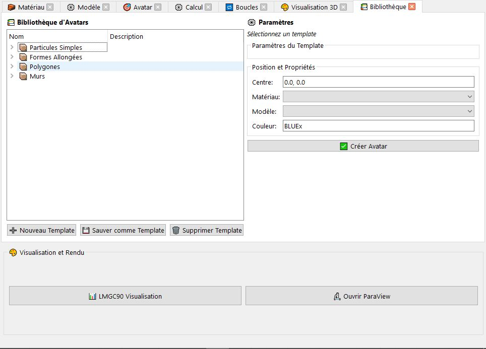
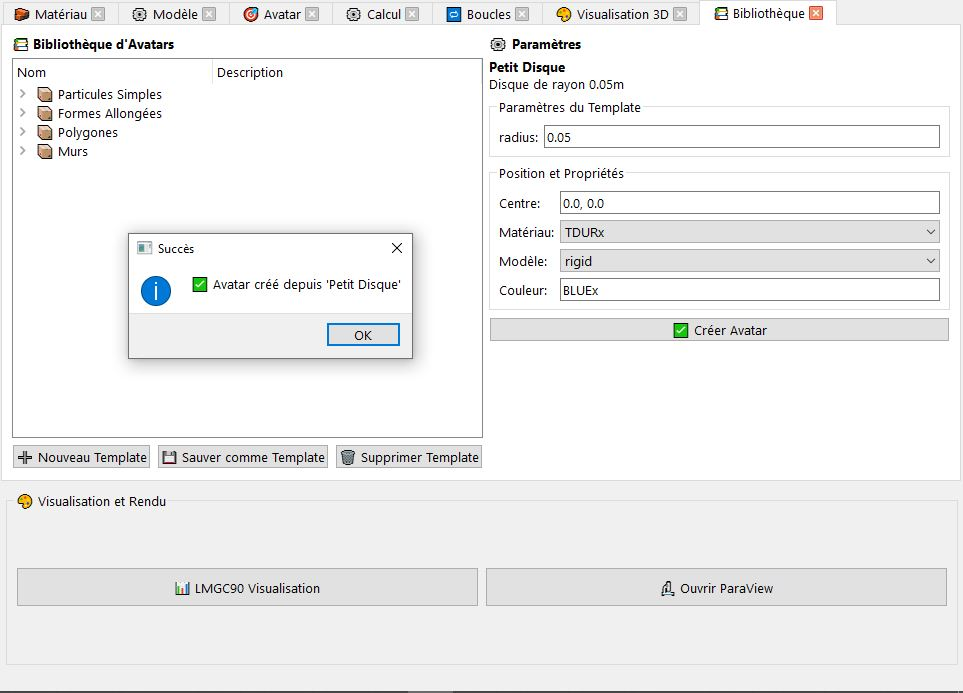
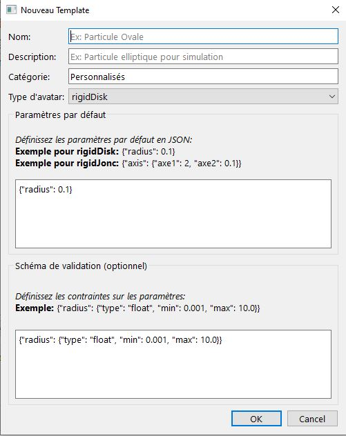

# Bibliothèque — Avatars préconfigurés

L'onglet **Bibliothèque** (`📚`) met à disposition un catalogue d'avatars préconfigurés, organisés par catégorie. Il permet d'insérer rapidement des formes courantes dans le projet sans avoir à saisir manuellement les paramètres géométriques.

Cet onglet se **rafraîchit automatiquement** à chaque changement de dimension dans l'onglet Modèle : les templates disponibles s'adaptent à la dimension courante du projet (2D ou 3D).

---

## Organisation de l'interface

L'onglet est divisé en deux panneaux :

| Panneau | Description |
|---------|-------------|
| **Gauche — Arbre des templates** | Arborescence des avatars disponibles, organisés par catégorie. Cliquer sur une entrée pour afficher ses propriétés à droite. |
| **Droite — Propriétés** | Affiche le nom, le type d'avatar, la description et les paramètres par défaut du template sélectionné. Permet également de configurer le centre, le matériau, le modèle et la couleur avant insertion. |

---

## Templates disponibles

Les templates sont organisés par catégorie. La liste change selon que la dimension du projet est **2D** ou **3D**.

### Templates 2D

#### Particules simples

| Template | Type pylmgc90 | Paramètres par défaut | Description |
|----------|--------------|----------------------|-------------|
| **Petit Disque** | `rigidDisk` | `radius = 0.05 m` | Disque rigide de petit rayon, typique des simulations granulaires fines. |
| **Disque Moyen** | `rigidDisk` | `radius = 0.10 m` | Disque rigide de rayon intermédiaire. |
| **Grand Disque** | `rigidDisk` | `radius = 0.20 m` | Disque rigide de grand rayon, pour les particules de taille importante. |

#### Formes allongées

| Template | Type pylmgc90 | Paramètres par défaut | Description |
|----------|--------------|----------------------|-------------|
| **Cylindre Horizontal** | `rigidJonc` | `axe1 = 2.0 m`, `axe2 = 0.1 m` | Jonc elliptique allongé horizontalement, rapport d'aspect 2:1. |
| **Cylindre Vertical** | `rigidJonc` | `axe1 = 2.0 m`, `axe2 = 0.1 m` | Jonc elliptique allongé verticalement. |

> `axe1` est le demi-axe long, `axe2` le demi-axe court (mêmes paramètres que `rigidJonc` dans l'onglet Avatar).

#### Polygones réguliers

| Template | Type pylmgc90 | Paramètres par défaut | Description |
|----------|--------------|----------------------|-------------|
| **Triangle** | `rigidPolygon` | `generation_type='regular'`, `nb_vertices=3`, `radius=0.1 m` | Triangle équilatéral inscrit dans un cercle de rayon 0,1 m. |
| **Carré** | `rigidPolygon` | `generation_type='regular'`, `nb_vertices=4`, `radius=0.1 m` | Carré régulier inscrit dans un cercle de rayon 0,1 m. |
| **Pentagone** | `rigidPolygon` | `generation_type='regular'`, `nb_vertices=5`, `radius=0.1 m` | Pentagone régulier. |
| **Hexagone** | `rigidPolygon` | `generation_type='regular'`, `nb_vertices=6`, `radius=0.1 m` | Hexagone régulier — forme très utilisée en DEM pour les assemblages compacts. |
| **Rectangle** | `rigidPolygon` | `generation_type='full'`, sommets définis explicitement, `radius=0.15 m` | Rectangle 0,30 m × 0,10 m défini par liste de sommets. |

#### Murs

| Template | Type pylmgc90 | Paramètres par défaut | Description |
|----------|--------------|----------------------|-------------|
| **Mur Horizontal** | `fineWall` | `l=2.0 m`, `r=0.1 m`, `nb_polyg=20` | Mur horizontal fin de longueur 2 m, composé de 20 segments polygonaux. |

---

### Templates 3D

#### Particules simples

| Template | Type pylmgc90 | Paramètres par défaut | Description |
|----------|--------------|----------------------|-------------|
| **Petite Sphère** | `rigidSphere` | `radius = 0.05 m` | Sphère rigide de petit rayon. |
| **Sphère Moyenne** | `rigidSphere` | `radius = 0.10 m` | Sphère rigide de rayon intermédiaire. |
| **Grande Sphère** | `rigidSphere` | `radius = 0.20 m` | Sphère rigide de grand rayon. |

#### Formes 3D

| Template | Type pylmgc90 | Paramètres par défaut | Description |
|----------|--------------|----------------------|-------------|
| **Cylindre 3D** | `rigidCylinder` | `radius=0.05 m`, `h=0.2 m` | Cylindre droit de rayon 0,05 m et de hauteur 0,2 m. |
| **Plan Sol** | `rigidPlan` | `axe1=2.0 m`, `axe2=2.0 m`, `axe3=0.1 m` | Plan horizontal rigide de 2 m × 2 m, utilisé comme sol ou plafond. |

---

## Assemblages complexes

En plus des templates unitaires, la bibliothèque propose des **assemblages de plusieurs avatars** générés en une seule action. Ces assemblages créent plusieurs corps coordonnés dans le projet.

### Cluster de disques 2D

Crée un corps rigide 2D de type `rigidCluster` — une agrégation de disques liés rigidement, formant une particule non convexe.

| Paramètre | Description | Valeur par défaut |
|-----------|-------------|-------------------|
| Centre | Position du centre de référence du cluster. | `[0.0, 0.0]` |
| Matériau | Matériau de type `RIGID`. | — |
| Modèle | Modèle avec élément `Rxx2D`. | — |
| Rayon principal | Rayon de chaque disque composant le cluster (m). | `0.1 m` |
| Nombre de disques (`nb_disk`) | Nombre de disques dans le cluster. | `5` |

---

### Haltère 2D _(dumbbell)_

Crée un avatar vide (`emptyAvatar`) composé de trois contacteurs : deux disques (`DISKx`) aux extrémités et un jonc (`JONCx`) au centre, formant une forme en haltère.

| Paramètre | Description | Valeur par défaut |
|-----------|-------------|-------------------|
| Centre | Position du centre de l'haltère. | `[0.0, 0.0]` |
| Longueur totale | Distance entre les centres des deux disques (m). | `0.3 m` |
| Rayon des disques | Rayon des deux extrémités (m). | `0.05 m` |

**Contacteurs générés automatiquement :**

| Contacteur | Forme | Paramètres |
|------------|-------|------------|
| Disque gauche | `DISKx` | `byrd = rayon`, positionné à `−longueur/2` |
| Disque droit | `DISKx` | `byrd = rayon`, positionné à `+longueur/2` |
| Corps central | `JONCx` | `axe1 = longueur`, `axe2 = rayon × 0.3` |

---

### Boîte rectangulaire 2D _(box container)_

Crée un conteneur rectangulaire ouvert en haut, composé de **3 murs lisses** (`smoothWall`) : un mur inférieur et deux murs latéraux.

| Paramètre | Description | Valeur par défaut |
|-----------|-------------|-------------------|
| Largeur totale | Dimension horizontale intérieure de la boîte (m). | — |
| Hauteur | Dimension verticale de la boîte (m). | — |
| Épaisseur des murs | Épaisseur de chaque paroi (m). | — |
| Centre | Position du centre de la boîte. | — |

**Corps créés :**

| Corps | Type | Position |
|-------|------|----------|
| Mur bas | `smoothWall` | `centre_y − hauteur/2` |
| Mur gauche | `smoothWall` | `centre_x − largeur/2` |
| Mur droit | `smoothWall` | `centre_x + largeur/2` |

---

### Trémie en V 2D _(hopper)_

Crée une trémie conique composée de **2 parois inclinées** (`rigidPolygon` avec `generation_type='full'`), formant un entonnoir ouvert en haut et en bas.

| Paramètre | Description |
|-----------|-------------|
| Largeur en haut | Ouverture supérieure de la trémie (m). |
| Largeur en bas | Ouverture inférieure de la trémie (m). |
| Hauteur | Hauteur totale de la trémie (m). |
| Centre | Position du centre géométrique. |

**Corps créés :** paroi gauche et paroi droite, chacune définie par 4 sommets calculés automatiquement à partir des dimensions.

---

## Créer un avatar depuis un template

1. Sélectionner un template dans l'arbre de gauche — ses propriétés s'affichent dans le panneau de droite.
2. Configurer les champs dans le panneau droit :
   - **Centre** : coordonnées d'insertion (x, y) en 2D ou (x, y, z) en 3D. Accepte les expressions Python.
   - **Matériau** : sélectionner parmi les matériaux définis dans l'onglet Matériau.
   - **Modèle** : sélectionner parmi les modèles définis dans l'onglet Modèle.
   - **Couleur** : code couleur LMGC90 à 5 caractères.
3. Cliquer sur **✅ Créer Avatar**.

L'avatar est ajouté à la liste du projet et apparaît dans l'arbre du modèle.

---

## Créer un nouveau template

Il est possible d'enregistrer un avatar existant comme nouveau template pour le réutiliser dans d'autres projets.

1. Cliquer sur le bouton **Nouveau template**.
2. La boîte de dialogue de création de template s'ouvre.
3. Renseigner le nom et la description du template.
4. Les paramètres géométriques de l'avatar sélectionné sont repris automatiquement.
5. Valider pour ajouter le template à la bibliothèque.

---

## Remarques importantes

**Dimension courante :** la liste des templates s'adapte automatiquement à la dimension du projet. Si la dimension est modifiée dans l'onglet Modèle, l'onglet Bibliothèque se rafraîchit et n'affiche que les templates compatibles (2D ou 3D).

**Matériau et modèle obligatoires :** un matériau et un modèle doivent être définis dans le projet avant de pouvoir créer un avatar depuis un template. Si aucun matériau ou modèle n'est disponible, un message d'erreur s'affiche.

**Paramètres par défaut :** les templates utilisent des valeurs par défaut raisonnables. Ces valeurs doivent être ajustées selon les unités et l'échelle du modèle. En particulier, les rayons et longueurs en mètres doivent être cohérents avec la granulométrie et les dimensions de la scène.

**Assemblages :** les assemblages complexes (boîte, trémie, haltère) créent plusieurs avatars simultanément dans le projet. Ils apparaissent tous dans l'arbre du modèle et peuvent être modifiés individuellement après leur création.

**Expressions Python :** le champ Centre accepte les expressions Python évaluées via `SafeEvaluator`, comme dans tous les autres onglets de l'interface : `avatar[0].x + 0.5`, `math.sqrt(2) * r`, etc.