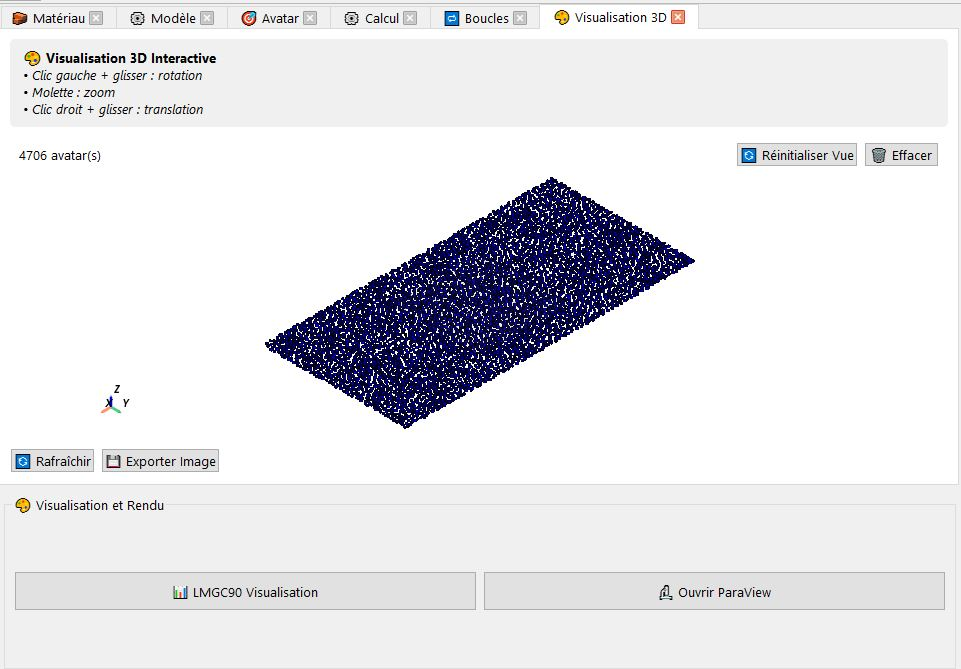

# Visualisation 
On plus de l'outil de visualisation intégré avec LMGC90 qui n'est d'autre que la fonction du préprocesseur `pre.visuAvatars()`, LMGC90_GUI permet de visualiser vos avatars dans un espace 3D complètement indépendant du solveur, simplement il est dans sa version *bétâ* donc il est très gourmand en ressources.

