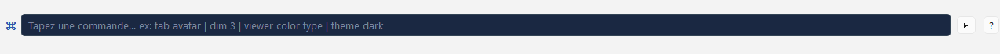
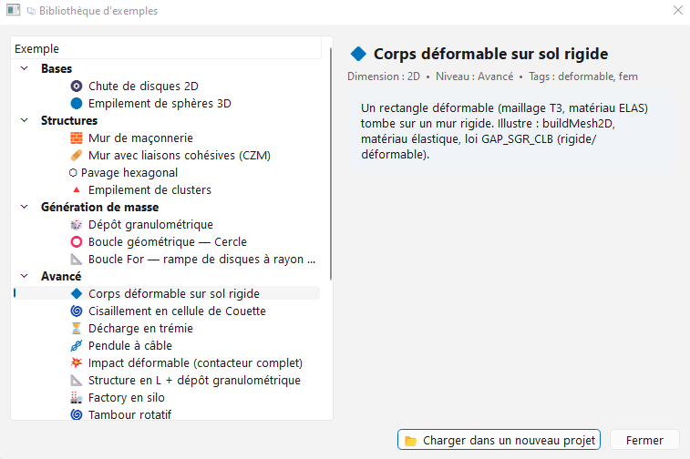
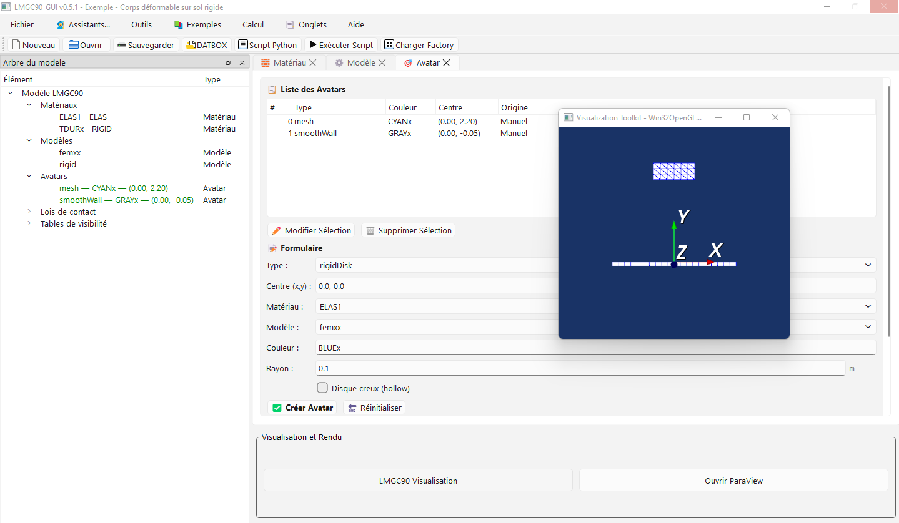

# Introduction to the LMGC90_GUI graphical interface

LMGC90_GUI is a modern graphical interface designed to ease the creation of numerical models with the **pre** (preprocessor) module of **LMGC90**.

It is also possible to run computations directly from LMGC90_GUI via the **chipy** module.

The interface is organised clearly and ergonomically to accompany the user from start to finish of the modelling process: creating elements, boundary conditions, post-processing, file generation and finally launching computations.

The following video gives an overview of the different parts of the interface.

## Main window

The interface is divided into **six main areas**:

1. **Menu**
2. **Toolbar** (top)
3. **Model tree** (left)
4. **Creation tabs** (centre top)
5. **Render area** (centre bottom)
6. **Status bar** (bottom)

Since version 0.4.8, a seventh area has been added, the **command palette**, accessible at the bottom of the **render area**, or with the keyboard shortcut `Ctrl+K`.

---

### 1. Menu and toolbar

#### Menu
##### File

| Action | Shortcut | Description |
|--------|----------|-------------|
| **New** | `Ctrl+N` | Creates a new project. A dialog opens to enter the project name. |
| **Open** | `Ctrl+O` | Opens an existing project. A dialog lets you browse to the project `.json` file. |
| **Save** | `Ctrl+S` | Saves the current project at its current location. |
| **Save as…** | `Ctrl+Shift+S` | Saves the project under a new name or location. |
| **Quit** | `Ctrl+Q` | Closes the application. |
 
**New project**

Click the **New** toolbar button, use menu **File → New**, or press `Ctrl+N`. A dialog opens to enter the project name.

  

**Open a project**
 
Click the **Open** toolbar button, use menu **File → Open**, or press `Ctrl+O`. Then specify the path and name of your project.

  

**Save**  
Saves your projects to disk. Click the **Save** toolbar button, menu **File → Save**, or shortcut `Ctrl+S`.

---

##### Assistants
 
Assistants guide the user step by step through the most common tasks. They can be used as many times as needed within the same project.
 
| Assistant | Shortcut | Description |
|-----------|----------|-------------|
| **Project configuration** | `Ctrl+Shift+N` | Guides step by step the creation and initial configuration of a new project (material, model, reference avatar, contact law). |
| **pylmgc90 granulometry** | `Ctrl+Shift+G` | Generates a granulometric distribution with gravity deposition via pylmgc90 routines. Recommended for assemblies under 8 000 avatars. Beyond that, interface refresh may be slow. |
| **Numpy granulometry** _(beta)_ | — | Generates and deposits avatars from numpy, without going through pylmgc90 routines. Recommended for assemblies over 5 000 avatars. |
| **Deformable** | `Ctrl+Shift+D` | Guides creation or import of deformable elements (rectangle, disk, sphere, cylinder meshes or external `.msh` / `.geo` files). |
| **Masonry** | `Ctrl+Shift+M` | Specialised in creating 2D and 3D brick stacks (`brick2D` / `brick3D`) with different bonds (standard, running bond, single stretcher, double stretcher, etc.). |
| **Factory** | `Ctrl+Shift+F` | Specialised in 2D/3D avatar Factory, making them appear visually or in the computation. |

  

  

   

   

  

> **Note:** assistants can be relaunched at any time during the session. Each run adds the generated elements after the existing project content, without erasing what was created before.  
Duplicating elements that share the same name causes errors; name your elements differently.

---

##### Tools
 
| Action | Shortcut | Description |
|--------|----------|-------------|
| **Generate DATBOX** | — | Generates the `.dat` files used by LMGC90 for computation (DATBOX/). |
| **Generate Python script** | — | Generates the preprocessing Python script (`pre.py`) reproducing the entire model built in the interface. |
| **Convert lmgc90 script** | `Ctrl+Shift+C` | A dialog that scans a pylmgc90 Python script and converts it to a `.lmgc90` file [beta version](#convert) |
| **Dynamic variables** | `Ctrl+V` | Opens a dialog to define reusable variables in numeric fields of the interface (radius, spacing, offset, etc.). It is also an inspection window for properties of LMGC90 objects in memory. See [Dynamic variables](dynam_variables.md). |
| **Preferences** | `Ctrl+,` | Opens the application configuration dialog. See section [Preferences](#5-preferences). |

---

##### Examples 

Introduced in version 0.4.6, this menu contains a single action **Browse examples**, which opens a dialog where you can browse several examples under six categories. Selecting an example loads its details in the right pane.

To load an example, simply select it and click **Load into a new project**. In the example below the example `Deformable body on rigid floor` is loaded by clicking **Yes** again.

---
  

##### Computation
 
| Action | Shortcut | Description |
|--------|----------|-------------|
| **Computation parameters** | `Ctrl+F5` | Opens the dialog to configure chipy routines: physics, contact detectors, extractions, control, inspection. |
| **Run computation** | `F5` | Runs the chipy computation directly from the interface, in a separate process so the interface is not blocked. |
| **Generate computation script** | — | Generates the computation Python script (`chipy.py`) from the routine configuration. |
| **View LMGC90 logs** | `F6` | Displays real-time console output of the running computation. |
| **Application journal** | `F7` | Displays the internal LMGC90_GUI journal: unhandled errors, Python warnings, failed pylmgc90 calls. Useful to diagnose problems that do not show a visible message in the interface. |
  

---

##### Tabs
 
| Action | Shortcut | Description |
|--------|----------|-------------|
| **Open** | — | Opens a specific tab from the full list. See section [Creation tabs](#3-creation-tabs-central-upper-area). |
| **Close others** | — | Closes all open tabs except the active one. |
| **Close all (except essential)** | — | Closes all non-essential tabs. |
| **Default tabs** | `Ctrl+Alt+D` | Restores the default tab layout. |
 
---
 
##### Help
 
| Action | Description |
|--------|-------------|
| **About** | Shows information about the LMGC90_GUI version and dependencies. |
| **Online help** | Opens the online documentation in the default browser. |
 
---
 
#### Toolbar
 
The toolbar groups the most frequent actions for quick access:
 
| Button | Menu equivalent |
|--------|-----------------|
| New project | File → New |
| Open project | File → Open |
| Save project | File → Save |
| Generate DATBOX | Tools → Generate DATBOX _(since v0.2.6)_ |
| Generate Python script | Tools → Generate Python script |
| Run script | Tools → Generate Python script _(since 0.4.2)_ | 
| Load Factory | loads factory avatars _(since 0.4.2)_ |

 
---

### 2. Model tree (left)
 
Fixed area showing the **full tree of the current model**. It updates automatically after every creation, modification or deletion of an element.
 
#### Displayed sections
 
| Section | Content |
|---------|---------|
| **Materials** | List of all materials defined in the project. |
| **Models** | List of all finite-element models (physics, element, dimension). |
| **Avatars** | List of all bodies in the project: rigid, empty, deformable. |
| **Avatar groups** | Groups created by loops, granulometry or the masonry assistant. |
| **Contact laws** | Defined contact behaviour laws (friction, cohesion, stiffness). |
| **Visibility tables** | chipy visibility rules for avatars during computation. |
| **PostPro** | Configured post-processing commands. |
 
#### Features
 
- **Click an element**: opens the corresponding tab in edit mode and loads the element into the form.
- **Right-click**: context menu with Edit, Delete and Information actions depending on the selected element.
- **Hierarchical view**: avatar groups are expandable to show member avatars.

---

### 3. Creation tabs (central upper area)
 
Main work area. Each tab is dedicated to a modelling step. To open a tab, use menu **Tabs → Open** and choose the desired tab.

| Tab | Shortcut | Description |
|-----|----------|-------------|
| **Material** | `Ctrl+1` | Creation and management of materials (RIGID, ELAS, ELAS_PLAS, THERMO_ELAS, PORO_ELAS, etc.). |
| **Model** | `Ctrl+2` | Definition of physical models and finite elements (MECAx, THERx, POROx, MULTI). |
| **Avatar** | `Ctrl+3` | Creation of standard rigid bodies: disk, jonc, polygon, rough wall, sphere, cylinder, polyhedron, etc. |
| **Empty avatar** | `Ctrl+4` | Creation of avatars with custom contactors, or adding contactors on an existing deformable body. |
| **Libraries** | `Ctrl+5` | Preconfigured avatars (complex shapes, common assemblies) ready to insert into the project. |
| **Loops** | `Ctrl+6` | Parametric generation of avatar series: circle, grid, line, spiral or manual placement. |
| **Granulometry** | `Ctrl+7` | Generation of deposits with statistical radius distribution and gravity deposition. |
| **DOF** | `Ctrl+8` | Boundary conditions: imposed translations, blocked rotations, imposed velocities, degree-of-freedom couplings. |
| **Contact** | `Ctrl+9` | Definition of contact behaviour laws (Coulomb friction, cohesion, normal and tangential stiffness). |
| **Visibility** | — | Creation of chipy visibility tables to show or hide avatars during computation. |
| **Postpro** | — | Configuration of post-processing commands: energy balance, body tracking, field extraction. |
| **3D visualisation** | — | Interactive display of model avatars with navigation, selection and measurement modes. |
 
> **Keyboard shortcuts:** keys `Ctrl+1` to `Ctrl+9` open the first nine tabs in the list directly.
 
---

### 4. Render area (central lower area)
 
Area dedicated to visualisation and computation outputs.
 
#### Available buttons
 
| Button | Description |
|--------|-------------|
| **LMGC90 Visualisation** | Launches the built-in pylmgc90 visualisation via `pre.visuAvatars()`. Opens an independent external window. |
| **ParaView** | Automatically opens computation output files in ParaView (default `rigids.pvd`). Requires ParaView installed on the machine and a computation already performed. |
 
#### Interactive modes of the 3D viewer
 
| Mode | Description |
|------|-------------|
| **🖱️ Navigation** | Default mode: rotation (left-click + drag), zoom (wheel), pan (right-click + drag). |
| **👆 Selection** | Click an avatar to highlight it (yellow highlight) and show its information in the status bar. |
| **📏 Ruler** | Distance measurement: click a first point (A) then a second point (B) to display the distance in metres. |
 
Quick views **XY**, **XZ**, **YZ** and **Iso** are available from the viewer toolbar.
 
---

### 5. Preferences

Accessible via **Tools → Preferences** or shortcut `Ctrl+,`. The preferences dialog groups application configuration settings.

| Setting | Description |
|---------|-------------|
| **Paths** | Default path used when opening and saving projects. Click **Browse** to change it. |
| **Units** | Choice between SI (metre, kilogram, second) and CGS (centimetre, gram, second). _(Not yet implemented in this version.)_ |
| **Automatic save** | Options to enable automatic save at regular intervals and on application close. |
| **Recent projects history** | Maximum number of projects kept in the **File → Recent projects** list. |
| **Performance** | Enables or disables display of avatars in the model tree and in the Avatar tab table. Disabling this option improves performance on projects with a large number of avatars. 

### Convert 

LMGC90_GUI includes a beta converter (Python script) to `.lmgc` (JSON).
Simply give the path of your script then the name of your file and click the **Convert** button.

> **Note**: translation quality depends on the complexity of your script.

---

## Keyboard shortcut summary
 
| Shortcut | Action |
|----------|--------|
| `Ctrl+N` | New project |
| `Ctrl+O` | Open a project |
| `Ctrl+S` | Save |
| `Ctrl+Shift+S` | Save as… |
| `Ctrl+Q` | Quit |
| `Ctrl+Shift+N` | Project configuration assistant |
| `Ctrl+Shift+G` | pylmgc90 granulometry assistant |
| `Ctrl+Shift+D` | Deformable assistant |
| `Ctrl+Shift+M` | Masonry assistant |
| `Ctrl+V` | Dynamic variables |
| `Ctrl+,` | Preferences |
| `Ctrl+F5` | Computation parameters |
| `F5` | Run computation |
| `F6` | View LMGC90 logs |
| `F7` | Application journal |
| `Ctrl+Alt+D` | Default tabs |
| `Ctrl+1` … `Ctrl+9` | Open the corresponding tab |
| `Ctrl+K` | Open the command palette |
 
---
### 6. Status bar
 
Horizontal strip at the bottom of the window displaying contextual messages about ongoing operations: avatar creation, script generation, measurement result in the 3D viewer, validation error, etc.

---
 
LMGC90_GUI is designed to be **intuitive** and **fully visual**, while remaining fully compatible with traditional LMGC90 Python scripts.
