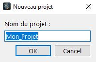
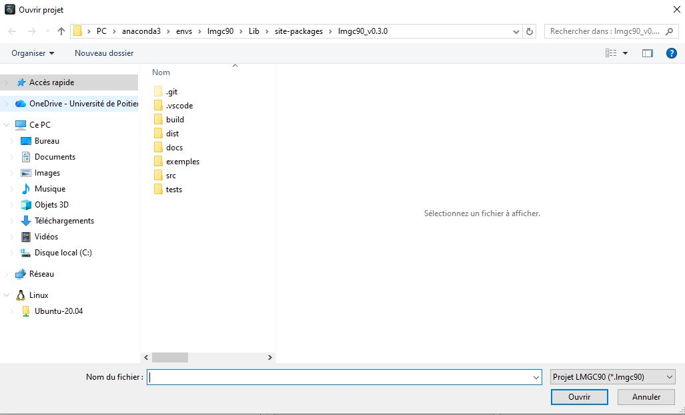
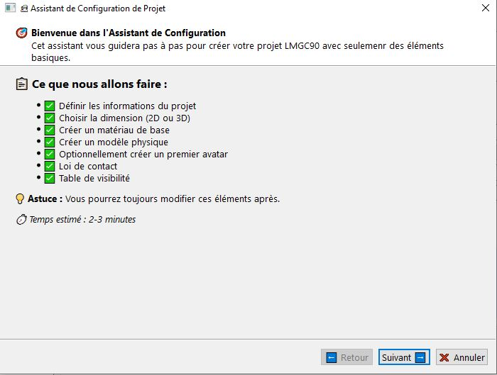
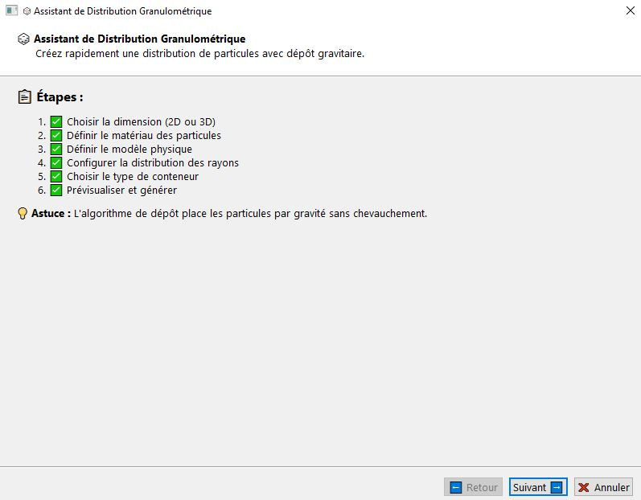
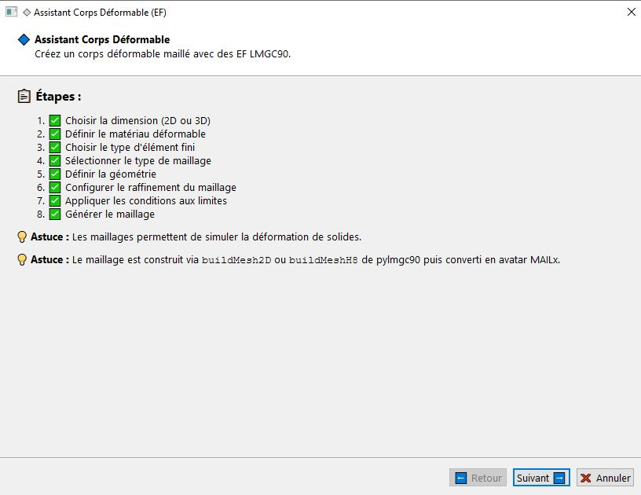
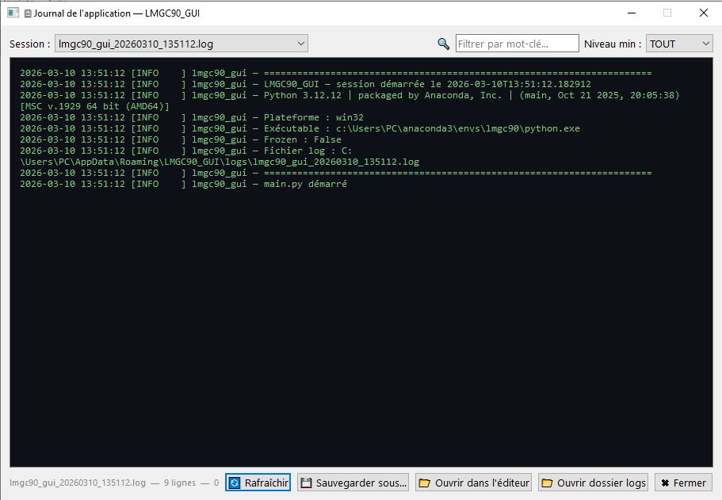
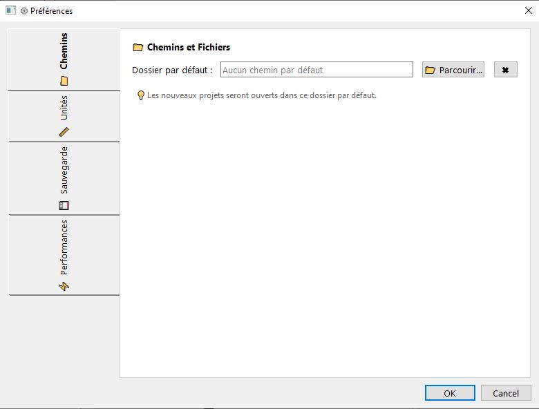

# Introduction à l'interface graphique de LMGC90_GUI

LMGC90_GUI est une interface graphique moderne conçue pour faciliter la création de modèles numériques avec le module **pre** (pré-processeur) de **LMGC90**.

Il est également possible de lancer vos calculs directement depuis LMGC90_GUI via le module **chipy**.

L'interface est organisée de manière claire et ergonomique pour accompagner l'utilisateur du début à la fin du processus de modélisation : création des éléments, conditions aux limites, post-traitement, génération des fichiers et enfin lancement des calculs.

La vidéo suivante présente une vue d'ensemble des différentes parties de l'interface.

## Fenêtre principale

L'interface est divisée en **Six zones principales** :

1. **Menu**
2. **Barre d'outils** (en haut)
3. **Arbre du modèle** (à gauche)
4. **Onglets de création** (centre haut)
5. **Zone de rendu** (centre bas)
6. **Barre d'état** (en bas)

---

### 1. Menu et Barre d'outils

#### Menu
##### Fichier

| Action | Raccourci | Description |
|--------|-----------|-------------|
| **Nouveau** | `Ctrl+N` | Crée un nouveau projet. Une boîte de dialogue s'ouvre pour saisir le nom du projet. |
| **Ouvrir** | `Ctrl+O` | Ouvre un projet existant. Une boîte de dialogue permet de naviguer jusqu'au fichier `.json` du projet. |
| **Sauvegarder** | `Ctrl+S` | Sauvegarde le projet courant à son emplacement actuel. |
| **Sauvegarder sous…** | `Ctrl+Shift+S` | Sauvegarde le projet sous un nouveau nom ou dans un nouvel emplacement. |
| **Quitter** | `Ctrl+Q` | Ferme l'application. |
 
**Nouveau projet**

Cliquez sur le bouton **Nouveau** de la barre d'outils, utilisez le menu **Fichier → Nouveau**, ou appuyez sur `Ctrl+N`. Une boîte de dialogue s'ouvre pour renseigner le nom du projet

  

**Ouvrir un projet**
 
Cliquez sur le bouton **Ouvrir** de la barre d'outils, utilisez le menu **Fichier → Ouvrir**, ou appuyez sur `Ctrl+O`. Il vous suffira ensuite de spécifier le chemin et le nom de votre projet

  

**Sauvegarder**
  Sert à sauvegarder vos projets dans votre disque dur, cliquez sur le bouton **sauvegarder** de la barre d'outils, ou de cliquez sur le menu **Fichier-> Sauvegarder**, ou avec le raccourci clavier `Ctrl+S`,

---

##### Assistants
 
Les assistants guident l'utilisateur étape par étape dans les tâches les plus courantes. Ils peuvent être utilisés autant de fois que nécessaire au cours d'un même projet.
 
| Assistant | Raccourci | Description |
|-----------|-----------|-------------|
| **Configuration de projet** | `Ctrl+Shift+N` | Guide pas à pas la création et la configuration initiale d'un nouveau projet (matériau, modèle, avatar de référence, loi de contact). |
| **Granulométrie pylmgc90** | `Ctrl+Shift+G` | Génère une distribution granulométrique avec dépôt gravitaire via les routines pylmgc90. Recommandé pour les assemblages de moins de 8 000 avatars. Au-delà, le rafraîchissement de l'interface peut être lent. |
| **Granulométrie numpy** _(bêta)_ | — | Génère et dépose des avatars à partir de numpy, sans passer par les routines pylmgc90. Recommandé pour les assemblages de plus de 5 000 avatars. |
| **Déformable** | `Ctrl+Shift+D` | Guide la création ou l'importation d'éléments déformables (maillages rectangles, disques, sphères, cylindres ou fichiers externes `.msh` / `.geo`). |
| **Maçonnerie** | `Ctrl+Shift+M` | Spécialisé dans la création d'empilements de briques 2D et 3D (`brick2D` / `brick3D`) selon différents appareillages (standard, running bond, paneresse simple, paneresse double, etc.). |

  

  

   

   

  

> **Remarque :** les assistants peuvent être relancés à tout moment pendant la session. Chaque exécution ajoute les éléments générés à la suite du projet existant, sans effacer ce qui a été créé auparavant. 
La duplication des éléments qui portent le même nom entraîne des erreurs, pensez à nommer différemment vos éléments.

---

##### Outils
 
| Action | Raccourci | Description |
|--------|-----------|-------------|
| **Générer DATBOX** | — | Génère les fichiers `.dat` utilisés par LMGC90 pour le calcul (DATBOX/). |
| **Générer Script Python** | — | Génère le script Python de pré-traitement (`pre.py`) reproduisant l'intégralité du modèle construit dans l'interface. |
| **Variables dynamiques** | `Ctrl+V` | Ouvre une boîte de dialogue permettant de définir des variables réutilisables dans les champs numériques de l'interface (rayon, espacement, offset, etc.). C'est également une fenêtre d'inspection des propriétés des objets LMGC90 présents en mémoire. Voir la page [Variables dynamiques](dynam_variables.md) |
| **Préférences** | `Ctrl+,` | Ouvre la boîte de dialogue de configuration de l'application. Voir section [Préférences](#5-préférences). |

---
  
##### Calcul
 
| Action | Raccourci | Description |
|--------|-----------|-------------|
| **Paramètres de calcul** | `Ctrl+F5` | Ouvre la boîte de dialogue de configuration des routines chipy : physique, détecteurs de contact, extractions, pilotage, inspection. |
| **Lancer calcul** | `F5` | Lance le calcul chipy directement depuis l'interface, dans un processus séparé pour ne pas bloquer l'interface. |
| **Générer Script Calcul** | — | Génère le script Python de calcul (`chipy.py`) depuis la configuration des routines. |
| **Voir logs LMGC90** | `F6` | Affiche en temps réel les sorties console du calcul en cours. |
| **Journal de l'application** | `F7` | Affiche le journal interne de LMGC90_GUI : erreurs non gérées, avertissements Python, appels pylmgc90 échoués. Utile pour diagnostiquer les problèmes qui ne génèrent pas de message visible dans l'interface. |
  

---

##### Onglets
 
| Action | Raccourci | Description |
|--------|-----------|-------------|
| **Ouvrir** | — | Ouvre un onglet spécifique parmi la liste complète. Voir section [Onglets de création](#3-onglets-de-création-zone-centrale-supérieure). |
| **Fermer les autres** | — | Ferme tous les onglets ouverts sauf l'onglet actif. |
| **Fermer tous (sauf essentiels)** | — | Ferme tous les onglets non essentiels. |
| **Onglets par défaut** | `Ctrl+Alt+D` | Restaure la disposition d'onglets par défaut. |
 
---
 
##### Aide
 
| Action | Description |
|--------|-------------|
| **À propos** | Affiche les informations sur la version de LMGC90_GUI et les dépendances. |
| **Aide en ligne** | Ouvre la documentation en ligne dans le navigateur par défaut. |
 
---
 
#### Barre d'outils
 
La barre d'outils regroupe les actions les plus fréquentes pour un accès rapide :
 
| Bouton | Équivalent menu |
|--------|----------------|
| Nouveau projet | Fichier → Nouveau |
| Ouvrir projet | Fichier → Ouvrir |
| Sauvegarder projet | Fichier → Sauvegarder |
| Générer Script Python | Outils → Générer Script Python |
| Générer DATBOX | Outils → Générer DATBOX _(depuis v0.2.6)_ |
 
---

### 2. Arbre du modèle (à gauche)
 
Zone fixe affichant l'**arborescence complète du modèle en cours**. Elle se met à jour automatiquement après chaque création, modification ou suppression d'élément.
 
#### Sections affichées
 
| Section | Contenu |
|---------|---------|
| **Matériaux** | Liste de tous les matériaux définis dans le projet. |
| **Modèles** | Liste de tous les modèles éléments finis (physique, élément, dimension). |
| **Avatars** | Liste de tous les corps du projet : rigides, vides, déformables. |
| **Groupes d'avatars** | Groupes créés par les boucles, la granulométrie ou l'assistant de maçonnerie. |
| **Lois de contact** | Lois de comportement de contact définies (frottement, cohésion, rigidité). |
| **Tables de visibilité** | Règles de visibilité chipy pour les avatars pendant le calcul. |
| **PostPro** | Commandes de post-traitement configurées. |
 
#### Fonctionnalités
 
- **Clic sur un élément** : ouvre l'onglet correspondant en mode édition et charge l'élément dans le formulaire.
- **Clic droit** : menu contextuel avec les actions Modifier, Supprimer et Informations selon l'élément sélectionné.
- **Vue hiérarchique** : les groupes d'avatars sont développables pour afficher les avatars membres.

---

### 3. Onglets de création (zone centrale supérieure)
 
Zone principale de travail. Chaque onglet est dédié à une étape de modélisation. Pour ouvrir un onglet, utilisez le menu **Onglets → Ouvrir** et choisissez l'onglet souhaité.

| Onglet | Raccourci | Description |
|--------|-----------|-------------|
| **Matériau** | `Ctrl+1` | Création et gestion des matériaux (RIGID, ELAS, ELAS_PLAS, THERMO_ELAS, PORO_ELAS, etc.). |
| **Modèle** | `Ctrl+2` | Définition des modèles physiques et éléments finis (MECAx, THERx, POROx, MULTI). |
| **Avatar** | `Ctrl+3` | Création de corps rigides standards : disque, jonc, polygone, mur rugueux, sphère, cylindre, polyèdre, etc. |
| **Avatar vide** | `Ctrl+4` | Création d'avatars à contacteurs personnalisés, ou ajout de contacteurs sur un corps déformable existant. |
| **Bibliothèques** | `Ctrl+5` | Avatars préconfigurés (formes complexes, assemblages courants) prêts à être insérés dans le projet. |
| **Boucles** | `Ctrl+6` | Génération paramétrique de séries d'avatars : cercle, grille, ligne, spirale ou placement manuel. |
| **Granulométrie** | `Ctrl+7` | Génération de dépôts avec distribution statistique des rayons et dépôt gravitaire. |
| **DOF** | `Ctrl+8` | Conditions aux limites : translations imposées, rotations bloquées, vitesses imposées, couplages de degrés de liberté. |
| **Contact** | `Ctrl+9` | Définition des lois de comportement de contact (frottement Coulomb, cohésion, rigidité normale et tangentielle). |
| **Visibilité** | — | Création de tables de visibilité chipy pour afficher ou masquer des avatars pendant le calcul. |
| **Postpro** | — | Configuration des commandes de post-traitement : bilan énergétique, suivi de corps, extraction de champs. |
| **Visualisation 3D** | — | Affichage interactif des avatars du modèle avec modes de navigation, sélection et mesure. |
 
> **Raccourcis clavier :** les touches `Ctrl+1` à `Ctrl+9` ouvrent directement les neuf premiers onglets de la liste.
 
---

### 4. Zone de rendu (zone centrale inférieure)
 
Zone dédiée à la visualisation et aux sorties du calcul.
 
#### Boutons disponibles
 
| Bouton | Description |
|--------|-------------|
| **LMGC90 Visualisation** | Lance la visualisation intégrée pylmgc90 via `pre.visuAvatars()`. Ouvre une fenêtre externe indépendante. |
| **ParaView** | Ouvre automatiquement les fichiers de sortie du calcul dans ParaView (par défaut `rigids.pvd`). Nécessite que ParaView soit installé sur la machine et qu'un calcul ait déjà été effectué. |
 
#### Modes interactifs du viewer 3D
 
| Mode | Description |
|------|-------------|
| **🖱️ Navigation** | Mode par défaut : rotation (clic gauche + glisser), zoom (molette), panoramique (clic droit + glisser). |
| **👆 Sélection** | Clic sur un avatar pour le mettre en évidence (surlignage jaune) et afficher ses informations dans la barre d'état. |
| **📏 Règle** | Mesure de distance : cliquer sur un premier point (A) puis un second point (B) pour afficher la distance en mètres. |
 
Les vues rapides **XY**, **XZ**, **YZ** et **Iso** sont accessibles depuis la barre d'outils du viewer.
 
---

### 5. Préférences

Accessible via **Outils → Préférences** ou le raccourci `Ctrl+,`. La boîte de dialogue de préférences regroupe les paramètres de configuration de l'application.

| Paramètre | Description |
|-----------|-------------|
| **Dossier des projets** | Chemin par défaut utilisé lors de l'ouverture et de la sauvegarde des projets. Cliquer sur **Parcourir** pour le modifier. |
| **Système d'unités** | Choix entre SI (mètre, kilogramme, seconde) et CGS (centimètre, gramme, seconde). _(Non encore implémenté dans cette version.)_ |
| **Sauvegarde automatique** | Options pour activer la sauvegarde automatique à intervalles réguliers et à la fermeture de l'application. |
| **Historique des projets récents** | Nombre maximum de projets conservés dans la liste **Fichier → Projets récents**. |
| **Affichage des avatars** | Active ou désactive l'affichage des avatars dans l'arbre du modèle et dans le tableau de l'onglet Avatar. Désactiver cette option améliore les performances sur les projets comportant un grand nombre d'avatars. 

---

### 6. Barre d'état 

Affiche des messages d'informations sur l'état des opérations en cours.

---

## Résumé des raccourcis clavier
 
| Raccourci | Action |
|-----------|--------|
| `Ctrl+N` | Nouveau projet |
| `Ctrl+O` | Ouvrir un projet |
| `Ctrl+S` | Sauvegarder |
| `Ctrl+Shift+S` | Sauvegarder sous… |
| `Ctrl+Q` | Quitter |
| `Ctrl+Shift+N` | Assistant de configuration de projet |
| `Ctrl+Shift+G` | Assistant de granulométrie pylmgc90 |
| `Ctrl+Shift+D` | Assistant de déformable |
| `Ctrl+Shift+M` | Assistant de maçonnerie |
| `Ctrl+V` | Variables dynamiques |
| `Ctrl+,` | Préférences |
| `Ctrl+F5` | Paramètres de calcul |
| `F5` | Lancer le calcul |
| `F6` | Voir les logs LMGC90 |
| `F7` | Journal de l'application |
| `Ctrl+Alt+D` | Onglets par défaut |
| `Ctrl+1` … `Ctrl+9` | Ouvrir l'onglet correspondant |
 
---
### 6. Barre d'état
 
Bande horizontale en bas de la fenêtre affichant des messages contextuels sur les opérations en cours : création d'un avatar, génération d'un script, résultat d'une mesure dans le viewer 3D, erreur de validation, etc.

---
 
LMGC90_GUI est conçue pour être **intuitive** et **entièrement visuelle**, tout en conservant une compatibilité totale avec les scripts Python traditionnels de LMGC90.
