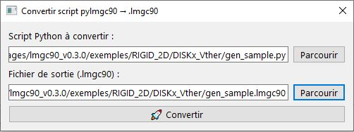

# Introduction to the LMGC90_GUI Graphical Interface

LMGC90_GUI is a modern graphical interface designed to facilitate the creation of numerical models with the **pre** (pre-processor) module of **LMGC90**.

It is also possible to launch your computations directly from LMGC90_GUI via the **chipy** module.

The interface is organized clearly and ergonomically to guide the user from start to finish of the modeling process: creating elements, boundary conditions, post-processing, file generation, and finally launching computations.

The following video presents an overview of the different parts of the interface.

## Main Window

The interface is divided into **six main areas**:

1. **Menu**
2. **Toolbar** (top)
3. **Model tree** (left)
4. **Creation tabs** (top center)
5. **Rendering area** (bottom center)
6. **Status bar** (bottom)

---

### 1. Menu and Toolbar

#### Menu
##### File

| Action | Shortcut | Description |
|--------|-----------|-------------|
| **New** | `Ctrl+N` | Creates a new project. A dialog box opens to enter the project name. |
| **Open** | `Ctrl+O` | Opens an existing project. A dialog box allows you to navigate to the project's `.json` file. |
| **Save** | `Ctrl+S` | Saves the current project to its current location. |
| **Save as…** | `Ctrl+Shift+S` | Saves the project under a new name or in a new location. |
| **Quit** | `Ctrl+Q` | Closes the application. |
 
**New project**

Click the **New** button in the toolbar, use the **File → New** menu, or press `Ctrl+N`. A dialog box opens to enter the project name.

  

**Open a project**
 
Click the **Open** button in the toolbar, use the **File → Open** menu, or press `Ctrl+O`. You will then simply need to specify the path and name of your project.

  

**Save**
  Used to save your projects to your hard drive. Click the **Save** button in the toolbar, use the **File → Save** menu, or use the keyboard shortcut `Ctrl+S`.

---

##### Wizards
 
Wizards guide the user step by step through the most common tasks. They can be used as many times as needed within the same project.
 
| Wizard | Shortcut | Description |
|-----------|-----------|-------------|
| **Project configuration** | `Ctrl+Shift+N` | Guides step by step through the creation and initial configuration of a new project (material, model, reference avatar, contact law). |
| **Granulometry pylmgc90** | `Ctrl+Shift+G` | Generates a granulometric distribution with gravitational deposit via pylmgc90 routines. Recommended for assemblies of fewer than 8,000 avatars. Beyond that, the interface refresh may become slow. |
| **Granulometry numpy** _(beta)_ | — | Generates and deposits avatars using numpy, without going through pylmgc90 routines. Recommended for assemblies of more than 5,000 avatars. |
| **Deformable** | `Ctrl+Shift+D` | Guides the creation or import of deformable elements (rectangular meshes, disks, spheres, cylinders, or external `.msh` / `.geo` files). |
| **Masonry** | `Ctrl+Shift+M` | Specialized in creating 2D and 3D brick stacks (`brick2D` / `brick3D`) according to different bonding patterns (standard, running bond, single stretcher bond, double stretcher bond, etc.). |
| **Factory** | `Ctrl+Shift+F` | Specialized in the 2D/3D avatar Factory, making them appear visually or in the computation. |

  

  

   

   

  

> **Note:** wizards can be relaunched at any time during the session. Each run adds the generated elements to the existing project, without erasing what was previously created.
Duplicating elements with the same name causes errors, so be sure to name your elements differently.

---

##### Tools
 
| Action | Shortcut | Description |
|--------|-----------|-------------|
| **Generate DATBOX** | — | Generates the `.dat` files used by LMGC90 for the computation (DATBOX/). |
| **Generate Python Script** | — | Generates the pre-processing Python script (`pre.py`) reproducing the entire model built in the interface. |
| **Convert lmgc90 script** | `Ctrl+Shift+C` | A dialog box that scans a pylmgc90 python script and converts it into an .lmgc90 file [beta version](#convert)|
| **Dynamic variables** | `Ctrl+V` | Opens a dialog box allowing you to define reusable variables in the interface's numeric fields (radius, spacing, offset, etc.). It is also an inspection window for the properties of LMGC90 objects present in memory. See the [Dynamic Variables](dynam_variables.md) page. |
| **Preferences** | `Ctrl+,` | Opens the application configuration dialog box. See the [Preferences](#5-preferences) section. |

---
  
##### Computation
 
| Action | Shortcut | Description |
|--------|-----------|-------------|
| **Computation settings** | `Ctrl+F5` | Opens the configuration dialog box for chipy routines: physics, contact detectors, extractions, control, inspection. |
| **Run computation** | `F5` | Launches the chipy computation directly from the interface, in a separate process so as not to block the interface. |
| **Generate Computation Script** | — | Generates the computation Python script (`chipy.py`) from the routine configuration. |
| **View LMGC90 logs** | `F6` | Displays the console output of the running computation in real time. |
| **Application log** | `F7` | Displays the internal log of LMGC90_GUI: unhandled errors, Python warnings, failed pylmgc90 calls. Useful for diagnosing problems that do not produce a visible message in the interface. |
  

---

##### Tabs
 
| Action | Shortcut | Description |
|--------|-----------|-------------|
| **Open** | — | Opens a specific tab from the complete list. See the [Creation tabs](#3-creation-tabs-upper-central-area) section. |
| **Close others** | — | Closes all open tabs except the active tab. |
| **Close all (except essential)** | — | Closes all non-essential tabs. |
| **Default tabs** | `Ctrl+Alt+D` | Restores the default tab layout. |
 
---
 
##### Help
 
| Action | Description |
|--------|-------------|
| **About** | Displays information about the LMGC90_GUI version and dependencies. |
| **Online help** | Opens the online documentation in the default browser. |
 
---
 
#### Toolbar
 
The toolbar groups together the most frequently used actions for quick access:
 
| Button | Menu equivalent |
|--------|----------------|
| New project | File → New |
| Open project | File → Open |
| Save project | File → Save |
| Generate Python Script | Tools → Generate Python Script |
| Generate DATBOX | Tools → Generate DATBOX _(since v0.2.6)_ |
 
---

### 2. Model Tree (left)
 
A fixed area displaying the **complete tree structure of the current model**. It updates automatically after each creation, modification, or deletion of an element.
 
#### Sections displayed
 
| Section | Content |
|---------|---------|
| **Materials** | List of all materials defined in the project. |
| **Models** | List of all finite element models (physics, element, dimension). |
| **Avatars** | List of all bodies in the project: rigid, empty, deformable. |
| **Avatar groups** | Groups created by loops, granulometry, or the masonry wizard. |
| **Contact laws** | Defined contact behavior laws (friction, cohesion, stiffness). |
| **Visibility tables** | chipy visibility rules for avatars during the computation. |
| **PostPro** | Configured post-processing commands. |
 
#### Features
 
- **Click on an element**: opens the corresponding tab in edit mode and loads the element into the form.
- **Right-click**: context menu with Edit, Delete, and Information actions depending on the selected element.
- **Hierarchical view**: avatar groups can be expanded to display the member avatars.

---

### 3. Creation Tabs (upper central area)
 
The main working area. Each tab is dedicated to a modeling step. To open a tab, use the **Tabs → Open** menu and choose the desired tab.

| Tab | Shortcut | Description |
|--------|-----------|-------------|
| **Material** | `Ctrl+1` | Creation and management of materials (RIGID, ELAS, ELAS_PLAS, THERMO_ELAS, PORO_ELAS, etc.). |
| **Model** | `Ctrl+2` | Definition of physical models and finite elements (MECAx, THERx, POROx, MULTI). |
| **Avatar** | `Ctrl+3` | Creation of standard rigid bodies: disk, jonc, polygon, rough wall, sphere, cylinder, polyhedron, etc. |
| **Empty avatar** | `Ctrl+4` | Creation of avatars with custom contactors, or addition of contactors to an existing deformable body. |
| **Libraries** | `Ctrl+5` | Preconfigured avatars (complex shapes, common assemblies) ready to be inserted into the project. |
| **Loops** | `Ctrl+6` | Parametric generation of series of avatars: circle, grid, line, spiral, or manual placement. |
| **Granulometry** | `Ctrl+7` | Generation of deposits with statistical distribution of radii and gravitational deposit. |
| **DOF** | `Ctrl+8` | Boundary conditions: imposed translations, blocked rotations, imposed velocities, degree-of-freedom couplings. |
| **Contact** | `Ctrl+9` | Definition of contact behavior laws (Coulomb friction, cohesion, normal and tangential stiffness). |
| **Visibility** | — | Creation of chipy visibility tables to show or hide avatars during the computation. |
| **Postpro** | — | Configuration of post-processing commands: energy balance, body tracking, field extraction. |
| **3D Visualization** | — | Interactive display of the model's avatars with navigation, selection, and measurement modes. |
 
> **Keyboard shortcuts:** the keys `Ctrl+1` through `Ctrl+9` directly open the first nine tabs in the list.
 
---

### 4. Rendering Area (lower central area)
 
An area dedicated to visualization and computation outputs.
 
#### Available buttons
 
| Button | Description |
|--------|-------------|
| **LMGC90 Visualization** | Launches the integrated pylmgc90 visualization via `pre.visuAvatars()`. Opens an independent external window. |
| **ParaView** | Automatically opens the computation's output files in ParaView (by default `rigids.pvd`). Requires ParaView to be installed on the machine and a computation to have already been performed. |
 
#### Interactive 3D viewer modes
 
| Mode | Description |
|------|-------------|
| **🖱️ Navigation** | Default mode: rotation (left-click + drag), zoom (scroll wheel), pan (right-click + drag). |
| **👆 Selection** | Click on an avatar to highlight it (yellow highlight) and display its information in the status bar. |
| **📏 Ruler** | Distance measurement: click on a first point (A) then a second point (B) to display the distance in meters. |
 
The quick views **XY**, **XZ**, **YZ**, and **Iso** are accessible from the viewer's toolbar.
 
---

### 5. Preferences

Accessible via **Tools → Preferences** or the shortcut `Ctrl+,`. The preferences dialog box brings together the application's configuration settings.

| Setting | Description |
|-----------|-------------|
| **Projects folder** | Default path used when opening and saving projects. Click **Browse** to change it. |
| **Unit system** | Choice between SI (meter, kilogram, second) and CGS (centimeter, gram, second). _(Not yet implemented in this version.)_ |
| **Automatic save** | Options to enable automatic saving at regular intervals and when closing the application. |
| **Recent projects history** | Maximum number of projects kept in the **File → Recent projects** list. |
| **Avatar display** | Enables or disables the display of avatars in the model tree and in the Avatar tab table. Disabling this option improves performance on projects with a large number of avatars. |

### Convert 

LMGC90_GUI includes a beta converter (python script) to .lmgc (JSON).
You simply need to provide the path to your script, then the name of your output file, and click the "Convert" button.

> **Note**: translation quality depends on the complexity of your script.

---

## Keyboard Shortcuts Summary
 
| Shortcut | Action |
|-----------|--------|
| `Ctrl+N` | New project |
| `Ctrl+O` | Open a project |
| `Ctrl+S` | Save |
| `Ctrl+Shift+S` | Save as… |
| `Ctrl+Q` | Quit |
| `Ctrl+Shift+N` | Project configuration wizard |
| `Ctrl+Shift+G` | Granulometry pylmgc90 wizard |
| `Ctrl+Shift+D` | Deformable wizard |
| `Ctrl+Shift+M` | Masonry wizard |
| `Ctrl+V` | Dynamic variables |
| `Ctrl+,` | Preferences |
| `Ctrl+F5` | Computation settings |
| `F5` | Run computation |
| `F6` | View LMGC90 logs |
| `F7` | Application log |
| `Ctrl+Alt+D` | Default tabs |
| `Ctrl+1` … `Ctrl+9` | Open the corresponding tab |
 
---
### 6. Status Bar
 
A horizontal strip at the bottom of the window displaying contextual messages about ongoing operations: creation of an avatar, generation of a script, measurement result in the 3D viewer, validation error, etc.

---
 
LMGC90_GUI is designed to be **intuitive** and **fully visual**, while maintaining full compatibility with traditional LMGC90 Python scripts.
