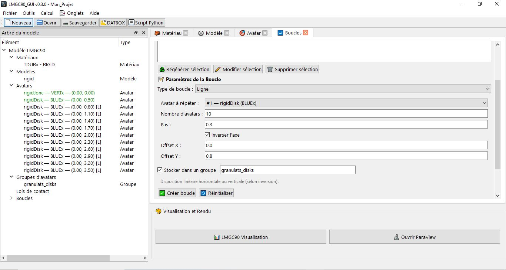
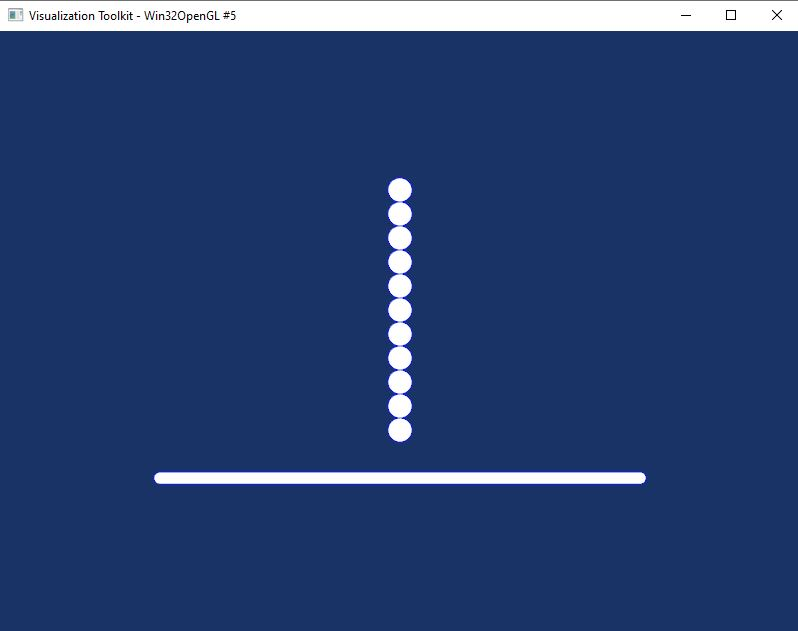
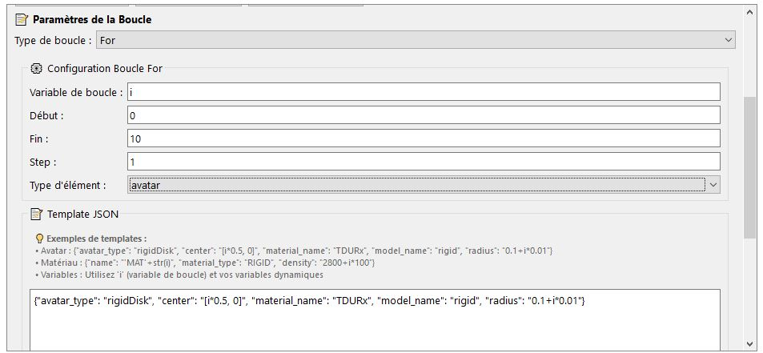

# Parametric Avatar Generation (Loops)

The **Loops** tab (`Ctrl+6`) allows you to automatically create series of avatars based on geometric patterns or Python expressions. It offers two complementary mechanisms:

- **Geometric loops**: automatic positioning of a model avatar according to a pattern (Circle, Grid, Line, Spiral).
- **Generic `for` loops**: generation of avatars, materials, models, contact laws, visibility tables, or DOF operations via Python expressions evaluated at each iteration.

The created loops are saved in the project and reconstructed when reloaded. They are also exported into the generated Python script.



---

## Part 1 — Geometric Loops

### Principle

A geometric loop takes a **model avatar** already defined in the Avatar tab, computes a list of positions according to the chosen pattern, then creates an identical copy of the avatar at each position. All the attributes of the model avatar are copied (type, material, model, radius, color, etc.).

### Form Fields

| Field | Description |
|-------|-------------|
| **Model avatar** | Index of the avatar whose properties will be copied to each position. Select from the dropdown list of existing avatars. |
| **Loop type** | Geometric placement pattern. See the 4 types below. |
| **Number of elements** | Number of avatars to create. |
| **Offset X** | Offset of the pattern's center along X (m). |
| **Offset Y** | Offset of the pattern's center along Y (m). |
| **Group** | Name of the avatar group in which to store the generated avatars. Left empty to not create a group. |

---

### Types of Geometric Loops

#### Circle

Distributes `count` avatars uniformly on a circle of radius `radius`, centered at `(offset_x, offset_y)`.

| Parameter | Description | Default |
|-----------|-------------|--------|
| **Radius** | Radius of the placement circle (m). | — |
| **Offset X / Y** | Center of the circle. | `0.0` |

**Typical use:** ring particles, rotating drum, bolt circle, circular granulometry.

---

#### Grid

Distributes `count` avatars on a square grid, with a spacing `step` between elements.

| Parameter | Description | Default |
|-----------|-------------|--------|
| **Step** | Distance between two neighboring avatars on the grid (m). | — |
| **Offset X / Y** | Bottom-left corner of the grid. | `0.0` |


> The grid is always square. If `count` is not a perfect square, the actual number of avatars created is `n_side²`. Example: `count=10` → 4×4 grid = 16 avatars.

**Typical use:** regular particle stacking, perforated plate, square lattice.

---

#### Line

Aligns `count` avatars in a straight line, separated by a step `step`, in the X or Y direction.

| Parameter | Description | Default |
|-----------|-------------|--------|
| **Step** | Distance between two consecutive avatars (m). | — |
| **Offset X / Y** | Position of the first avatar. | `0.0` |
| **Invert axis** | If checked, the line is oriented along Y (vertical) instead of X (horizontal). | unchecked |

**Typical use:** row of posts, line of particles, simple wall.



---

#### Spiral

Arranges `count` avatars on an Archimedean spiral, with an initial radius `radius` that grows by a factor `spiral_factor` at each iteration.

| Parameter | Description | Default |
|-----------|-------------|--------|
| **Initial radius** | Starting radius of the spiral (m). | — |
| **Spiral factor** | Radius increment per element (m). | — |
| **Offset X / Y** | Center of the spiral. | `0.0` |

**Typical use:** mixers, spiral deposits, decorative arrangements.

---

### Managing Geometric Loops

#### Creating a Loop

Fill in the form and click **✅ Generate the loop**. The avatars are created immediately in the project.

#### Editing a Loop

Select a loop in the list, modify the parameters, and click **💾 Update**. The old avatars are deleted and recreated with the new parameters.

#### Deleting a Loop

Select a loop in the list and click **🗑️ Delete**. All avatars generated by this loop are automatically deleted.

> **Cascading deletion:** deleting a loop deletes **all** the avatars it generated (indices recorded in `loop.generated_indices`), in reverse order so as not to shift the other indices.

---

## Part 2 — Generic `for` Loops

### Principle

Generic `for` loops allow you to create series of elements by varying a **loop variable** over an interval defined by Python expressions. The **element type** to create is chosen among: avatar, material, model, contact law, visibility table, or DOF operation.



At each iteration, the **configuration template** is evaluated with the loop variable injected into the evaluation context.

### Form Fields

| Field | Description | Example |
|-------|-------------|---------|
| **Loop variable** | Name of the Python variable available in the template. | `i`, `k`, `n` |
| **Start** | Python expression for the starting value. | `0`, `1`, `n_start` |
| **End** | Python expression for the ending value (excluded). | `10`, `count`, `n_start + 5` |
| **Step** | Python expression for the increment. | `1`, `2`, `-1` |
| **Element type** | Type of the object to create at each iteration. | see table below |
| **Template** | Configuration of the element, with the loop variable usable in the values. | see sections by type |
| **Group** | Name of the avatar group (avatars only). | `ma_ligne` |

### Available Evaluation Context

The expressions in the template and the loop bounds have access to the following elements:

| Symbol | Description |
|---------|-------------|
| `i` (or the loop variable) | Current value of the iteration |
| `math` | Full Python `math` module |
| `sqrt`, `pi`, `e` | Math shortcuts |
| `abs`, `min`, `max`, `sum`, `len` | Standard Python functions |
| `str`, `int`, `float` | Type conversions |
| Dynamic variables | All variables defined in the **Tools → Dynamic Variables** menu |

---

### Available Element Types

#### `avatar` Type — Avatar Creation

Creates an avatar at each iteration. All the parameters of the Avatar tab are available in the template.

**Template Parameters:**

| Key | Description | Example |
|-----|-------------|---------|
| `avatar_type` | pylmgc90 type of the avatar. | `"rigidDisk"` |
| `center` | Python expression returning a list `[x, y]` or `[x, y, z]`. The loop variable can be used. | `[i * 0.1, 0.0]` |
| `material_name` | Name of the material (string). | `"TDURx"` |
| `model_name` | Name of the model (string). | `"rigid"` |
| `color` | LMGC90 color code (5 characters). | `"BLUEx"` |
| `radius` | Python expression for the radius (m). | `"0.05 + i * 0.01"` |
| `axis` | Dict `{axe1: expr, axe2: expr}` for joncs / planes. | `{"axe1": "1.0", "axe2": "0.1"}` |
| `nb_vertices` | Expression for the number of vertices (polygons). | `"6"` |
| `generation_type` | `"regular"`, `"full"`, or `"bevel"`. | `"regular"` |
| `vertices` | Python expression returning the list of vertices. | `"[[-0.1,-0.1],[0.1,-0.1],[0.1,0.1],[-0.1,0.1]]"` |
| `wall_params` | Dict of wall parameters. | `{"l": "2.0", "r": "0.05"}` |
| `contactors` | List of contactors (same format as the Empty Avatar tab). | |
| `is_hollow` | Boolean — creates a hollow disk. | `false` |

**Generated Script:**
```python
for i in range(0, 10, 1):
    center = [i * 0.1, 0.0]
    body = pre.rigidDisk(
        center=center,
        model=mods['rigid'],
        material=mats['TDURx'],
        color='BLUEx',
        r=0.05 + i * 0.01
    )
    bodies.addAvatar(body)
    bodies_list.append(body)
```

**Typical use:** line of disks with increasing radii, grid of heterogeneous avatars, series of bodies with varying parameters.

---

#### `material` Type — Material Creation

Creates a material at each iteration. Useful for generating a family of materials with graded properties.

**Template Parameters:**

| Key | Description | Example |
|-----|-------------|---------|
| `name` | Python expression for the name (string, 5 chars max). | `"str('mat') + str(i)"` |
| `material_type` | LMGC90 material type. | `"RIGID"` |
| `density` | Python expression for the density (kg/m³). | `"2800 + i * 100"` |
| `properties` | Dict of additional properties. | `{"young": "1e9 + i * 1e8"}` |

**Generated Script:**
```python
for i in range(0, 5, 1):
    mat_name = str('mat') + str(i)
    density_val = 2800 + i * 100
    mats[mat_name] = pre.material(
        name=mat_name,
        materialType='RIGID',
        density=density_val
    )
    materials.addMaterial(mats[mat_name])
```

---

#### `model` Type — Model Creation

Creates a finite element model at each iteration.

**Template Parameters:**

| Key | Description | Example |
|-----|-------------|---------|
| `name` | Python expression for the name. | `"'mod' + str(i)"` |
| `physics` | Physics. | `"MECAx"` |
| `element` | Finite element. | `"Rxx2D"` |
| `dimension` | Dimension (2 or 3). | `2` |
| `options` | Dict of numerical options. | `{}` |

---

#### `contact_law` Type — Contact Law Creation

Creates a contact law at each iteration. Useful for generating laws with different friction coefficients.

**Template Parameters:**

| Key | Description | Example |
|-----|-------------|---------|
| `name` | Python expression for the name. | `"'law' + str(i)"` |
| `law_type` | Law type (`IQS_CLB`, etc.). | `"IQS_CLB"` |
| `friction` | Python expression for the friction coefficient. | `"0.1 + i * 0.05"` |

**Generated Script:**
```python
for i in range(0, 5, 1):
    law_name = 'law' + str(i)
    laws[law_name] = pre.tact_behav(
        name=law_name,
        law='IQS_CLB',
        fric=0.1 + i * 0.05
    )
    tacts.addBehav(laws[law_name])
```

---

#### `visibility` Type — Visibility Table Creation

Creates a visibility rule (contact detection table) at each iteration.

**Template Parameters:**

| Key | Description | Example |
|-----|-------------|---------|
| `candidate_body` | Candidate body (`RBDY2`, `RBDY3`). | `"RBDY2"` |
| `candidate_contactor` | Candidate contactor (`DISKx`, etc.). | `"DISKx"` |
| `candidate_color` | Expression for the candidate color. | `"'BLUEx'"` |
| `antagonist_body` | Antagonist body. | `"RBDY2"` |
| `antagonist_contactor` | Antagonist contactor. | `"DISKx"` |
| `antagonist_color` | Expression for the antagonist color. | `"'REDxx'"` |
| `behavior_name` | Name of the associated contact law. | `"'law' + str(i)"` |
| `alert` | Alert distance (m). | `"0.05 + i * 0.01"` |

---

#### `dof` Type — DOF Operations

Applies a boundary condition (imposed degree of freedom) to one or more avatars at each iteration.

**Template Parameters:**

| Key | Description | Example |
|-----|-------------|---------|
| `operation_type` | pylmgc90 operation type. | `"imposeDrivenDof"` |
| `target_type` | Always `"avatar"`. | `"avatar"` |
| `target_value` | Python expression for the index of the target avatar. | `"i"`, `"i + 10"` |
| `parameters` | Dict of pylmgc90 kwargs. | `{"component": "[1,2]", "dofty": "\"vlocy\""}` |

**Generated Script:**
```python
for i in range(0, 5, 1):
    bodies_list[i].imposeDrivenDof(component=[1,2], dofty="vlocy")
```

---

### Managing `for` Loops

`for` loops are listed separately from geometric loops. The same operations are available: create, edit (regenerates the elements), delete (removes the generated elements).

---

## Avatar Groups

Both types of loops can store the generated avatars in a **named group**. A group is a list of avatar indices accessible throughout the project under the given name.

Groups allow you to:
- apply a DOF condition to all the avatars of a group at once
- target a set of avatars in visibility tables
- distinguish multiple avatar populations for data extraction (chipy `GetBodyVector`)

> If the Group field is left empty, no group is created and the avatars are simply added to the global list.

---

## Summary of Parameters by Geometric Loop Type

| Type | Required Parameters | Optional Parameter | Formula |
|------|-------------------|---------------------|---------|
| **Circle** | `count`, `radius` | `offset_x`, `offset_y` | `x = offset_x + radius × cos(2πi/count)` |
| **Grid** | `count`, `step` | `offset_x`, `offset_y` | `x = offset_x + (i % n_side) × step` |
| **Line** | `count`, `step` | `offset_x`, `offset_y`, `invert_axis` | `x = offset_x + i × step` (or Y if inverted) |
| **Spiral** | `count`, `radius`, `spiral_factor` | `offset_x`, `offset_y` | `r = radius + i × spiral_factor` |


---

## Important Notes

**Non-deletable model avatar:** an avatar used as a model by a geometric loop cannot be deleted as long as the loop exists. A warning message is displayed.

**Cascading update:** editing a loop (geometric or `for`) deletes and recreates all its avatars. If other elements of the project reference these avatars (DOF conditions, visibility tables), they may be invalidated.

**Python expressions:** in `for` loops, expressions are evaluated via `SafeEvaluator`. Malformed expressions generate an error message without blocking the project. Dynamic variables defined in **Tools → Dynamic Variables** (`Ctrl+V`) are accessible in all expressions.

**3D dimension:** geometric loops generate 2D `[x, y]` or 3D `[x, y, z]` centers depending on the project's dimension. 3D avatars (spheres, polyhedra) can be generated in a `for` loop with explicitly 3D centers in the template.

**Number of elements and performance:** creating more than a few thousand avatars via a loop can slow down the interface. For large assemblies (> 5,000 avatars), use the granulometry generator or the dedicated wizards.
