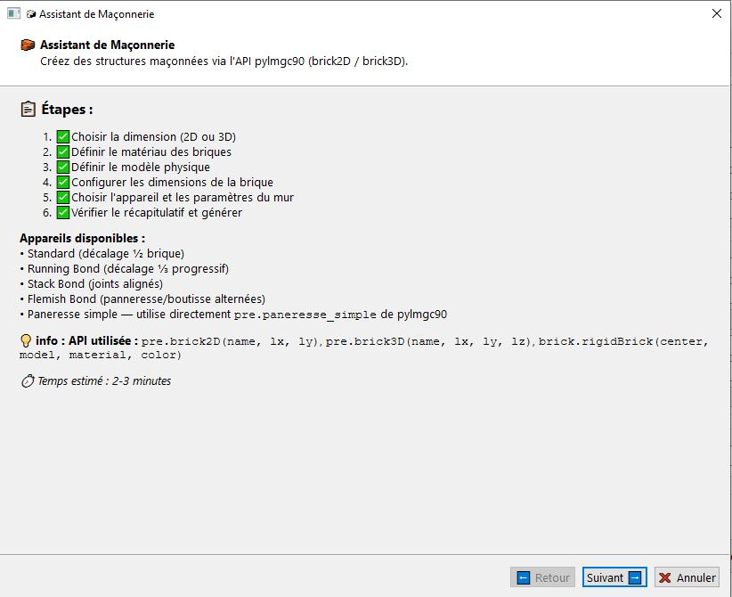
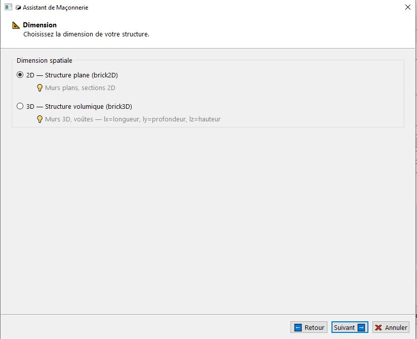
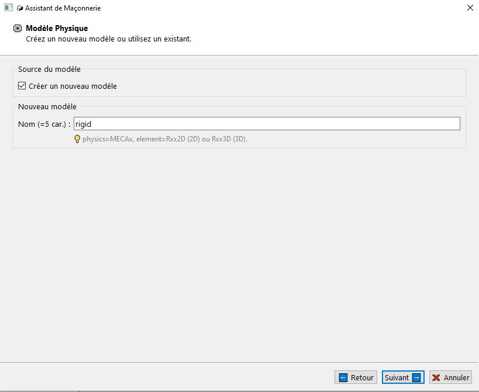
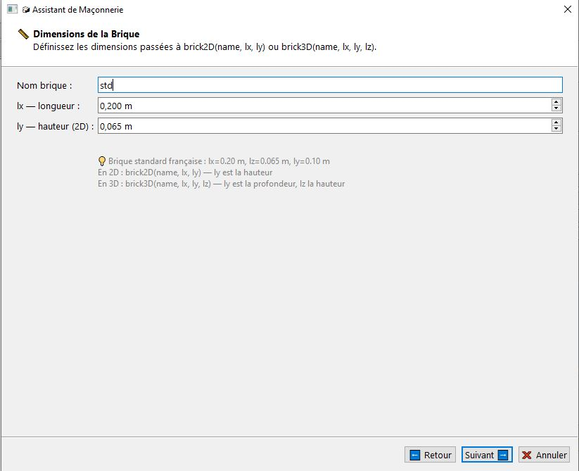
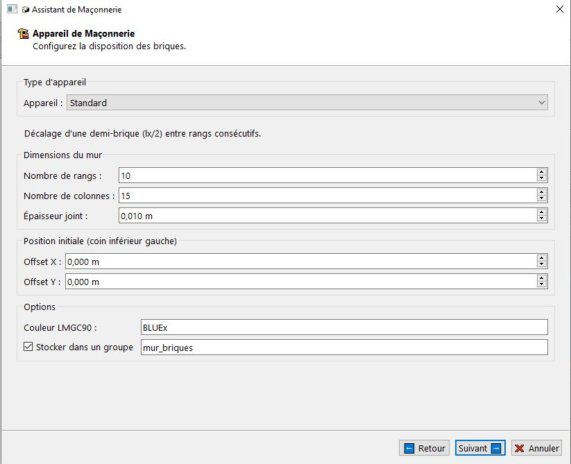
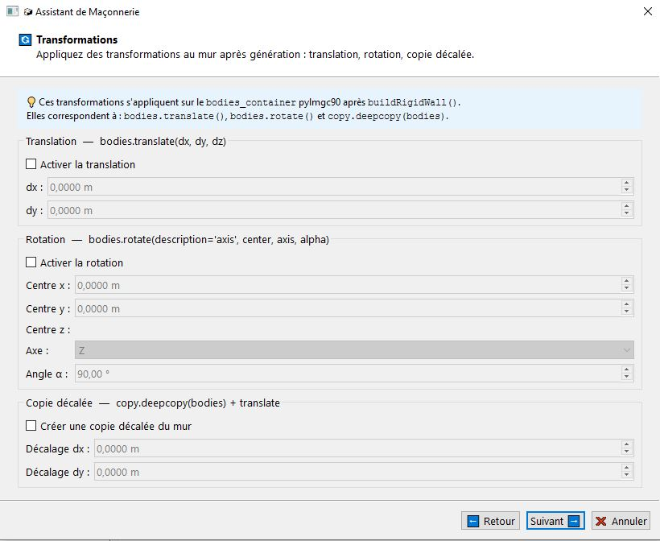

# Masonry Wizard

The **Masonry Wizard** guides you step by step through the creation of masonry structures in LMGC90_GUI. It automatically generates stacks of rigid bricks via the pylmgc90 API (`brick2D`, `brick3D`, `paneresse_simple`, `paneresse_double`), managing the generation functions, joints, transformations, and avatar groups.

---

## Launching the Wizard

| Method | Action |
|---------|--------|
| Menu | **Wizards → Masonry Wizard…** |
| Keyboard shortcut | `Ctrl+Shift+M` |

> **Cancellation possible at any time** via the **❌ Cancel** button, with no changes made to the project.

---

## Overview of Steps

The wizard consists of **8 pages** navigated sequentially.

| Page | Title | Description |
|------|-------|-------------|
| 0 | Introduction | Presentation of the bonding patterns and the API used |
| 1 | Dimension | 2D (`brick2D`) or 3D (`brick3D`) |
| 2 | Material | Create or reuse a `RIGID`-type material |
| 3 | Model | Create or reuse a `Rxx2D` / `Rxx3D` model |
| 4 | Brick dimensions | `lx`, `ly`, `lz`, and brick name |
| 5 | Masonry bond | Bond type, wall dimensions, position, color, group |
| 6 | Transformations | Translation, rotation, offset copy after generation |
| 7 | Summary | Verification before generation 




**pylmgc90 API used:**
- `pre.brick2D(name, lx, ly)` — 2D brick (length × height)
- `pre.brick3D(name, lx, ly, lz)` — 3D brick (length × depth × height)
- `brick.rigidBrick(center, model, material, color)` — pylmgc90 avatar from the brick
- `pre.paneresse_simple(brick_ref, disposition)` — single-thickness wall managed by pylmgc90
- `pre.paneresse_double(brick_ref, disposition)` — double-thickness wall managed by pylmgc90

---

## Page 1 — Dimension

| Choice | pylmgc90 API | Description |
|-------|-------------|-------------|
| **2D** — Flat structure | `pre.brick2D(name, lx, ly)` | Flat walls, 2D sections. `ly` is the **height** of the brick. |
| **3D** — Volumetric structure | `pre.brick3D(name, lx, ly, lz)` | 3D walls, vaults. `ly` is the **depth**, `lz` is the **height**. |

The **2D** value is selected by default.



> **Effect on subsequent steps:** the dimension determines the label of `ly` (height in 2D / depth in 3D), the visibility of `lz` and the Z offset, the model element (`Rxx2D` or `Rxx3D`), and the available rotation axes.

---

## Page 2 — Brick Material

Two modes available:

### Mode A — Create a New Material _(checked by default)_

| Field | Description | Default Value |
|-------|-------------|-------------------|
| **Name** | Material identifier. **5 characters maximum** (LMGC90 constraint). | `brick` |
| **Density** | Density (kg/m³). Range: 100 to 20,000. | `1800 kg/m³` (typical masonry) |

> The type is always `RIGID` — bricks are rigid bodies. There is no need to specify elastic properties.

### Mode B — Use an Existing Material

Dropdown list of all materials already defined in the Material tab. All types are accepted, but `RIGID` is recommended for bricks.


> **Validation:** the Next button is disabled if the name is empty (mode A) or if no valid material is available (mode B).

---

## Page 3 — Physical Model

Two modes available:

### Mode A — Create a New Model _(checked by default)_

| Field | Description | Default Value |
|-------|-------------|-------------------|
| **Name** | Model identifier. **5 characters maximum.** | `rigid` |
| **Physics** | Always `MECAx` for rigid bricks. | `MECAx` (automatic) |
| **Element** | Adapted automatically to the dimension. | `Rxx2D` (2D) or `Rxx3D` (3D) |

### Mode B — Use an Existing Model

Dropdown list of the models defined in the Model tab.



> **Validation:** the Next button is disabled if the name is empty (mode A) or if no valid model is available (mode B).

---

## Page 4 — Brick Dimensions

Defines the geometry of the reference brick passed to `brick2D()` or `brick3D()`.

| Field | Description | 2D | 3D | Default Value |
|-------|-------------|----|----|-------------------|
| **Brick name** | Internal pylmgc90 identifier (8 characters max). Used as the first argument of `brick2D` / `brick3D`. | ✅ | ✅ | `std` |
| **lx — length** | Length of the brick along the X direction (m). | ✅ | ✅ | `0.200 m` |
| **ly — height (2D)** | In 2D: height of the brick. `ly` argument of `brick2D`. | ✅ | — | `0.065 m` |
| **ly — depth (3D)** | In 3D: depth (wall thickness). `ly` argument of `brick3D`. | — | ✅ | `0.100 m` |
| **lz — height (3D)** | 3D only: height of the brick. `lz` argument of `brick3D`. | — | ✅ | `0.065 m` |

> **Standard French brick:** lx = 0.20 m · ly = 0.10 m · lz = 0.065 m (NF EN 771-1 format).  
> **pylmgc90 convention:** `brick2D(name, lx, ly)` with ly = height. `brick3D(name, lx, ly, lz)` with ly = depth, lz = height.



---

## Page 5 — Masonry Bond

Main configuration page. Defines the stacking type, wall dimensions, position, color, and avatar group.

---

### Available Bond Types

#### Standard — Half-Brick Offset

Each odd row is offset by half a brick (`lx/2`) relative to the even row. The most common bond, very resistant to vertical loads.

```
Row 2: [=====][=====][=====]
Row 1:   [=====][=====][=====]
Row 0: [=====][=====][=====]
```

**Center calculation:**
```
cx = offset_x + col × (lx + joint) + (lx/2 if odd row) + lx/2
cy = offset_y + row × (ly + joint) + ly/2
```

---

#### Running Bond — Progressive Third Offset

The offset increases by a third of a brick (`lx/3`) at each row, then returns to zero every three rows.

```
Row 3: [=====][=====][=====]
Row 2:     [=====][=====][=====]
Row 1:   [=====][=====][=====]
Row 0: [=====][=====][=====]
```

**Center calculation:**
```
cx = offset_x + col × (lx + joint) + (row % 3) × (lx/3) + lx/2
```

---

#### Stack Bond — Aligned Joints

All vertical joints are perfectly aligned. No offset between rows. Aesthetically pleasing, but mechanically less resistant (no interlocking between rows).

```
Row 2: [=====][=====][=====]
Row 1: [=====][=====][=====]
Row 0: [=====][=====][=====]
```

**Center calculation:**
```
cx = offset_x + col × (lx + joint) + lx/2
cy = offset_y + row × (ly + joint) + ly/2
```

---

#### Flemish Bond — Alternating Stretcher / Header

Each row alternates bricks laid as stretchers (length `lx`) and bricks laid as headers (length `lx/2`). The pattern reverses from one row to the next.

```
Row 1: [1/2][==lx==][1/2][==lx==]
Row 0: [==lx==][1/2][==lx==][1/2]
```

**Calculation:** if `(row + col) % 2 == 0` → stretcher (`brick_lx = lx`), otherwise header (`brick_lx = lx/2`). The X position is calculated using a cumulative cursor.

---

### Functions Available Only in 3D

#### Single Stretcher Bond — `pre.paneresse_simple`

**Single-thickness** wall generated by the pylmgc90 API, with automatic handling of half-bricks at the ends, joints, and height.

**Options specific to this bond:**

| Option | Description | Values |
|--------|-------------|---------|
| **Disposition** | Orientation of the bricks within the row. | `paneresse` (stretcher) · `boutisse` (header) · `chant` (on edge) |
| **First brick** | Brick type at the start of the first row. | `1` · `1/2` · `1/4` · `3/4` |
| **Sizing** | Method for defining the width of the wall. | Number of bricks · Total length (m) |
| **Total length** | Visible only if Sizing = "Total length". Calls `setFirstRowByLength()`. | E.g.: `3.0 m` |
| **No half-bricks** | If checked, calls `buildRigidWallWithoutHalfBricks()` instead of `buildRigidWall()`. | checkbox |

**Dispositions:**

| Disposition | Description |
|-------------|-------------|
| `paneresse` (stretcher) | Bricks laid lengthwise (visible face = long side). |
| `boutisse` (header) | Bricks laid crosswise (visible face = short side, `lx/2`). |
| `chant` (on edge) | Bricks laid on edge (height = width of the brick). |


---

#### Double Stretcher Bond — `pre.paneresse_double`

**Double-thickness** wall (two rows of bricks side by side). All the options of the single stretcher bond are available. The pylmgc90 API automatically manages the offset between the two thicknesses.

---

### Wall Dimensions

| Field | Description | Default |
|-------|-------------|--------|
| **Number of rows** | Height of the wall in number of brick rows. Range: 1 to 200. | `10` |
| **Number of columns** | Width of the wall in number of bricks per row. Range: 1 to 200. | `15` |
| **Joint thickness** | Thickness of the mortar between bricks (m). Range: 0 to 0.05. | `0.010 m` |

> **Automatic estimate** in the summary:  
> Wall width ≈ nb_columns × (lx + joint)  
> Wall height ≈ nb_rows × (lz or ly + joint)

> **Warning beyond 5,000 bricks:** a confirmation dialog requests validation before continuing, since generation can take several seconds.

---

### Initial Position

Coordinates of the **bottom-left corner** of the wall (in meters). The centers of the bricks are calculated from this point.

| Field | Description | Default |
|-------|-------------|--------|
| **Offset X** | X coordinate of the bottom-left corner. | `0.0 m` |
| **Offset Y** | Y coordinate of the bottom-left corner. | `0.0 m` |
| **Offset Z** | Z coordinate of the wall (3D only). | `0.0 m` |

---

### Options

| Option | Description | Default |
|--------|-------------|--------|
| **LMGC90 Color** | 5-character color code. | `BLUEx` |
| **Store in a group** | If checked, saves all generated avatars in a named group (`state.avatar_groups`). The group is also saved in `masonry_patterns` for script reconstruction. | checked |
| **Group name** | Avatar group identifier. | `mur_briques` |



---

## Page 6 — Post-Generation Transformations

Transformations are applied **after** the generation of all the bricks, to the entire set of pylmgc90 bodies in the current session. They correspond to the pylmgc90 calls `bodies.translate()`, `bodies.rotate()`, and `copy.deepcopy(bodies)`.

> All transformations are **disabled by default** (unchecked boxes). The fields are grayed out as long as the corresponding box is not checked.

---

### Translation — `bodies.translate(dx, dy, dz)`

Moves the entire wall by a vector (dx, dy, dz).

| Field | Description | Default |
|-------|-------------|--------|
| **Enable translation** | checkbox | unchecked |
| **dx** | Displacement along X (m). | `0.0 m` |
| **dy** | Displacement along Y (m). | `0.0 m` |
| **dz** | Displacement along Z (m). **3D only.** | `0.0 m` |

**Generated pylmgc90 call:**
```python
# In 2D
bodies.translate(dx=dx, dy=dy)
# In 3D
bodies.translate(dx=dx, dy=dy, dz=dz)
```

---

### Rotation — `bodies.rotate(description='axis', center, axis, alpha)`

Rotates the entire wall about an axis passing through a given center. The angle is entered in degrees and automatically converted to radians.

| Field | Description | Values | Default |
|-------|-------------|---------|--------|
| **Enable rotation** | checkbox | — | unchecked |
| **Center x** | X coordinate of the center of rotation (m). | — | `0.0 m` |
| **Center y** | Y coordinate of the center of rotation (m). | — | `0.0 m` |
| **Center z** | Z coordinate of the center of rotation (m). **3D only.** | — | `0.0 m` |
| **Axis** | Axis of rotation. In 2D, only Z is relevant (set automatically). | `Z` · `X` · `Y` | `Z` |
| **Angle α** | Rotation angle in degrees. Converted to radians before the pylmgc90 call. | −360° to +360° | `90.0°` |

**Generated pylmgc90 call:**
```python
import math, numpy as np
alpha = math.radians(90.0)
axis  = [0., 0., 1.]            # Z axis
center = np.array([cx, cy, cz])
bodies.rotate(description='axis', center=center, axis=axis, alpha=alpha)
```

> **In 2D:** the axis is always Z (rotation in the XY plane). The Axis field is grayed out and fixed to `Z`.

---

### Offset Copy — `copy.deepcopy(bodies) + translate`

Duplicates the complete wall (after any translation and rotation) and applies an offset to it. This creates a second, independent wall in the project.

| Field | Description | Default |
|-------|-------------|--------|
| **Create an offset copy** | checkbox | unchecked |
| **Offset dx** | X offset of the copy (m). | `0.0 m` |
| **Offset dy** | Y offset of the copy (m). | `0.0 m` |
| **Offset dz** | Z offset of the copy (m). **3D only.** | `0.0 m` |

**Generated pylmgc90 call:**
```python
import copy
bodies_copy = copy.deepcopy(bodies)
bodies_copy.translate(dx=dx_copy, dy=dy_copy)   # or dz in 3D
```

> **Typical use:** creating two parallel walls at once (dx = room thickness), or, combined with rotation, creating a building corner.



---

## Page 7 — Summary

Displays a complete HTML table before generation, including:

| Section | Information |
|---------|-------------|
| **Dimension** | 2D or 3D |
| **pylmgc90 API** | `brick2D(...)` or `brick3D(...)` call with the exact values |
| **Material** | Name and density (new) or existing name |
| **Model** | Name (new) or existing name |
| **Brick dimensions** | lx, ly, lz |
| **Bond** | Name of the selected pattern |
| **Rows × columns** | Estimated total number of bricks |
| **Joint thickness** | Value in meters |
| **Estimated wall size** | Width × Height calculated from the parameters |
| **Position** | Offset X, Y (and Z in 3D) |
| **Color** | LMGC90 color code |
| **Group** | Group name (if enabled) |
| **Translation** | dx, dy, dz (if enabled) |
| **Rotation** | Axis, angle α, center (if enabled) |
| **Offset copy** | dx, dy, dz of the copy (if enabled) |
| **Stretcher bond options** | Disposition, first brick, sizing mode, no half-bricks (if a stretcher bond) |

> **Automatic warning:** if the total number of bricks exceeds 1,000, an orange message indicates that generation may be slow.

Click **✅ Generate** to create the structure. A confirmation message indicates the number of bricks created.

---

## Generation Result

At the end of the wizard, the following elements are created in the project:

| Element | Description |
|---------|-------------|
| **Material** | Added to the Material tab (if created). Type `RIGID`, configured density. |
| **Model** | Added to the Model tab (if created). `MECAx` + `Rxx2D` or `Rxx3D`. |
| **Brick avatars** | One `EMPTY_AVATAR` avatar per brick, with `wall_params` stored for reconstruction. Configured color. |
| **Group** | Group named in `state.avatar_groups`, grouping together all the indices of the generated avatars (if the option is enabled). |
| **masonry_patterns** | Dictionary saved in the state for reconstruction of the generation script by `ScriptGenerator`. |

> **Script reconstruction:** the complete parameters of the pattern (bond, dimensions, joints, transformations, etc.) are saved in `state.masonry_patterns[group_name]`. The script generator (`script_generator.py`) uses this data to faithfully reproduce the pylmgc90 generation upon export.

---

## Usage Examples

### Simple 2D Standard Wall

```
Dimension      : 2D
Material       : brick — RIGID — 1800 kg/m³
Model          : rigid — MECAx — Rxx2D
Brick          : std — lx=0.200 m, ly=0.065 m
Bond           : Standard
Rows × cols.   : 10 × 15 (150 bricks)
Joint          : 0.010 m
Position       : (0.0, 0.0)
Color          : BLUEx
Group          : mur_nord
Transformations: (none)
```

---

### Single Stretcher Bond Wall with Fixed Length

```
Dimension      : 3D
Material       : stone — RIGID — 2200 kg/m³
Model          : rigid — MECAx — Rxx3D
Brick          : std — lx=0.200 m, ly=0.100 m, lz=0.065 m
Bond           : Single stretcher bond (pylmgc90)
  Disposition       : paneresse (stretcher)
  First brick       : 1/2
  Sizing            : Total length — 4.000 m
  No half-bricks    : No
Rows           : 15
Joint          : 0.010 m
Group          : mur_facade
```

---

### Two Parallel Walls via Offset Copy

```
Bond           : Standard — 8 rows × 12 columns
Translation    : disabled
Rotation       : disabled
Offset copy    : enabled — dx=0.0, dy=3.5 m (room width)
```

Result: two identical walls 3.5 m apart, created in a single run of the wizard.

---

## Important Notes

**Brick name limited to 8 characters:** the Brick name field accepts up to 8 characters, but LMGC90 may truncate identifiers. Use short names (`std`, `half`, `custom`).

**Performance:** beyond 5,000 bricks, generation and the interface can slow down significantly. For large assemblies (> 10,000 bricks), prefer direct generation from a Python script.

**Default color:** if the Color field is left empty, the value `BLUEx` is used automatically.

**Transformations and centers:** after a translation or rotation, the centers of the avatars in `state.avatars` are updated from the actual coordinates of the pylmgc90 nodes (`body.nodes[1].coor`). The avatars of the offset copy are added afterward with their own calculated center.

**Reusability:** the wizard can be launched multiple times on the same project. Each run adds a new group of bricks without erasing the previous ones, provided different element and group names are used.
