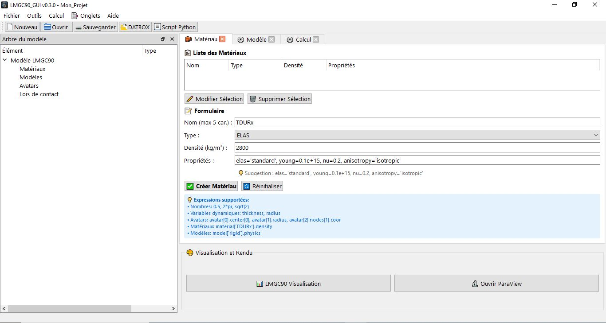
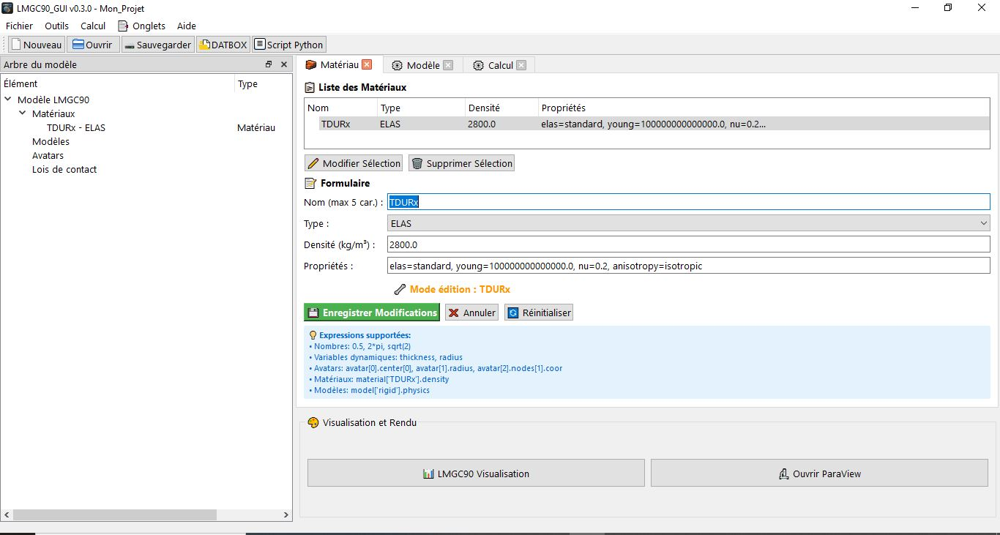
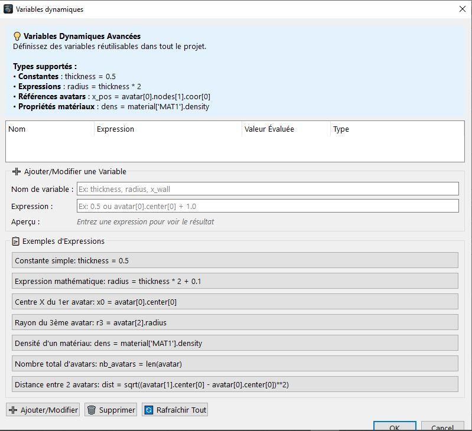

# Création d'un Matériau

Cette section explique comment créer et configurer un matériau dans LMGC90_GUI.

## Interface
- Onglet **Matériau** vous sert à créer votre matériau,
- Champs principaux :
  - **Nom** : Nom unique du matériau (maximum 5 caractère ex: `TDURx`, `ROCKx`, `steel`)
  - **Type** : Liste déroulante avec les types supportés
  - **Densité** : Valeur en kg/m³ (en SI)
  - **Propriétés** : Champ texte pour paramètres avancés pour chaque type de matériau

## Types de matériaux disponibles
Vous pourriez créer différents types de matériaux, ce tabelau comprenne tous les paramères pour chaque matériau:  

| Code matériau | Nom complet | Nombre de paramètres | Paramètres principaux | Modèles compatibles |
|---------------|-------------|----------------------|-----------------------|---------------------|
| **RIGID** | Corps rigide | 1 | density | MECAx, THERx |
| **THERMO_RIGID** | Corps rigide thermique | 6 | density, anisotropy, thermal_conductivity, specific_heat, thermal_young, thermal_nu | MECAx, THERx |
| **DISCRETE** | Éléments discrets | 3 | masses, stiffnesses, viscosities | MECAx, THERx |
| (x)**USER_MAT** | Matériau utilisateur | 2 | density, file_mat | MECAx |
| (x)**EXTERNAL** | Matériau externe | 0 | *(aucun)* | MECAx |
| **ELAS** | Élastique linéaire | 6 | elas, young, nu, anisotropy, density, G | MECAx, THERx |
| **VISCO_ELAS** | Visco-élastique | 8 | elas, young, nu, anisotropy, density, viscous_model, viscous_young, viscous_nu | MECAx, THERx |
| **ELAS_PLAS** | Élasto-plastique | 11 | critere, iso_hard, isoh_coeff, young, nu, anisotropy, elas, density, isoh, cinh, visc | MECAx |
| **ELAS_DILA** | Élastique avec dilatation | 7 | elas, young, nu, anisotropy, dilatation, T_ref_meca, density | MECAx |
| **THERMO_ELAS** | Thermo-élastique | 10 | elas, young, nu, anisotropy, conductivity, dilatation, T_ref_meca, specific_capacity, therm_cpl, density | MECAx, THERx |
| **PORO_ELAS** | Poro-élastique | 8 | elas, young, nu, anisotropy, hydro_cpl, conductivity, specific_capacity, density | POROx |

Par cas d'usage
| Matériau | Applications typiques | Exemples concrets | Domaines |
|----------|----------------------|-------------------|----------|
| **RIGID** | Méthode des éléments discrets (DEM) | Empilement de grains, écoulements granulaires, assemblages de particules rigides | Génie civil, pharmacie, agroalimentaire |
| **THERMO_RIGID** | DEM avec transferts thermiques | Particules chaudes, réacteurs à lit fluidisé, procédés thermiques | Chimie, métallurgie |
| **DISCRETE** | Systèmes masse-ressort-amortisseur | Isolateurs sismiques, suspensions, liaisons élastiques | Génie parasismique, automobile |
| (x)**USER_MAT** | Lois de comportement personnalisées | Matériaux spécifiques, lois expérimentales | Recherche, matériaux innovants |
| (x)**EXTERNAL** | Interfaces avec codes externes | Couplage avec autres logiciels | Multi-physique |
| **ELAS** | Structures en régime élastique | Bâtiments, ponts, pièces mécaniques, structures métalliques | Génie civil, mécanique |
| **VISCO_ELAS** | Matériaux visqueux | Polymères, asphalte, matériaux amortissants, joints | Routes, automobile, aéronautique |
| **ELAS_PLAS** | Déformations plastiques permanentes | Formage des métaux, crash, endommagement, usinage | Métallurgie, automobile, aéronautique |
| **ELAS_DILA** | Contraintes thermiques | Structures soumises à variations de température, dilatation différentielle | Bâtiment, mécanique, électronique |
| **THERMO_ELAS** | Couplage thermo-mécanique complet | Dissipation thermique, chocs thermiques, freinage | Électronique, automobile, nucléaire |
| **PORO_ELAS** | Milieux poreux saturés | Consolidation de sols, réservoirs pétroliers, aquifères, injection CO2 | Géotechnique, hydrogéologie, pétrole |

## Exemple de création
**LMGC90_GUI** vous proposera comme d'habitude des valeurs par défaut pour le nom, type et densité,  
1. Sélectionnez le type (ex: ELAS), 
2. LMGC90_GUI vous chargera automatiquement les paramètres de ce matériau, il vous suffira seulement de modifier les valeurs dans le champs propriétés  (exemple pour acier):
   - elas='standard', young=200e+9, nu=0.3, anisotropy='isotropic' 
3. Cliquez ensuite sur bouton **Créer Matériau**

## Astuces
- Le champ Propriétés accèpte la syntaxe Python-like
- Utilisez les variables dynamiques si définies (menu Outils -> définir variables dynamiques)
- Faites attention aux matériaux choisis pour les éléments rigides du code LMGC90

## Modification/suppression
Vous avez aussi la possibilité de modifier ou de supprimer un matériau, pour cela sur le tabelau de liste des matériaux crées , commencez par sélectionner un matériau, cliquez ensuite sur le bouton "modifier sélection"  toutes ses données seront chargés dans les champs en mode _"Edition"_, une fois vos corrections seront apportés cliquez sur le bouton "Enregistrer Modifications", sinon sur le bouton "Annuler" pour afin d'ignorer les changements

## Variables dynamiques 

Il est tout à fait possible de créer des variables dynamiques ainsi que des expressions pour pouvoir les utilisés dans les champs des onglets afin d'automatiser vos valeurs.
Dans le menu "Outils"-> "Variables dynamiques", vous aurez cette boite de dialogue,

### Exemples et expressions
Si je clique sur le premier exemple (Constante simple thickness = 0.5), et je modifie le nom de la variable à "radius ", je lui attribut la valeur de 0.25, puis de cliquer sur le bouton "Ajouter ou modifier", puis sur "OK", vous aurez la possibilité de l'utiliser dans tous les champs.