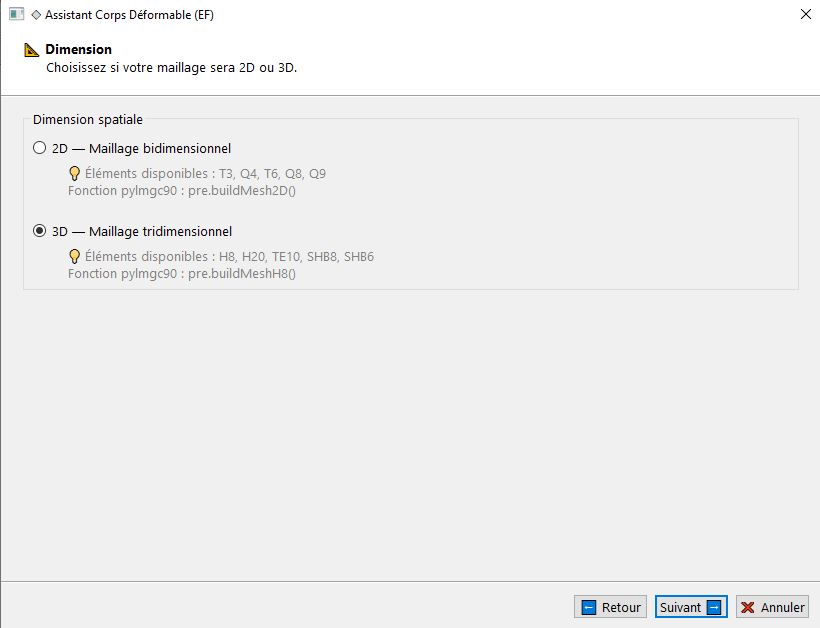
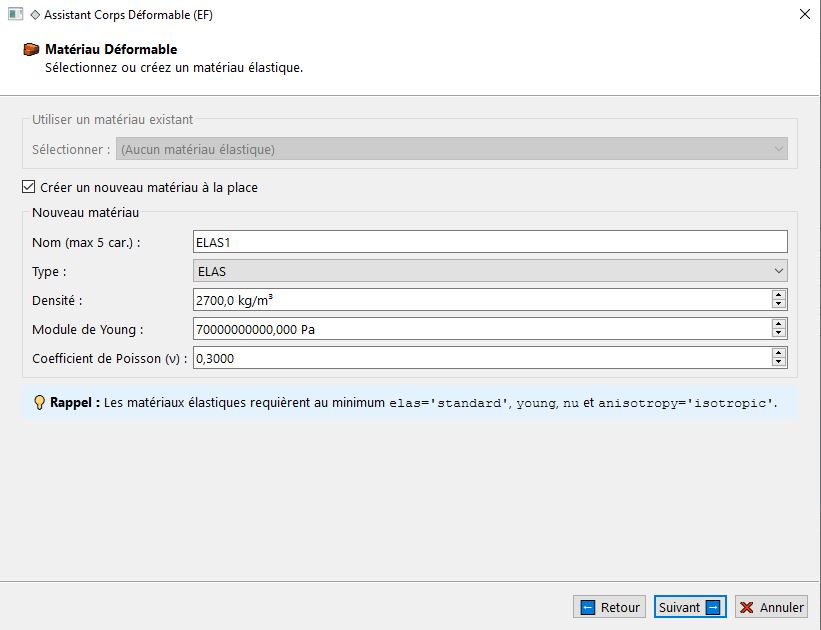
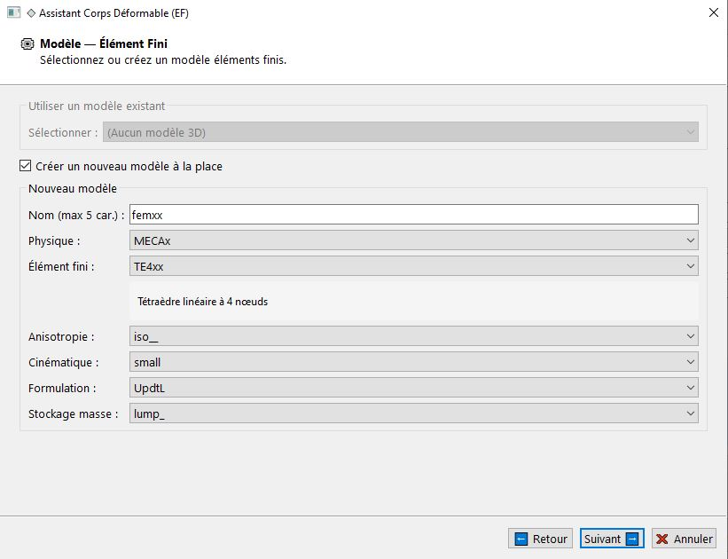
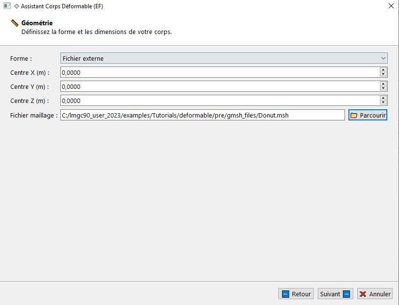
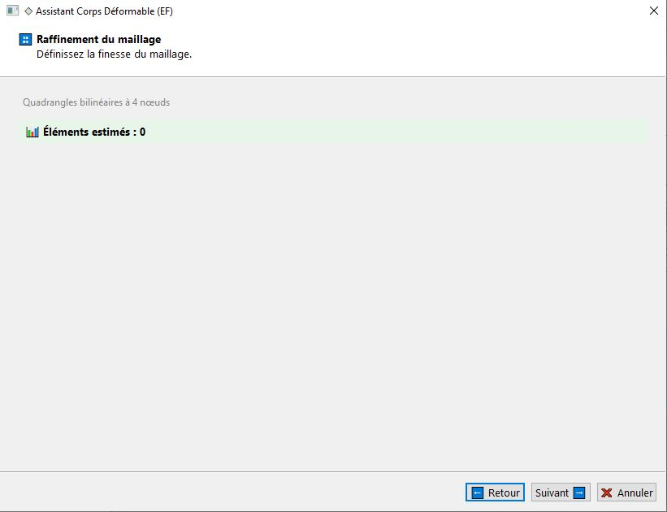
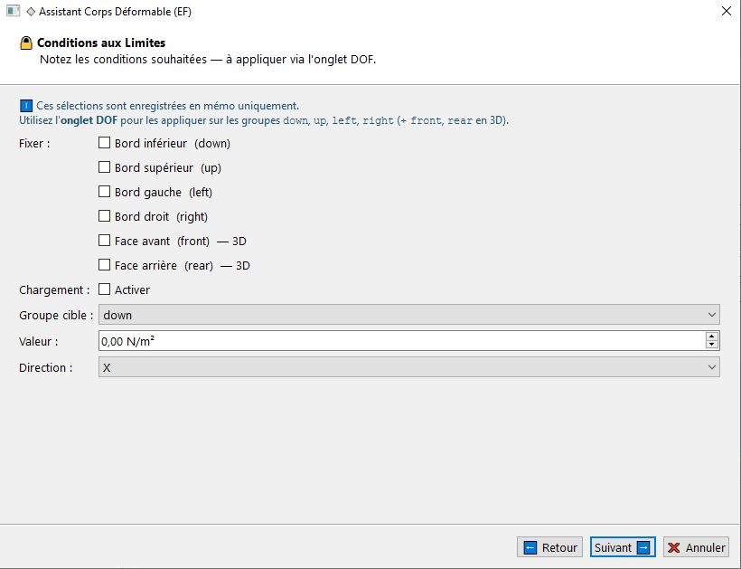
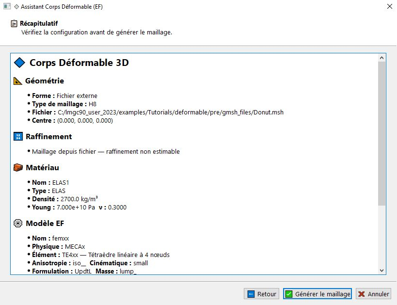
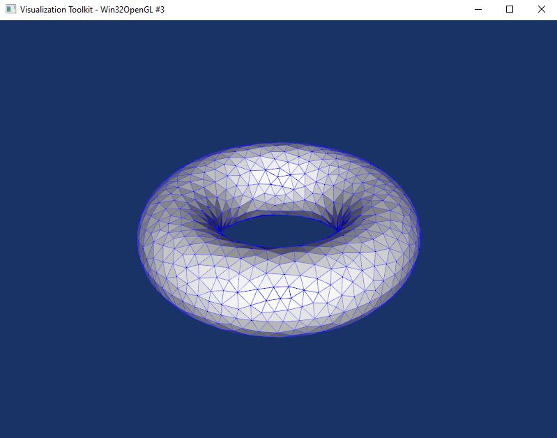

# Déformable 

Dans cette section nous allons nous servir de l'assistant des déformables afin de pouvoir les créer et les utiliser dans vos modèles numériques. Nous commençons par une brève introduction sur les corps déformbles.

### 📚 Documentation Complète - Corps Déformables LMGC90

### 1. Introduction aux Corps Déformables 
### 🎯 Qu'est-ce qu'un Corps Déformable ?

Dans LMGC90, un **corps déformable** est un objet simulé par la méthode des éléments finis. Contrairement aux corps rigides, les corps déformables peuvent se déformer sous l'action des forces.

### 📦 Structure de Base

Tou comme un avatar un corps déformable est composé de :
- **Nœuds** (`nodes`) : Points de discrétisation spatiale
- **Éléments** (`bulks`) : Éléments finis reliant les nœuds
- **Groupes** (`groups`) : Ensembles de nœuds ou d'éléments
- **Modèle** (`model`) : Comportement physique (élastique, plastique, etc.)
- **Matériau** (`material`) : Propriétés du matériau
- **Contacteurs** (`contactors`) : Surfaces de contact avec d'autres corps

### ⚠️ DISTINCTION IMPORTANTE : Mesh vs Avatar

la fontion **`buildMesh2D()`** : définit une structure de données contenant la géométrie discrétisée (nœuds + éléments)

la fonction  **`buildMeshedAvatar()`** : Corps simulable dans LMGC90 (mesh + modèle + matériau + contacteurs)

## Conditions aux limites
Il est tout à fait possible d'appliquer des CL sur des déformbales, puisque à la fin on construit un avatar sur un déformable, toutes les fonctions qui s'appliquent sur eux peuvent l'être aussi sur les déformables.
### 🏷️ Bords d'un déformable 2D

`buildMesh2D` crée **automatiquement** 4 groupes de bords :

| Groupe | Description | Condition |
|--------|-------------|-----------|
| `'left'` | Bord gauche | `x ≈ x0` |
| `'right'` | Bord droit | `x ≈ x0 + lx` |
| `'down'` | Bord inférieur | `y ≈ y0` |
| `'up'` | Bord supérieur | `y ≈ y0 + ly` |

### 🏷️ Bords d'un déformbale 3D

`buildMesh3D` crée **automatiquement** 6 groupes de faces :

| Groupe | Description | Condition |
|--------|-------------|-----------|
| `'left'` | Face gauche | `x ≈ x0` |
| `'right'` | Face droite | `x ≈ x0 + lx` |
| `'down'` | Face inférieure | `y ≈ y0` |
| `'up'` | Face supérieure | `y ≈ y0 + ly` |
| `'front'` | Face avant | `z ≈ z0` |
| `'back'` | Face arrière | `z ≈ z0 + lz` |

### 🔢 Types de Maillage 2D
Voici les types des éléments finis 2D pour la discrétisation de vos corps déformables

| Type | Description | Éléments |
|------|-------------|----------|
| `'Q4'` | Quadrangles linéaires | 4 nœuds par élément |
| `'2T3'` | Triangles (2 par Q4) | 3 nœuds par élément |
| `'4T3'` | Triangles (4 par Q4) | 3 nœuds par élément |
| `'Q8'` | Quadrangles quadratiques | 8 nœuds par élément |

### 🧊 Types de Maillage 3D
Les éléments finis utilisés 3D pour la discrétisation des corps déformables

| Type | Description | Éléments |
|------|-------------|----------|
| `'H8'` | Hexaèdres linéaires | 8 nœuds par élément |

### Import de Fichiers de Maillage {#import-fichiers}

### 📁 Formats Supportés

LMGC90 peut importer des maillages depuis :

| Format | Extension | Source |
|--------|-----------|--------|
| **GMSH** | `.msh` | Gmsh (mailleur open-source) |
| **Sysweld** | `.txt` | Sysweld |
| **VTK** | `.vtk` | ParaView / VTK |

#### Composantes de DDL

| Code | Description | 2D | 3D |
|------|-------------|----|----|
| `'X'` | Déplacement en X | ✓ | ✓ |
| `'Y'` | Déplacement en Y | ✓ | ✓ |
| `'Z'` | Déplacement en Z | - | ✓ |
| `'XY'` | X et Y | ✓ | ✓ |
| `'XYZ'` | Tous | - | ✓ |

### L'assistant des déformables
Passons maintenant à l'utilisation de notre assistant, pour cela je vais  cliquer sur le menu "fichier" -> "Assistant de déformable...", ou avec le raccourci clavier "Ctrl + Shift + D", puis on clique sur le bouton "Suivant",

On choisi la dimension de notre déformable, dans mon cas je la fixe à 3, puis je porsuis en cliquant sur "Suivant",

On arrive maintenant à la page pour créer un matériau, vous avez aussi la possibilité de choisir un matériau déjà crée, je choisis les valeurs par défauts du matériau, puis sur "Suivant", 

Cette page est prèsque la plus importante, car votre maillage dépendra de votre éléments bien choisi, je vais créer un modèle avec un élément fini de type "TE4xx", puis sur "Suivant", 

On est dans la page de votre géométrie, l'assistant vous propose quatre types de géométries de bases : 
   - Rectange (boiteH8)
   - Sphère
   - Cylindre
   - Fichier externe 
dans mon cas je veux importer ma géométrie crée avec **gmsh** sous l'extension .mesh, je clique sur le bouton "Parcourir " afin de parcourir le chemin vers mon fichier "Donut.mesh", puis je clique sur "Suivant", 

Nous arriverons à la page de type d'élément fini, dans mon cas l'assistant à bien choisi tout seul, elle peut peut être personnalisée dans certaines cas,  je clique sur "Suivant", 

Cette page n'est pas encore implémenté, elle servira à définir des conditions aux limites appliqués aux objets déformables, je porsuis en cliquant sur "Suivant", 

On arrive maintenant à la page du récapitulatif, je clique sur "Générer le maillage",

Voila un apreçu de notre objet discrétisé, 

**Important** : LMGC90_GUI ne gère pas encore toute la puissance de pylmgc90 pour les déformables ni les erreurs due à un mauvais choix d'éléments, l'assistant sera en fur et à mesure amélioré.