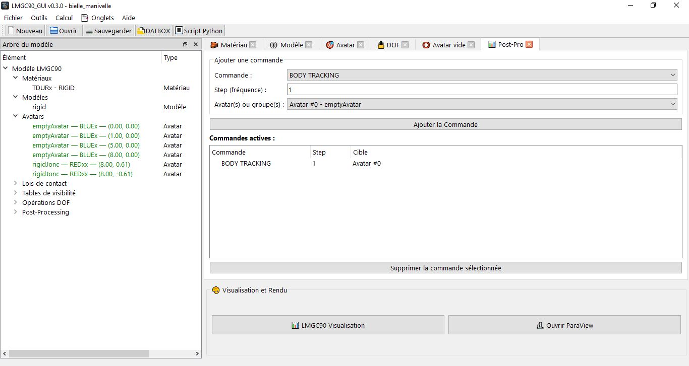

# Post-Processing (PostPro)

The **Post-Pro** tab defines the **post-processing commands** that will be included in the DATBOX and executed by LMGC90 during the computation. Each command asks LMGC90 to write output files at a given frequency, allowing the results to subsequently be analyzed and visualized.



---

## Operating Principle

A **PostPro command** (`PostProCommand`) associates a pylmgc90 **command name** with a **write frequency** (`step`) and, optionally, a **target** (single avatar or group). The corresponding pylmgc90 call is:

```python
# Without a target (global command):
posts.addCommand(pre.postpro_command(name='SOLVER INFORMATIONS', step=1))

# With an avatar target:
posts.addCommand(pre.postpro_command(
    name='BODY TRACKING',
    step=10,
    rigid_set=[bodies[3]]
))

# With a group target:
posts.addCommand(pre.postpro_command(
    name='TORQUE EVOLUTION',
    step=5,
    rigid_set=[bodies[i] for i in group_granulo_box2d]
))
```

The `PostProCommand` structure in the project stores three fields: `name`, `step`, and optionally `target_type` / `target_value`.

---

## Tab Interface

The tab is organized into two areas:

- **List of commands** (top): a table of all recorded commands. Each row displays the command name, the frequency (`step=N`), and the target (`Global`, `Avatar #N`, or `Group: name`). Double-click to edit.
- **Creation / editing form** (bottom): three simple fields.

---

## Form Fields

| Field | Description | Default Value |
|-------|-------------|-------------------|
| **Command** | Name of the pylmgc90 post-processing command. Select from the dropdown list. | `SOLVER INFORMATIONS` |
| **Frequency (step)** | Writes every `step` computation steps. `step=1` = writes at every step, `step=100` = every 100 steps. | `1` |
| **Target** | `Global` (entire simulation), `Avatar` (numeric index), or `Group` (group name). | `Global` |

---

## Available Commands

### Numerical Quality — No Target Required

These commands are **global** and do not require a `rigid_set`. They apply to the entire simulation.

| Command | Description | Output Files |
|----------|-------------|-------------------|
| **`SOLVER INFORMATIONS`** | Contact solver information at each step: number of iterations, residual, computation time. Essential for checking the **convergence** of the contact scheme. | `OUTBOX/solver_informations.dat` |
| **`VIOLATION EVOLUTION`** | Average and maximum violation (residual interpenetration) evolution between bodies. Measures the numerical **error** of non-penetration. | `OUTBOX/violation_evolution.dat` |
| **`KINETIC ENERGY`** | Total kinetic energy of the system at each step. Useful for tracking energy dissipation and detecting instabilities. | `OUTBOX/kinetic_energy.dat` |
| **`CONTACT ENERGY`** | Energy dissipated by contacts (friction + restitution). | `OUTBOX/contact_energy.dat` |
| **`STRAIN ENERGY`** | Strain energy stored in the system. For deformable FE bodies. | `OUTBOX/strain_energy.dat` |
etc.,
---

### Body Tracking — Target Required (`rigid_set`)

These commands write information about a **specific body** or a **group of avatars**. A target (`target_type` + `target_value`) is mandatory.

| Command | Description | Extracted Data | Output Files |
|----------|-------------|-------------------|--------------------|
| **`BODY TRACKING`** | Complete tracking of the position, velocity, and acceleration of a body over time. The most commonly used command for analyzing an avatar's trajectory. | Position (x, y, z), velocity (vx, vy, vz), acceleration, angle, and angular velocity | `OUTBOX/body_tracking.dat` |
| **`TORQUE EVOLUTION`** | Evolution of the torque applied to the body or group. | Torque components along X, Y, Z | `OUTBOX/torque_evolution.dat` |
| **`MOMENTUM EVOLUTION`** | Evolution of the momentum of the body or group. | Momentum (px, py, pz) | `OUTBOX/momentum_evolution.dat` |

---

### Additional Commands

| Command | Description |
|----------|-------------|
| **`WORK EVOLUTION`** | Work done by the external forces applied over time. |
| **`DISSIPATED ENERGY`** | Total dissipated energy (contact + damping). |

---

## Command Target

### Global _(no `rigid_set`)_

The command applies to the entire system. Use for `SOLVER INFORMATIONS`, `VIOLATION EVOLUTION`, `KINETIC ENERGY`.

```python
pre.postpro_command(name='SOLVER INFORMATIONS', step=1)
```

### Avatar (single index)

The command monitors a specific body identified by its index in the avatar list (0-based).

```python
pre.postpro_command(name='BODY TRACKING', step=10, rigid_set=[bodies[3]])
```

In the interface: select **Avatar** as the target type, then enter the index (e.g.: `3`).

### Group (set of avatars)

The command monitors all the bodies of a named group (loop, granulometry, masonry…).

```python
pre.postpro_command(
    name='TORQUE EVOLUTION',
    step=5,
    rigid_set=[bodies[i] for i in group_granulo_box2d]
)
```

In the interface: select **Group** as the target type, then choose the group from the dropdown list.

> All groups defined in the project (loops, granulometry, masonry) automatically appear in the list.

---

## Write Frequency (`step`)

The `step` parameter controls the write frequency of the results files.

| `step` Value | Behavior | Use |
|---------------|-------------|-------|
| `1` | Writes at every computation step | Detailed analysis, debugging, small models |
| `10` | Writes every 10 steps | Good accuracy / file size compromise |
| `100` | Writes every 100 steps | Large, long-duration simulations |
| `step_total / 1000` | ~1000 points in the file | Rule of thumb for smooth curves |

> **Performance impact:** a `step=1` with `BODY TRACKING` on a large group can generate files several gigabytes in size and slow down the computation. Adapt the frequency to the required duration and accuracy.

---

## Managing Commands

### Creating a Command

Fill in the form and click **✅ Add the Command**. The command is created via `add_postpro_command()`, which:

1. Resolves the target (`rigid_set`) into lists of pylmgc90 objects.
2. Creates the `pre.postpro_command(name, step, rigid_set)` object.
3. Adds it to the `_postpro_container` via `addCommand()`.
4. Saves it in `state.postpro_commands`.
5. Emits the `command_added` signal → `_refresh_all()`.

### Editing a Command

Double-click in the list to load the values into the form. Edit them and click **💾 Update**. `update_postpro_command()` rebuilds the entire postpro container (same behavior as for visibility tables — a pylmgc90 limitation).

### Deleting a Command

Select it and click **🗑️ Delete**. The command is removed from `state.postpro_commands` via `remove_postpro_command()`. The `command_deleted` signal is emitted.

---

## Display in the Model Tree

PostPro commands are displayed in the model tree (left panel) under the **Post-Processing** node, with for each command:

- Its name (e.g. `BODY TRACKING`)
- Its frequency (`step=10`)
- Its target (`Global`, `Avatar #3`, or `Group: granulo_box2d`)

Double-clicking on a command in the tree directly opens the PostPro tab in edit mode (`load_for_edit(postpro)`).

---

## Generated Python Script

```python
# Post-processing

# Global command
post_cmd_0 = pre.postpro_command(
    name='SOLVER INFORMATIONS',
    step=1
)
posts.addCommand(post_cmd_0)

# Command with an avatar target
post_cmd_1 = pre.postpro_command(
    name='BODY TRACKING',
    step=10,
    rigid_set=[bodies[3]]
)
posts.addCommand(post_cmd_1)

# Command with a group target
post_cmd_2 = pre.postpro_command(
    name='TORQUE EVOLUTION',
    step=5,
    rigid_set=[bodies[i] for i in group_granulo_box2d]
)
posts.addCommand(post_cmd_2)
```

The `posts` container is passed to `pre.writeDatbox(post=posts, ...)` when generating the DATBOX.

---

## Reading the Results

The output files are written to the LMGC90 project's `OUTBOX/` directory during the computation. Each file is a text file (space-separated columns) whose format depends on the command:

| Command | Typical Format | Columns |
|----------|---------------|---------|
| `BODY TRACKING` | Text, N columns | `t`, `x`, `y`, `z`, `vx`, `vy`, `vz`, `theta`, `omega` |
| `SOLVER INFORMATIONS` | Text | `t`, `iter`, `residual`, `cpu_time` |
| `VIOLATION EVOLUTION` | Text | `t`, `mean_violation`, `max_violation` |
| `KINETIC ENERGY` | Text | `t`, `Ec` |
| `TORQUE EVOLUTION` | Text | `t`, `Mx`, `My`, `Mz` |

These files can be read and plotted directly with Python (numpy, matplotlib) or with LMGC90's built-in visualization tool.

---

## Usage Example — Slider-Crank

For a slider-crank simulation, configure the following commands:

| # | Command | Step | Target | Objective |
|---|----------|------|-------|---------|
| 0 | `SOLVER INFORMATIONS` | `1` | Global | Check convergence |
| 1 | `VIOLATION EVOLUTION` | `1` | Global | Monitor interpenetration |
| 2 | `BODY TRACKING` | `10` | Avatar #0 (crank) | Angular trajectory |
| 3 | `BODY TRACKING` | `10` | Avatar #2 (slider) | Linear displacement |
| 4 | `KINETIC ENERGY` | `1` | Global | Energy balance |


---


## Important Notes

**Reconstruction upon editing:** as with visibility tables, any modification to a command triggers a full reconstruction of the `_postpro_container`. This is transparent to the user.

**Output files are only written during the computation.** Generating the DATBOX and the Python script does not write any results — the computation must be launched from the Computation tab (`F5`) for the `OUTBOX/` files to be created.

**Step and simulation duration:** make sure `step` is smaller than the total number of computation steps. A command with `step=100` in a 50-step simulation will produce no output.

**Consistency of avatar indices:** the indices in `target_value` reference the position in `state.avatars` at the time of creation. If avatars are deleted or reordered after a command is created, the indices may become incorrect. Prefer named groups for commands covering multiple bodies.


# Post-Processing

Definition of the outputs for LMGC90 used to extract and analyze your computations.

## Available Commands
### 1. Checking Numerical Quality 
- SOLVER INFORMATIONS: to ensure convergence
- VIOLATION EVOLUTION: measures the average interpenetration "error"
- TORQUE EVOLUTION (on an avatar/group): 
- BODY TRACKING (body tracking)
- KINETIC ENERGY, etc.

## Features
-  step: step 
-  rigid_set: avatar or group of avatars

## Example: 
To add a postpro command, go to the "PostPro" tab, then choose the desired command — in this case "BODY TRACKING" — then enter the step, and click the **"Add the Command"** button 

