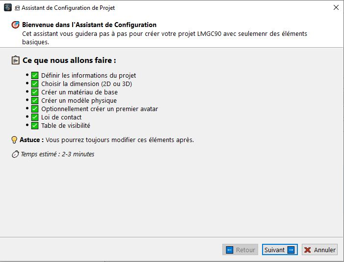
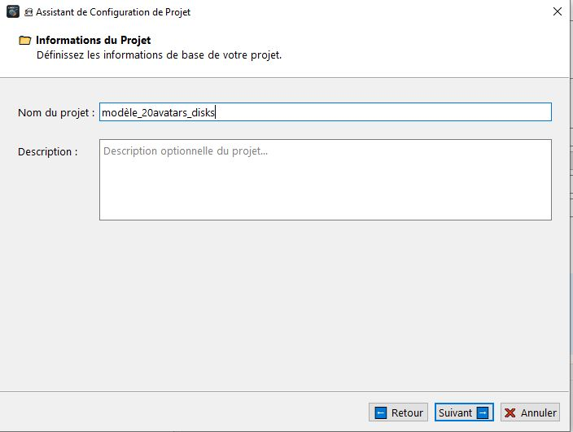
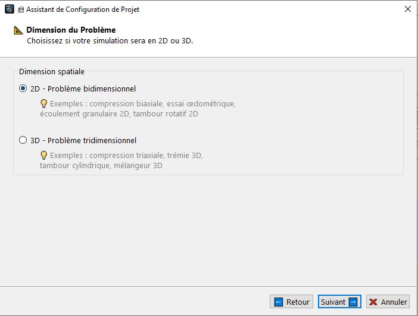
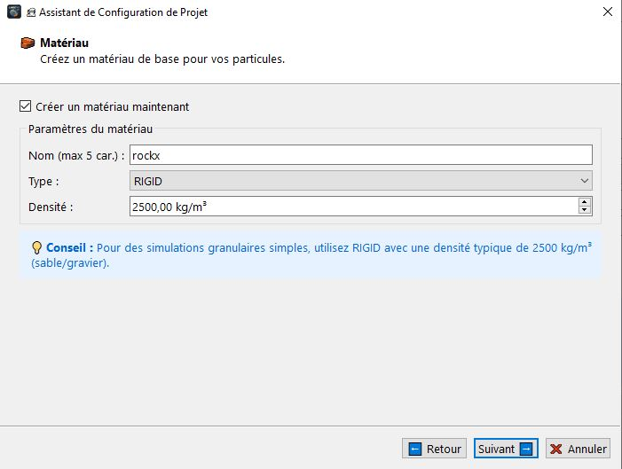
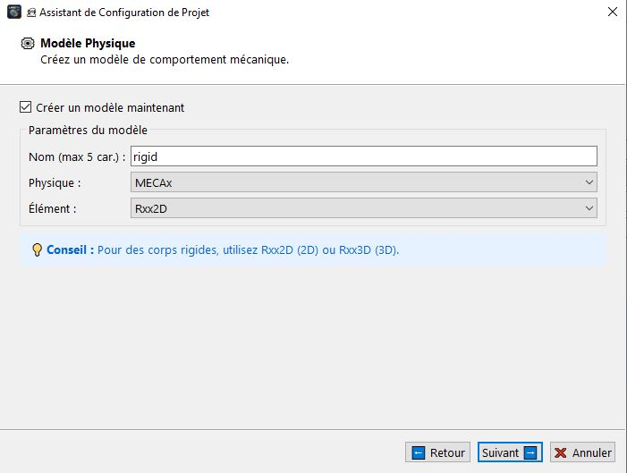
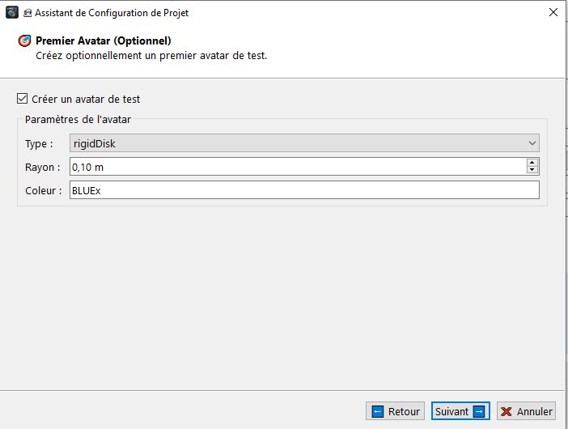
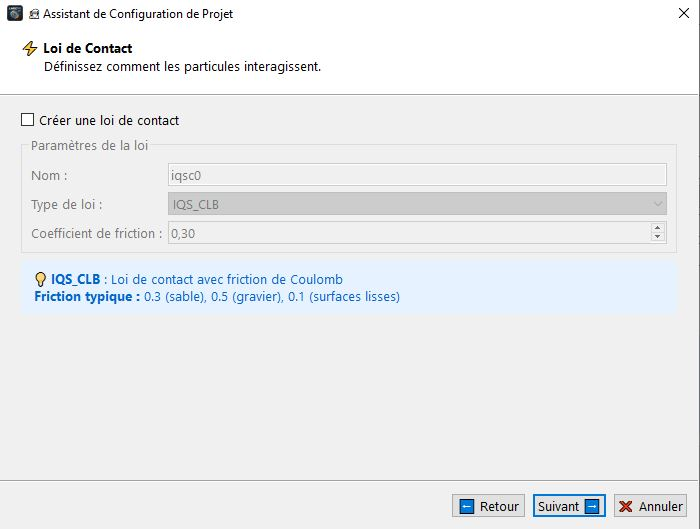
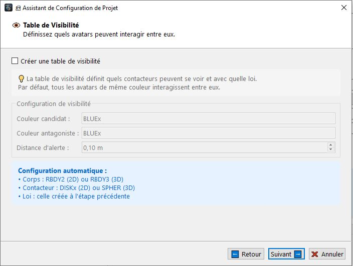
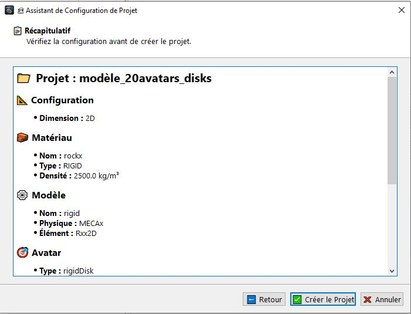

# Assistant de projet 
L'Assistant de Configuration de Projet est un outil qui vous guidera pas à pas afin de créer rapidement un projet LMGC90 complet avec tous les éléments de base nécessaires pour créer voos modèles.

## 🎯 Objectif

Créer automatiquement un projet fonctionnel comprenant :
- ✅ Les informations du projet
- ✅ La dimension (2D ou 3D)
- ✅ Un matériau de base
- ✅ Un modèle physique
- ✅ Un avatar (optionnel)
- ✅ Une loi de contact
- ✅ Une table de visibilité

Procédons directement à la création d'un projet, pour cela il suffit seulement de cliquer sur le menu "Fichier" puis "Assistant de projet..." ou avec le raccourci calvier "Ctrl+Shift+N". Une boite de dialogue s'ouvrira,  

Cliquez sur "suivant", vous aurez une page pour le nom et description de votre projet, 

Cliquez maintenant sur "suivant", une nouvelle page apparait pour définir la dimension de votre modèle, dans mon cas je vais choisir 2D, 

On clic toujours sur "suivant" pour pouvoir créer un matériau, l'assistant vous proposera des valeurs par défaut, dans mon cas je clique simplement sur "suivant", 

L'assistant vous propesera de créer un modèle par défaut dans la nouvelle page, je porsuie en cliquant sur "suivant", 

Je porsuie en cochant la case _"Créer un avatar de test"_ et je laisse les valeurs par défaut, puis "suivant", 

Maintenant l'assistant vous propose de créer une loi de contact entre vos avatars, pour mon cas je décoche, 

Je poursuie avec la dernière étape, créer une table de visibilité pour la gestion de contact entre mes avatars, dans mon cas je décoche cette partie, et je clique sur "suivant",

Nous arriverons enfin au récapulatif de notre assistant, en cliquant sur le bouton "Créer projet", tous éléments seront crées automatiquement. 
