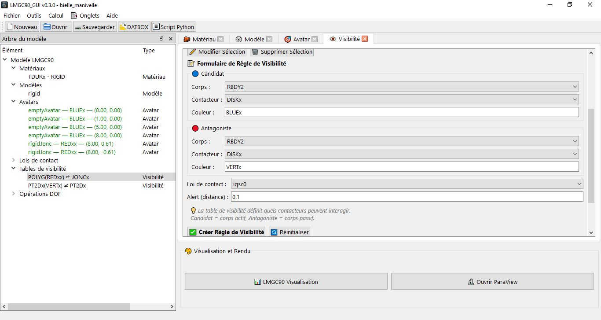

# Visibility Tables

The **Visibility** tab (`Ctrl+9`) allows you to define pylmgc90's **visibility tables** (`see_table`): each rule declares which contactors can detect each other and with which contact law. This is a **mandatory** step before generating the DATBOX — without a visibility table, no contact interaction is computed.



---

## Operating Principle

A **visibility table** (`see_table`) is the mechanism by which pylmgc90 knows which bodies must be tested for contact detection. It links a **candidate body** (which can be penetrated) and an **antagonist body** (never penetrated), specifying for each pair the color of the contactors involved and the contact law to apply.

**Generated pylmgc90 call:**

```python
see_0 = pre.see_table(
    CorpsCandidat='RBDY2',
    candidat='DISKx',
    colorCandidat='BLUEx',
    CorpsAntagoniste='RBDY2',
    antagoniste='DISKx',
    colorAntagoniste='BLUEx',
    behav=law_IQS_CLB,
    alert=0.1
)
sees.addSeeTable(see_0)
```

The `VisibilityRule` structure in the project stores exactly these 8 parameters.

---

## Tab Interface

The tab is divided into two areas:

- **List of rules** (top): a table of all visibility tables defined in the project, with candidate body, contactor, colors, antagonist body, law, and alert distance. Double-click to edit.
- **Creation / editing form** (bottom): 8 fields corresponding to the parameters of `pre.see_table`.

---

## Form Fields

### Candidate Body

| Field | Description | Common Values |
|-------|-------------|-------------------|
| **Candidate body** (`CorpsCandidat`) | Type of the body carrying the candidate contactor. | `RBDY2` (2D rigid body), `RBDY3` (3D rigid body), `MAILx` (FE deformable body) |
| **Candidate contactor** (`candidat`) | Shape of the contactor on the candidate body. Must match the shape declared in the Empty Avatar tab. | See the contactor table below |
| **Candidate color** (`colorCandidat`) | 5-character LMGC90 color code of the candidate contactor. **Must match exactly** the color of the contactor declared on the body. | `BLUEx`, `REDxx`, `VERTx`, `GRAYx`… |

### Antagonist Body

| Field | Description | Common Values |
|-------|-------------|-------------------|
| **Antagonist body** (`CorpsAntagoniste`) | Type of the body carrying the antagonist contactor. | `RBDY2`, `RBDY3`, `MAILx` |
| **Antagonist contactor** (`antagoniste`) | Shape of the antagonist contactor. | See the contactor table |
| **Antagonist color** (`colorAntagoniste`) | Color of the antagonist contactor. **Must match** the color of the contactor declared on the antagonist body. | `BLUEx`, `REDxx`… |

### Law and Alert

| Field | Description | Default |
|-------|-------------|--------|
| **Behavior** (`behav`) | Name of the contact law to apply for this pair. Select from the dropdown list of laws defined in the Contact tab. The law must exist before creating the rule. | _(first available law)_ |
| **Alert distance** (`alert`) | Detection distance (m). Two contactors less than `alert` apart are considered potentially in contact and are tested. Range: 0.001 to 10.0 m. | `0.1 m` |

---

## Available Body Types

| Type | Description | Usage |
|------|-------------|-------|
| `RBDY2` | 2D rigid body (`rigidDisk`, `rigidJonc`, `rigidPolygon`…) | 2D simulations — particles, masonry, mechanisms |
| `RBDY3` | 3D rigid body (`rigidSphere`, `rigidPolyhedron`…) | 3D simulations — spheres, polyhedra |
| `MAILx` | FE deformable body (`MESH_DEFORMABLE`) | Rigid/deformable or deformable/deformable interactions |

---

## Available Contactor Types

### 2D Contactors (for `RBDY2`)

| Contactor | Description | pylmgc90 Parameter |
|------------|-------------|---------------------|
| `DISKx` | Circular disk | `r` (radius) |
| `xKSID` | Oriented disk (anti-disk) | `r` |
| `JONCx` | Elliptical jonc / capsule | `axe1`, `axe2` |
| `POLYG` | 2D convex polygon | `nb_vertices`, `vertices` |
| `CLxxx` | Contact line (masonry) | length determined by the brick |
| `PT2Dx` | 2D contact point | — |

### 3D Contactors (for `RBDY3`)

| Contactor | Description | pylmgc90 Parameter |
|------------|-------------|---------------------|
| `SPHER` | Sphere | `r` (radius) |
| `PLANx` | Semi-infinite plane | normal vector |
| `CYLND` | Cylinder | `r`, length |
| `DNLYC` | Half-cylinder | `r`, length |
| `POLYR` | 3D convex polyhedron | `vertices` |
| `PT3Dx` | 3D contact point | — |

### Contactors for Deformable Bodies (for `MAILx`)

| Contactor | Description |
|------------|-------------|
| `CLxxx` | Contact line on an FE edge (2D) |
| `ALpxx` | Polygon line (2D FE interface) |

---

## Colors and Matching

The color (`colorCandidat`, `colorAntagoniste`) is the main **filtering criterion**. Only contactors carrying exactly the color declared in the visibility table are tested for contact. This allows you to create selective rules:

- Make only blue particles interact with each other: `colorCandidat='BLUEx'`, `colorAntagoniste='BLUEx'`
- Make red particles interact with a gray wall: `colorCandidat='REDxx'`, `colorAntagoniste='GRAYx'`
- Contact between disks and a fixed plane: `RBDY2/DISKx/BLUEx` ↔ `RBDY3/PLANx/GRAYx`

> **Common error:** if no interaction is detected during the computation, check that the colors in the visibility table match **exactly** (5 characters, case-sensitive) the colors declared on the avatars' contactors.

---

## Alert Distance (`alert`)

The `alert` distance determines the contact search zone. Two contactors are placed on the candidate list for the computation if the distance between them is less than `alert`.

| Situation | Recommended Value |
|-----------|-------------------|
| Granular particles (r ≈ 0.05 to 0.15 m) | `0.1` to `0.3 m` |
| Masonry (standard bricks) | `0.02` to `0.05 m` |
| Large structures | 5 to 10% of the maximum radius |
| FE deformable bodies | Characteristic size of an element |

> **Too small:** some real contacts are not detected → unhandled interpenetration (very minor).  
> **Too large:** too many candidate pairs → computation slowed down unnecessarily.

---

## Managing Rules

### Creating a Rule

Fill in the form and click **✅ Create**. The rule will be created as follows:
1. Checks that the referenced contact law exists in `_pylmgc_laws`.
2. Creates the pylmgc90 `see_table` object via `LMGC90Bridge.create_visibility_rule()`.
3. Adds it to the `_visibility_container` (the `sees` collection).
4. Saves it in `state.visibility_rules`.
5. Emits the `rule_created` signal → `_refresh_all()`.

### Editing a Rule

Double-click in the list, or select it and click **✏️ Edit**. After confirmation, `update_visibility_rule()`:
1. **Fully** rebuilds the `_visibility_container` (pylmgc90 limitation — no in-place modification of an existing see_table).
2. Reinserts all the rules with the new values.
3. Emits the `rule_updated` signal → `_refresh_all()`.

### Deleting a Rule

Select it and click **🗑️ Delete**. The rule is removed from `state.visibility_rules` via `remove_visibility_rule()`. The `rule_deleted` signal is emitted.

> **Cascading update:** renaming a contact law in the Contact tab automatically updates the `behavior_name` field of all visibility rules that reference it.

---

## Common Rules by Simulation Type

### 2D Granulometry — Rigid Disks

```
CandidateBody    : RBDY2   candidate    : DISKx   candidateColor    : BLUEx
AntagonistBody   : RBDY2   antagonist   : DISKx   antagonistColor   : BLUEx
behav : IQS_CLB   alert : 0.1
```

### 2D Masonry — Rigid Bricks

```
CandidateBody    : RBDY2   candidate    : CLxxx   candidateColor    : BLUEx
AntagonistBody   : RBDY2   antagonist   : CLxxx   antagonistColor   : BLUEx
behav : IQS_CLB   alert : 0.02
```

### 3D Granulometry — Rigid Spheres

```
CandidateBody    : RBDY3   candidate    : SPHER   candidateColor    : BLUEx
AntagonistBody   : RBDY3   antagonist   : SPHER   antagonistColor   : BLUEx
behav : IQS_CLB   alert : 0.1
```

### Rigid / Deformable — Disk on an FE Mesh

```
CandidateBody    : RBDY2   candidate    : DISKx   candidateColor    : BLUEx
AntagonistBody   : MAILx   antagonist   : CLxxx   antagonistColor   : VERTx
behav : GAP_SGR_CLB   alert : 0.05
```

### Different Body Types — Disks and Joncs

```
CandidateBody    : RBDY2   candidate    : DISKx   candidateColor    : BLUEx
AntagonistBody   : RBDY2   antagonist   : JONCx   antagonistColor   : REDxx
behav : IQS_CLB   alert : 0.15
```
---

## Connection with the Project Wizard

The **Project Wizard** (`Ctrl+Shift+N`) offers a **Visibility** page that automatically pre-fills the visibility table based on the choices made in the previous steps:

- **Body**: `RBDY2` (2D) or `RBDY3` (3D) depending on the project's dimension.
- **Contactor**: `DISKx` (2D) or `SPHER` (3D).
- **Colors**: automatically synchronized with the color of the avatar created at the Avatar step.
- **Law**: the law created at the Contact step.

For more complex configurations (multiple contactor types, multiple laws), use the Visibility tab directly after finishing the wizard.

---

## Important Notes

**The law must exist before the rule:** `add_visibility_rule()` checks that the referenced law is present in `_pylmgc_laws`. If the law is deleted from the Contact tab after the rule is created, the rule becomes invalid and script generation will fail. The Contact tab warns if you attempt to delete a law used by a visibility rule.

**Full reconstruction upon editing:** pylmgc90 does not allow modifying an existing `see_table`. The slightest modification to a rule triggers a full reconstruction of the `sees` container with all the rules. This behavior is transparent to the user but can be slow if the project contains many rules.

**Multiplicity of rules:** a project can have as many visibility rules as needed. For an assembly with several populations of particles of different colors (e.g. blue, red, green), create one rule per pair of colors that must interact. Populations of different colors with no common rule will not see each other.

**Contact detector vs. visibility table:** the visibility table declares *who* can interact. The Computation tab (`Ctrl+8`) configures the *contact detectors* (`DKDKx`, `SPSPx`…) that determine *how* the contact is resolved. The two must be consistent — if a rule declares `DISKx/DISKx`, the `DKDKx` detector must be enabled in the Computation tab.
